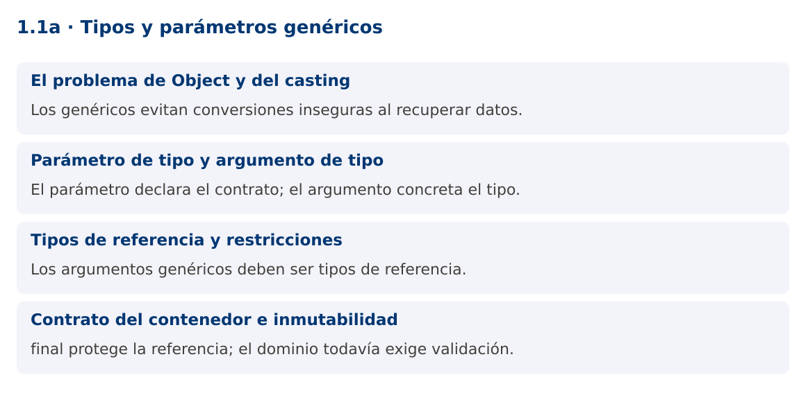

# Programación Aplicada

## 1.1a. Tipos y parámetros genéricos


**Autor:** Ing. Pablo Torres, Mgtr.  
**Unidad:** 1. Programación genérica  
**Proyecto de trabajo:** CampusMonitor

[Inicio del curso](../../../README.md) · [Presentación editable](presentacion.pptx) · [Ver en el navegador](index.html)

---

## 1. Conceptos y ejemplos

### Contexto

CampusMonitor debe almacenar identificadores, nombres y lecturas de sensores. Duplicar una clase contenedora por cada tipo repite la lógica. Usar Object acepta mezclas que solo se descubren al recuperar el dato. Una clase genérica expresa la relación entre el dato que entra y el que sale, y permite comprobarla durante la compilación.

### Antes de empezar

Revisa el ejemplo completo antes de implementar la PC. Las demostraciones del material se ejecutan separadas del proyecto personal.


La ilustración sirve como analogía. El contrato técnico se define en el texto y el código.

<a id="concepto-1"></a>

### 1.1. El problema de Object y del casting

Una variable de tipo Object puede referirse a un String, un Integer o un Sensor. Esa flexibilidad pierde información en la interfaz del contenedor: al recuperar Object, quien llama debe conocer el tipo real y convertirlo. Un cast no transforma el objeto y puede lanzar ClassCastException. La programación genérica conserva esa relación en el contrato. El compilador comprueba que una Caja<String> recibe cadenas y devuelve cadenas, sin que el cliente escriba conversiones.

La ventaja principal es la seguridad de tipos y la reutilización de algoritmos. Los genéricos no implican que el programa sea más rápido, ni crean una clase distinta en ejecución por cada tipo. El error se detecta cerca de la operación que lo introduce, antes de ejecutar la aplicación.

```java
Object dato = "Aula 201";
String nombre = (String) dato;
// Integer numero = (Integer) dato; // Compila, pero falla al ejecutar.
```

<a id="concepto-2"></a>

### 1.2. Parámetro de tipo y argumento de tipo

En Caja<T>, T es un parámetro de tipo, una variable que participa en la declaración de la clase. En Caja<String>, String es el argumento concreto proporcionado por el cliente. No es un parámetro de valor como una cantidad o un identificador. Los nombres T, E, K y V son convenciones: tipo, elemento, clave y valor. Cuando existen varios roles, nombres como ID ayudan a expresar la intención.

El operador diamante <> permite inferir argumentos a partir del contexto. La inferencia no convierte Java en un lenguaje dinámico: el tipo queda establecido en compilación. Una Caja<Integer> y una Caja<String> tienen contratos distintos, aunque comparten la misma clase en ejecución. No uses Caja sin argumentos, porque el tipo crudo elimina parte de las comprobaciones.

```java
Caja<String> ubicacion = new Caja<>("Laboratorio");
Caja<Integer> capacidad = new Caja<>(30);
String texto = ubicacion.obtener();
```

<a id="concepto-3"></a>

### 1.3. Tipos de referencia y restricciones

Los argumentos genéricos son tipos de referencia. Usa Integer donde el dato original sea int, y Double para double. Java realiza boxing y unboxing cuando corresponde, tema que se desarrolla en 1.1c. Un parámetro T no permite ejecutar new T(), acceder a miembros estáticos de un supuesto tipo concreto ni comprobar instanceof Caja<String>. Tampoco puedes declarar un campo static T en una clase genérica: el campo estático pertenece a la clase compartida.

El genérico describe qué operaciones son válidas. Sin una cota, solo están disponibles las operaciones garantizadas por Object. Si un algoritmo necesita comparar, sumar o extraer un identificador, debe expresar un contrato adicional. Las cotas y los comparadores aparecerán en los siguientes contenidos.

<a id="concepto-4"></a>

### 1.4. Contrato del contenedor e inmutabilidad

La demostración usa un campo final y rechaza null al construir la caja. final impide reasignar la referencia, pero no vuelve inmutable al objeto almacenado. Si T es una lista modificable, el contenido de esa lista todavía puede cambiar. Decide si el contenedor acepta valores nulos y documenta esa decisión.

Las validaciones del dominio siguen siendo necesarias. Caja<Double> garantiza un Double, pero no que la temperatura sea válida. La seguridad de tipos y la validación de valores resuelven problemas diferentes. En CampusMonitor, el modelo Lectura deberá controlar rangos, unidad y origen además del tipo de su valor.

### Mapa de conceptos



---

<a id="demostracion"></a>

## 2. Demostración guiada

### 2.1. Problema y contrato

CampusMonitor debe almacenar identificadores, nombres y lecturas de sensores. Duplicar una clase contenedora por cada tipo repite la lógica. Usar Object acepta mezclas que solo se descubren al recuperar el dato. Una clase genérica expresa la relación entre el dato que entra y el que sale, y permite comprobarla durante la compilación.

La implementación siguiente es una demostración resuelta. La PC de la sección 3 requiere desarrollar una ampliación propia sobre CampusMonitor.

**Archivo completo:** [TiposDemo.java](ejemplos/TiposDemo.java).

```java
package edu.ups.pap.u01;
import java.util.Objects;

public class TiposDemo {
    static final class Caja<T> {
        private final T valor;
        Caja(T valor) { this.valor = Objects.requireNonNull(valor); }
        T obtener() { return valor; }
    }
    record Sensor(String id, String ubicacion) {}
    public static void main(String[] args) {
        Caja<String> lugar = new Caja<>("Laboratorio 1");
        Caja<Integer> limite = new Caja<>(30);
        Caja<Sensor> dispositivo = new Caja<>(new Sensor("S01", lugar.obtener()));
        System.out.println(dispositivo.obtener().id() + " / " + lugar.obtener());
        System.out.println("Capacidad: " + limite.obtener());
        System.out.println(lugar.getClass() == limite.getClass());
        try { new Caja<String>(null); }
        catch (NullPointerException e) { System.out.println("Valor nulo rechazado"); }
    }
}
```

### 2.2. Ejecución

Desde la raíz de este repositorio, con JDK 25:

```bash
java 01/1.1-fundamentos/01-tipos/ejemplos/TiposDemo.java
```

Con el proyecto Gradle de demostraciones:

```bash
cd demostraciones
./gradlew runDemo -Pdemo=1.1a
```

En Windows usa `gradlew.bat`. Ejecuta cada demostración desde una terminal nueva o vuelve a la raíz antes de cambiar de contenido.

### 2.3. Resultado y lectura de la ejecución

```text
S01 / Laboratorio 1
Capacidad: 30
true
Valor nulo rechazado
```

1. Identifica los datos iniciales y las precondiciones que la demostración valida.
2. Sigue las llamadas desde `main` o `loop` y relaciona las operaciones con los conceptos de la sección 1.
3. Contrasta el resultado con la salida esperada del ejemplo. Si el orden es concurrente, compara la invariante y no el orden de impresión.
4. Cambia un dato del ejemplo y predice el resultado antes de ejecutarlo. Registra cualquier diferencia y su causa.

---

<a id="pc"></a>

## 3. PC1.1a · Práctica de clase

### 3.1. Ampliación del proyecto

Esta actividad se resuelve en tu repositorio `icc-pap-campusmonitor-apellido`. Mantén la funcionalidad anterior. No reemplaces tu solución con los archivos de demostración del material.

1. Crea el proyecto personal CampusMonitor siguiendo la guía general. Agrega Lectura<T> con idSensor, valor y unidad, sin utilizar Object como tipo del valor.
2. Construye una lectura Double de temperatura y otra Integer de ocupación. Rechaza id o unidad vacíos y valores nulos.
3. Agrega un comando lecturas que muestre ambas y documenta una asignación incompatible como comentario, con el error de compilación esperado.

### 3.2. Comprobación y evidencia

Prueba los casos de esta sección y registra entradas, salida real y explicación. Incluye una ejecución normal y un caso de error. La evidencia debe permitir repetir el resultado desde el commit entregado.

| Caso que debes revisar | Comportamiento requerido |
|---|---|
| S01, 22.5, °C | Lectura válida y recuperada como Double |
| S02, 18, personas | Lectura válida y recuperada como Integer |
| id vacío o valor null | Error descriptivo de validación |

En `evidencias/PC1.1a.md` agrega: cambio realizado, archivos principales, comandos de ejecución, tabla de pruebas y enlace al commit final. No añadas una rúbrica a esta PC.

### 3.3. Commits de la actividad

```bash
git status
git add src evidencias
git commit -m "feat(pc1.1a): tipos-y-parametros-genericos"
git push
git log -1 --format=%H
```

Ajusta las rutas de `git add` a los archivos que realmente creaste. Incluye también configuración o SQL si cambiaste esos archivos. El último comando muestra el hash real que debes enlazar en tu evidencia.

### Lo esencial

- Los genéricos evitan conversiones inseguras al recuperar datos.
- El parámetro declara el contrato; el argumento concreta el tipo.
- Los argumentos genéricos deben ser tipos de referencia.
- final protege la referencia; el dominio todavía exige validación.

## Referencias técnicas

- [Genéricos en Java](https://dev.java/learn/generics/)
- [Reflexión](https://dev.java/learn/reflection/)
- [API Java 25](https://docs.oracle.com/en/java/javase/25/docs/api/index.html)
