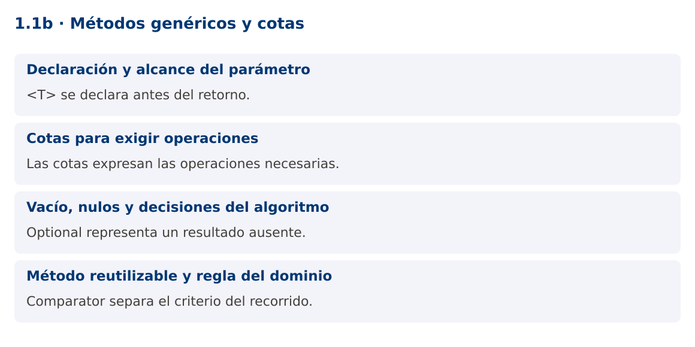

# Programación Aplicada

## 1.1b. Métodos genéricos y cotas


**Autor:** Ing. Pablo Torres, Mgtr.  
**Unidad:** 1. Programación genérica  
**Proyecto de trabajo:** CampusMonitor

[Inicio del curso](../../../README.md) · [Presentación editable](presentacion.pptx) · [Ver en el navegador](index.html)

---

## 1. Conceptos y ejemplos

### Contexto

Una vez representadas las lecturas, CampusMonitor necesita seleccionar la mayor lectura y filtrar catálogos. Copiar un método para cada modelo introduce versiones que se desincronizan. Un método genérico permite parametrizar la operación sin exigir que toda la clase sea genérica.

### Antes de empezar

Recupera el avance de [1.1a](../01-tipos/material.md). Conserva sus comandos y evidencias. Revisa el ejemplo completo antes de implementar la PC. Las demostraciones del material se ejecutan separadas del proyecto personal.

<a id="concepto-1"></a>

### 1.1. Declaración y alcance del parámetro

Un método genérico declara <T> antes del tipo de retorno. El alcance de T es ese método, incluidos sus parámetros y retorno. Puede existir en una clase no genérica y también puede ser static. Esto permite reunir algoritmos reutilizables en una clase de utilidades. Un método de una clase Caja<T> que simplemente devuelve T utiliza el parámetro de la clase y no es, por esa sola razón, un método genérico independiente.

El compilador infiere T a partir de los argumentos y del contexto. También puede indicarse explícitamente con Utilidades.<String>identidad("a"). Evita parámetros genéricos que no relacionan nada: aceptar T y devolver siempre String puede ser menos claro que aceptar el contrato realmente necesario.

```java
static <T> T identidad(T valor) {
    return valor;
}
String id = identidad("S01");
```

<a id="concepto-2"></a>

### 1.2. Cotas para exigir operaciones

Una cota restringe los tipos admisibles y habilita operaciones. <T extends Number> permite llamar doubleValue(), pero no convierte T en un tipo aritmético con operador +. Para comparar, Comparable describe el orden natural, mientras Comparator permite elegir un orden externo. El ejemplo usa Comparator<? super T> para aceptar comparadores que también sepan comparar supertipos, relación que se explica con detalle en 1.2.

La forma <T extends Comparable<? super T>> es útil para un máximo con orden natural. Las cotas múltiples se separan con &: si hay una clase, aparece primero y solo puede haber una. Expresa únicamente los requisitos del algoritmo, porque cada cota adicional reduce la reutilización.

```java
static <T extends Number> double convertir(T valor) {
    return valor.doubleValue();
}
```

<a id="concepto-3"></a>

### 1.3. Vacío, nulos y decisiones del algoritmo

Un método máximo debe definir qué ocurre con una colección vacía. Devolver null traslada una comprobación implícita al cliente. Optional<T> comunica la ausencia de resultado. La demostración rechaza elementos nulos para que el comparador no tenga que interpretarlos. Otra política válida sería Comparator.nullsLast, pero debe ser explícita y consistente.

La selección recorre n elementos y conserva solo el mejor candidato: tiempo O(n) y memoria auxiliar O(1). No necesita ordenar toda la lista. Si dos elementos empatan, este algoritmo conserva el primero. La política de desempate forma parte del comportamiento observable y debe aparecer en las pruebas.

<a id="concepto-4"></a>

### 1.4. Método reutilizable y regla del dominio

La utilidad no conoce sensores, estudiantes ni productos. Recibe datos y una estrategia de comparación. El cliente define que una lectura es mayor por su valor o por su identificador, sin cambiar el recorrido. Esa separación reduce dependencias y prepara el uso de Strategy en 1.4.

En un sistema real no se debe comparar indiscriminadamente una temperatura con una ocupación solo porque ambas son Number. CampusMonitor debe agrupar lecturas por magnitud y unidad antes de calcular máximos. Reutilizar código no elimina la semántica del problema.

### Mapa de conceptos



---

<a id="demostracion"></a>

## 2. Demostración guiada

### 2.1. Problema y contrato

Una vez representadas las lecturas, CampusMonitor necesita seleccionar la mayor lectura y filtrar catálogos. Copiar un método para cada modelo introduce versiones que se desincronizan. Un método genérico permite parametrizar la operación sin exigir que toda la clase sea genérica.

La implementación siguiente es una demostración resuelta. La PC de la sección 3 requiere desarrollar una ampliación propia sobre CampusMonitor.

**Archivo completo:** [MetodosDemo.java](ejemplos/MetodosDemo.java).

```java
package edu.ups.pap.u01;
import java.util.*;
public class MetodosDemo {
    record Medicion(String sensor, double valor) {}
    static <T> Optional<T> maximo(List<T> datos, Comparator<? super T> orden) {
        Objects.requireNonNull(datos);
        Objects.requireNonNull(orden);
        T mejor = null;
        for (T actual : datos) {
            Objects.requireNonNull(actual, "No se admiten elementos nulos");
            if (mejor == null || orden.compare(actual, mejor) > 0) mejor = actual;
        }
        return Optional.ofNullable(mejor);
    }
    public static void main(String[] args) {
        var datos = List.of(new Medicion("S01",22.5), new Medicion("S02",27.2),
                            new Medicion("S03",24.0));
        var orden = Comparator.comparingDouble(Medicion::valor);
        System.out.println(maximo(datos, orden).orElseThrow());
        System.out.println(maximo(List.<Medicion>of(), orden));
        System.out.println(maximo(List.of("Aula", "Laboratorio"),
                                  Comparator.comparingInt(String::length)).orElseThrow());
    }
}
```

### 2.2. Ejecución

Desde la raíz de este repositorio, con JDK 25:

```bash
java 01/1.1-fundamentos/02-metodos/ejemplos/MetodosDemo.java
```

Con el proyecto Gradle de demostraciones:

```bash
cd demostraciones
./gradlew runDemo -Pdemo=1.1b
```

En Windows usa `gradlew.bat`. Ejecuta cada demostración desde una terminal nueva o vuelve a la raíz antes de cambiar de contenido.

### 2.3. Resultado y lectura de la ejecución

```text
Medicion[sensor=S02, valor=27.2]
Optional.empty
Laboratorio
```

1. Identifica los datos iniciales y las precondiciones que la demostración valida.
2. Sigue las llamadas desde `main` o `loop` y relaciona las operaciones con los conceptos de la sección 1.
3. Contrasta el resultado con la salida esperada del ejemplo. Si el orden es concurrente, compara la invariante y no el orden de impresión.
4. Cambia un dato del ejemplo y predice el resultado antes de ejecutarlo. Registra cualquier diferencia y su causa.

---

<a id="pc"></a>

## 3. PC1.1b · Práctica de clase

### 3.1. Ampliación del proyecto

Esta actividad se resuelve en tu repositorio `icc-pap-campusmonitor-apellido`. Mantén la funcionalidad anterior. No reemplaces tu solución con los archivos de demostración del material.

1. Reutiliza las lecturas Double de la PC anterior. Implementa seleccionar(List<T>, Predicate<? super T>) que devuelva una lista nueva y no modifique la entrada.
2. Filtra temperaturas mayores a 25 °C y calcula el máximo con un comparador. Una lista vacía debe producir ausencia de resultado.
3. Demuestra la reutilización de seleccionar con una lista de sensores por ubicación. No copies el recorrido para el segundo tipo.

### 3.2. Comprobación y evidencia

Prueba los casos de esta sección y registra entradas, salida real y explicación. Incluye una ejecución normal y un caso de error. La evidencia debe permitir repetir el resultado desde el commit entregado.

| Caso que debes revisar | Comportamiento requerido |
|---|---|
| 22.5, 27.2, 24.0 con umbral 25 | Solo 27.2 |
| Lista vacía | Lista filtrada vacía y máximo ausente |
| Dos máximos iguales | Desempate documentado |

En `evidencias/PC1.1b.md` agrega: cambio realizado, archivos principales, comandos de ejecución, tabla de pruebas y enlace al commit final. No añadas una rúbrica a esta PC.

### 3.3. Commits de la actividad

```bash
git status
git add src evidencias
git commit -m "feat(pc1.1b): metodos-genericos-y-cotas"
git push
git log -1 --format=%H
```

Ajusta las rutas de `git add` a los archivos que realmente creaste. Incluye también configuración o SQL si cambiaste esos archivos. El último comando muestra el hash real que debes enlazar en tu evidencia.

### Lo esencial

- <T> se declara antes del retorno.
- Las cotas expresan las operaciones necesarias.
- Optional representa un resultado ausente.
- Comparator separa el criterio del recorrido.

## Referencias técnicas

- [Genéricos en Java](https://dev.java/learn/generics/)
- [Reflexión](https://dev.java/learn/reflection/)
- [API Java 25](https://docs.oracle.com/en/java/javase/25/docs/api/index.html)
