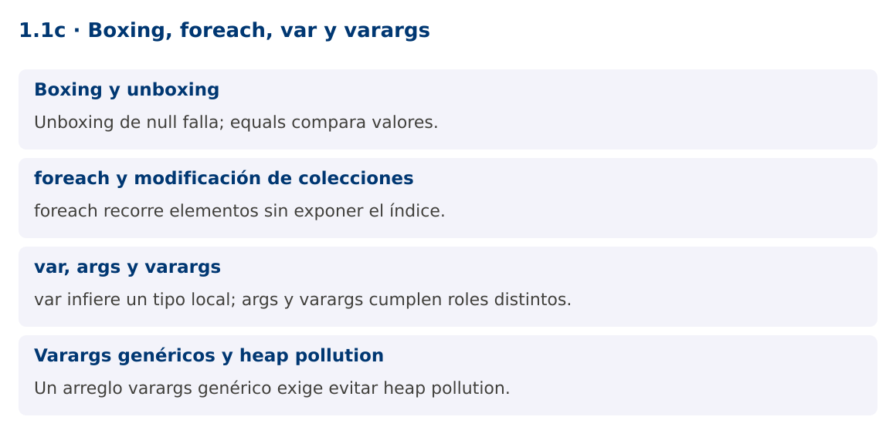

# Programación Aplicada

## 1.1c. Boxing, foreach, var y varargs


**Autor:** Ing. Pablo Torres, Mgtr.  
**Unidad:** 1. Programación genérica  
**Proyecto de trabajo:** CampusMonitor

[Inicio del curso](../../../README.md) · [Presentación editable](presentacion.pptx) · [Ver en el navegador](index.html)

---

## 1. Conceptos y ejemplos

### Contexto

El catálogo ya usa tipos genéricos. Ahora necesitamos cargar varias lecturas, recorrerlas y calcular un promedio. Esta operación conecta los tipos primitivos con sus envoltorios y obliga a distinguir inferencia local, argumentos de consola y cantidad variable de argumentos.

### Antes de empezar

Recupera el avance de [1.1b](../02-metodos/material.md). Conserva sus comandos y evidencias. Revisa el ejemplo completo antes de implementar la PC. Las demostraciones del material se ejecutan separadas del proyecto personal.

<a id="concepto-1"></a>

### 1.1. Boxing y unboxing

Boxing convierte un valor primitivo en una instancia de su clase envoltorio, por ejemplo int a Integer. Unboxing recupera el primitivo. El compilador inserta conversiones en asignaciones, argumentos y operaciones aritméticas. List<Integer> almacena referencias a envoltorios. Unboxing de null produce NullPointerException.

Con envoltorios, == puede comparar identidad de referencias. Algunas instancias se reutilizan mediante cachés y otras no, por lo que un resultado observado con un número pequeño no establece una regla general. Para comparar valores usa equals u Objects.equals si admites null. En cálculos intensivos, arreglos primitivos o streams especializados pueden evitar boxing innecesario.

```java
Integer cantidad = 18; // boxing
int total = cantidad + 2; // unboxing
boolean mismoValor = java.util.Objects.equals(cantidad, 18);
```

<a id="concepto-2"></a>

### 1.2. foreach y modificación de colecciones

El foreach facilita recorrer arreglos y objetos Iterable. La variable del bucle recibe cada valor o referencia. Reasignar esa variable no reemplaza la posición original del arreglo o de la lista. Si el elemento es mutable, llamar a sus métodos sí puede modificar el objeto compartido.

No elimines elementos de un ArrayList mediante lista.remove dentro de su foreach. Sus iteradores pueden detectar modificaciones estructurales y lanzar ConcurrentModificationException, incluso sin varios hilos. Usa removeIf para eliminación por condición, o Iterator.remove cuando proceda. Si necesitas el índice o reemplazar posiciones, un for con índice comunica mejor la operación.

```java
for (Double valor : valores) {
    System.out.println(valor);
}
valores.removeIf(v -> v == null);
```

<a id="concepto-3"></a>

### 1.3. var, args y varargs

var permite inferir el tipo de una variable local inicializada. No significa Object, no admite inicialización con null sin tipo y no se utiliza para campos o parámetros ordinarios. Si escribes var lista = new ArrayList<String>(), el tipo estático de lista es ArrayList<String>.

String[] args es el arreglo de argumentos recibido por main. Su nombre es convencional. En cambio, T... valores declara varargs: el método admite cero o más argumentos y los recibe como un arreglo. Solo puede existir un parámetro varargs y debe ser el último. Pasar explícitamente un arreglo nulo sigue siendo posible y necesita una política de validación.

```java
static int contar(String... ids) { return ids.length; }
var n = contar("S01", "S02");
// main(String[] args) recibe textos desde la consola.
```

<a id="concepto-4"></a>

### 1.4. Varargs genéricos y heap pollution

Los arreglos comprueban su tipo de componente en ejecución, mientras los genéricos emplean borrado. Mezclarlos puede introducir contaminación del heap: una variable parametrizada contiene un objeto incompatible debido a operaciones no seguras. @SafeVarargs documenta que la implementación no realiza esas operaciones, pero la anotación no corrige código inseguro.

Úsala solo en métodos o constructores permitidos y realmente seguros. En el ejemplo, el método static recorre los argumentos, valida cada elemento y copia las referencias a una lista nueva. No escribe tipos ajenos en el arreglo ni lo expone al llamador. Para una API que recibe lotes grandes o nulos frecuentes, aceptar una List<T> puede ser más explícito.

### Mapa de conceptos



---

<a id="demostracion"></a>

## 2. Demostración guiada

### 2.1. Problema y contrato

El catálogo ya usa tipos genéricos. Ahora necesitamos cargar varias lecturas, recorrerlas y calcular un promedio. Esta operación conecta los tipos primitivos con sus envoltorios y obliga a distinguir inferencia local, argumentos de consola y cantidad variable de argumentos.

La implementación siguiente es una demostración resuelta. La PC de la sección 3 requiere desarrollar una ampliación propia sobre CampusMonitor.

**Archivo completo:** [BoxingDemo.java](ejemplos/BoxingDemo.java).

```java
package edu.ups.pap.u01;
import java.util.*;
public class BoxingDemo {
    @SafeVarargs
    static <T> List<T> lote(T... valores) {
        Objects.requireNonNull(valores, "Arreglo nulo");
        List<T> copia = new ArrayList<>();
        for (T valor : valores) copia.add(Objects.requireNonNull(valor, "Elemento nulo"));
        return List.copyOf(copia);
    }
    static OptionalDouble promedio(List<Double> valores) {
        if (valores.isEmpty()) return OptionalDouble.empty();
        double suma = 0;
        for (Double valor : valores) suma += Objects.requireNonNull(valor);
        return OptionalDouble.of(suma / valores.size());
    }
    public static void main(String[] args) {
        var temperaturas = lote(22.0, 24.0, 26.0);
        System.out.println(promedio(temperaturas).orElseThrow());
        System.out.println("Argumentos de consola: " + args.length);
        System.out.println(promedio(List.of()));
        try { lote(22.0, null); }
        catch (NullPointerException e) { System.out.println(e.getMessage()); }
    }
}
```

### 2.2. Ejecución

Desde la raíz de este repositorio, con JDK 25:

```bash
java 01/1.1-fundamentos/03-boxing-foreach-varargs/ejemplos/BoxingDemo.java
```

Con el proyecto Gradle de demostraciones:

```bash
cd demostraciones
./gradlew runDemo -Pdemo=1.1c
```

En Windows usa `gradlew.bat`. Ejecuta cada demostración desde una terminal nueva o vuelve a la raíz antes de cambiar de contenido.

### 2.3. Resultado y lectura de la ejecución

```text
24.0
Argumentos de consola: 0
OptionalDouble.empty
Elemento nulo
```

1. Identifica los datos iniciales y las precondiciones que la demostración valida.
2. Sigue las llamadas desde `main` o `loop` y relaciona las operaciones con los conceptos de la sección 1.
3. Contrasta el resultado con la salida esperada del ejemplo. Si el orden es concurrente, compara la invariante y no el orden de impresión.
4. Cambia un dato del ejemplo y predice el resultado antes de ejecutarlo. Registra cualquier diferencia y su causa.

---

<a id="pc"></a>

## 3. PC1.1c · Práctica de clase

### 3.1. Ampliación del proyecto

Esta actividad se resuelve en tu repositorio `icc-pap-campusmonitor-apellido`. Mantén la funcionalidad anterior. No reemplaces tu solución con los archivos de demostración del material.

1. Agrega un comando promedio que convierta los argumentos de consola a Double, valide valores finitos y calcule el promedio de un lote.
2. Implementa una fábrica varargs de Lectura<Double> que no exponga el arreglo recibido. Rechaza elementos nulos con un mensaje concreto.
3. Compara en la evidencia un foreach que reasigna su variable con una operación que reemplaza la posición de una lista. Explica los resultados.

### 3.2. Comprobación y evidencia

Prueba los casos de esta sección y registra entradas, salida real y explicación. Incluye una ejecución normal y un caso de error. La evidencia debe permitir repetir el resultado desde el commit entregado.

| Caso que debes revisar | Comportamiento requerido |
|---|---|
| promedio 20 22 24 | 22.0 |
| promedio sin valores | Mensaje de lote vacío, sin división por cero |
| promedio NaN o texto | Entrada rechazada |

En `evidencias/PC1.1c.md` agrega: cambio realizado, archivos principales, comandos de ejecución, tabla de pruebas y enlace al commit final. No añadas una rúbrica a esta PC.

### 3.3. Commits de la actividad

```bash
git status
git add src evidencias
git commit -m "feat(pc1.1c): boxing-foreach-var-y-varargs"
git push
git log -1 --format=%H
```

Ajusta las rutas de `git add` a los archivos que realmente creaste. Incluye también configuración o SQL si cambiaste esos archivos. El último comando muestra el hash real que debes enlazar en tu evidencia.

### Lo esencial

- Unboxing de null falla; equals compara valores.
- foreach recorre elementos sin exponer el índice.
- var infiere un tipo local; args y varargs cumplen roles distintos.
- Un arreglo varargs genérico exige evitar heap pollution.

## Referencias técnicas

- [Genéricos en Java](https://dev.java/learn/generics/)
- [Reflexión](https://dev.java/learn/reflection/)
- [API Java 25](https://docs.oracle.com/en/java/javase/25/docs/api/index.html)
