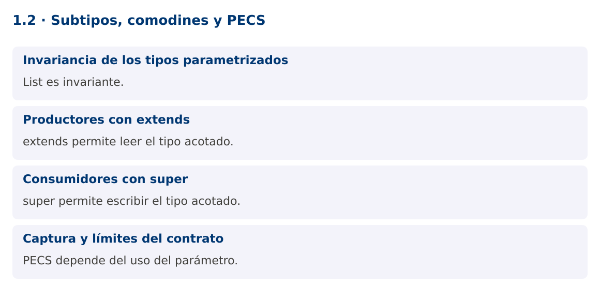

# Programación Aplicada

## 1.2. Subtipos, comodines y PECS


**Autor:** Ing. Pablo Torres, Mgtr.  
**Unidad:** 1. Programación genérica  
**Proyecto de trabajo:** CampusMonitor

[Inicio del curso](../../README.md) · [Presentación editable](presentacion.pptx) · [Ver en el navegador](index.html)

---

## 1. Conceptos y ejemplos

### Contexto

Las lecturas de temperatura son Double, pero una utilidad de cálculo puede aceptar Number. La herencia entre Integer, Double y Number no se propaga automáticamente a List. El diseño de la firma determina qué se puede leer y escribir de forma segura.

### Antes de empezar

Recupera el avance de [1.1c](../1.1-fundamentos/03-boxing-foreach-varargs/material.md). Conserva sus comandos y evidencias. Revisa el ejemplo completo antes de implementar la PC. Las demostraciones del material se ejecutan separadas del proyecto personal.

<a id="concepto-1"></a>

### 1.1. Invariancia de los tipos parametrizados

Aunque Integer extiende Number, List<Integer> no es subtipo de List<Number>. Si esa asignación fuera válida, una referencia List<Number> permitiría insertar un Double en una lista destinada a Integer. La invariancia evita esa contradicción. No se resuelve añadiendo un cast: un cast no comprueba todos los elementos y puede posponer el fallo.

La compatibilidad se expresa con comodines. List<?> representa una lista de un tipo desconocido. Puedes recuperar elementos como Object y consultar tamaño o vaciado, pero no insertar un valor concreto con seguridad. Desconocido no significa que la lista mezcle libremente todos los tipos.

```java
List<Integer> ocupacion = List.of(10, 12);
List<? extends Number> lectura = ocupacion;
Number primero = lectura.get(0);
```

<a id="concepto-2"></a>

### 1.2. Productores con extends

List<? extends Number> representa una lista de algún subtipo de Number. Se puede leer cada elemento como Number. No permite añadir un Integer o un Double porque el subtipo concreto es desconocido. La lista podría ser List<BigDecimal>. Esta restricción se aplica a la referencia con comodín y no convierte el objeto subyacente en inmutable.

Usa extends cuando el parámetro produce valores para el algoritmo. Un sumador solo necesita leer y convertir a double. Este contrato acepta listas Integer y Double. Recuerda que una suma numérica no valida unidades y que double no sirve para todos los dominios, como importes monetarios exactos.

<a id="concepto-3"></a>

### 1.3. Consumidores con super

List<? super Integer> representa una lista de Integer o de alguno de sus supertipos. Es seguro añadir Integer. Al leer, el tipo garantizado es Object, porque una List<Number> podría contener Double y una List<Object> podría contener cadenas.

PECS resume Producer Extends, Consumer Super. Se aplica a parámetros de entrada según su papel en el algoritmo. En copiar, el origen produce T y el destino consume T. Si un parámetro se lee y escribe con el mismo tipo concreto, una List<T> suele ser más adecuada. Evita devolver comodines sin necesidad porque obliga al cliente a gestionar tipos desconocidos.

```java
static <T> void copiar(List<? extends T> origen, List<? super T> destino) {
    destino.addAll(origen);
}
```

<a id="concepto-4"></a>

### 1.4. Captura y límites del contrato

El compilador captura el comodín como un tipo desconocido consistente. Un método auxiliar genérico puede aprovechar esa captura para operaciones como intercambiar elementos de una misma lista. La necesidad de ese auxiliar no implica que deba usarse un cast sin comprobar.

La firma tampoco garantiza mutabilidad. List.of crea una lista no modificable, por lo que usarla como destino de copiar lanza UnsupportedOperationException. Documenta las precondiciones: el destino debe aceptar inserciones y los valores deben respetar la política de nulos. Tipo, mutabilidad y reglas del dominio son dimensiones independientes.

### Mapa de conceptos



---

<a id="demostracion"></a>

## 2. Demostración guiada

### 2.1. Problema y contrato

Las lecturas de temperatura son Double, pero una utilidad de cálculo puede aceptar Number. La herencia entre Integer, Double y Number no se propaga automáticamente a List. El diseño de la firma determina qué se puede leer y escribir de forma segura.

La implementación siguiente es una demostración resuelta. La PC de la sección 3 requiere desarrollar una ampliación propia sobre CampusMonitor.

**Archivo completo:** [ComodinesDemo.java](ejemplos/ComodinesDemo.java).

```java
package edu.ups.pap.u01;
import java.util.*;
public class ComodinesDemo {
    static double sumar(List<? extends Number> valores) {
        double total = 0;
        for (Number n : valores) total += Objects.requireNonNull(n).doubleValue();
        return total;
    }
    static <T> void copiar(List<? extends T> origen, List<? super T> destino) {
        destino.addAll(origen);
    }
    public static void main(String[] args) {
        List<Integer> ocupacion = List.of(10,12,8);
        List<Number> acumulado = new ArrayList<>();
        copiar(ocupacion, acumulado);
        copiar(List.of(22.5,24.0), acumulado);
        System.out.println(acumulado);
        System.out.println("Total numérico: " + sumar(acumulado));
        List<Object> auditoria = new ArrayList<>();
        copiar(acumulado, auditoria);
        System.out.println("Elementos auditados: " + auditoria.size());
    }
}
```

### 2.2. Ejecución

Desde la raíz de este repositorio, con JDK 25:

```bash
java 01/1.2-subtipos-comodines/ejemplos/ComodinesDemo.java
```

Con el proyecto Gradle de demostraciones:

```bash
cd demostraciones
./gradlew runDemo -Pdemo=1.2
```

En Windows usa `gradlew.bat`. Ejecuta cada demostración desde una terminal nueva o vuelve a la raíz antes de cambiar de contenido.

### 2.3. Resultado y lectura de la ejecución

```text
[10, 12, 8, 22.5, 24.0]
Total numérico: 76.5
Elementos auditados: 5
```

1. Identifica los datos iniciales y las precondiciones que la demostración valida.
2. Sigue las llamadas desde `main` o `loop` y relaciona las operaciones con los conceptos de la sección 1.
3. Contrasta el resultado con la salida esperada del ejemplo. Si el orden es concurrente, compara la invariante y no el orden de impresión.
4. Cambia un dato del ejemplo y predice el resultado antes de ejecutarlo. Registra cualquier diferencia y su causa.

---

<a id="pc"></a>

## 3. PC1.2 · Práctica de clase

### 3.1. Ampliación del proyecto

Esta actividad se resuelve en tu repositorio `icc-pap-campusmonitor-apellido`. Mantén la funcionalidad anterior. No reemplaces tu solución con los archivos de demostración del material.

1. Generaliza el método de copia del catálogo con origen productor y destino consumidor. Usa una lista destino modificable.
2. Demuestra copias Integer a Number y Number a Object. Mantén separados los promedios por unidad en CampusMonitor.
3. Incluye dos contraejemplos comentados: asignación List<Integer> a List<Number> e inserción en List<? extends Number>. Explica por qué no compilan.

### 3.2. Comprobación y evidencia

Prueba los casos de esta sección y registra entradas, salida real y explicación. Incluye una ejecución normal y un caso de error. La evidencia debe permitir repetir el resultado desde el commit entregado.

| Caso que debes revisar | Comportamiento requerido |
|---|---|
| Origen Integer, destino Number | Copia válida |
| Destino List.of | Precondición incumplida documentada |
| Origen vacío | Destino permanece igual |

En `evidencias/PC1.2.md` agrega: cambio realizado, archivos principales, comandos de ejecución, tabla de pruebas y enlace al commit final. No añadas una rúbrica a esta PC.

### 3.3. Commits de la actividad

```bash
git status
git add src evidencias
git commit -m "feat(pc1.2): subtipos-comodines-y-pecs"
git push
git log -1 --format=%H
```

Ajusta las rutas de `git add` a los archivos que realmente creaste. Incluye también configuración o SQL si cambiaste esos archivos. El último comando muestra el hash real que debes enlazar en tu evidencia.

### Lo esencial

- List es invariante.
- extends permite leer el tipo acotado.
- super permite escribir el tipo acotado.
- PECS depende del uso del parámetro.

## Referencias técnicas

- [Genéricos en Java](https://dev.java/learn/generics/)
- [Reflexión](https://dev.java/learn/reflection/)
- [API Java 25](https://docs.oracle.com/en/java/javase/25/docs/api/index.html)
