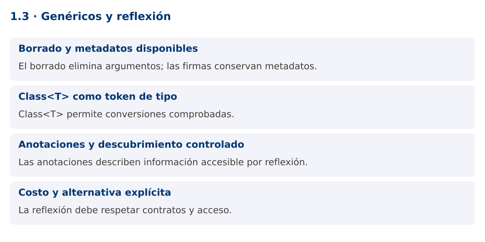

# Programación Aplicada

## 1.3. Genéricos y reflexión


**Autor:** Ing. Pablo Torres, Mgtr.  
**Unidad:** 1. Programación genérica  
**Proyecto de trabajo:** CampusMonitor

[Inicio del curso](../../README.md) · [Presentación editable](presentacion.pptx) · [Ver en el navegador](index.html)

---

## 1. Conceptos y ejemplos

### Contexto

CampusMonitor puede registrar proveedores de sensores por nombre y crear adaptadores bajo demanda. La reflexión permite inspeccionar clases en ejecución, pero debe conservar contratos verificables y respetar el encapsulamiento.

### Antes de empezar

Recupera el avance de [1.2](../1.2-subtipos-comodines/material.md). Conserva sus comandos y evidencias. Revisa el ejemplo completo antes de implementar la PC. Las demostraciones del material se ejecutan separadas del proyecto personal.

<a id="concepto-1"></a>

### 1.1. Borrado y metadatos disponibles

El compilador borra buena parte de los argumentos genéricos al producir bytecode. Una ArrayList<String> y una ArrayList<Integer> comparten clase en ejecución. No puede preguntarse de forma general si un objeto es una List<String>. El compilador inserta conversiones y, cuando hace falta, métodos puente para conservar polimorfismo.

Algunas declaraciones conservan su firma genérica como metadatos. Field.getGenericType puede describir List<String> cuando el campo fue declarado así. Esto informa de la declaración, no certifica que los objetos actuales sean correctos si alguien utilizó tipos crudos o reflexión insegura. Diferencia Class, Type, ParameterizedType y TypeVariable al inspeccionar una firma.

<a id="concepto-2"></a>

### 1.2. Class<T> como token de tipo

Un argumento Class<T> transporta una clase conocida a una operación genérica. Class.cast realiza una comprobación en ejecución, y asSubclass verifica que una clase implemente el contrato esperado. Esa técnica es útil en fábricas o deserializadores y es más clara que una conversión unchecked.

getDeclaredConstructor().newInstance() exige un constructor compatible y accesible. La creación puede fallar por ausencia del constructor, acceso restringido o una excepción lanzada por el constructor. ReflectiveOperationException agrupa varios fallos relacionados, pero conviene preservar su causa y comunicar qué proveedor no pudo construirse.

```java
static <T> T crear(Class<T> tipo) throws ReflectiveOperationException {
    return tipo.getDeclaredConstructor().newInstance();
}
```

<a id="concepto-3"></a>

### 1.3. Anotaciones y descubrimiento controlado

Una anotación con RetentionPolicy.RUNTIME queda disponible para reflexión. Target restringe dónde puede usarse. Puede servir para identificar un adaptador o describir una unidad. No ejecuta código por sí misma: el programa que la inspecciona decide qué hacer.

Para cargar extensiones, prefiere un registro de clases permitido o ServiceLoader. No aceptes desde un archivo externo cualquier nombre de clase para ejecutarlo. Tampoco uses setAccessible(true) para saltar el diseño del modelo. En Java modular, los paquetes abiertos y exportados condicionan el acceso. La reflexión debe tener un propósito concreto y una superficie acotada.

<a id="concepto-4"></a>

### 1.4. Costo y alternativa explícita

La reflexión desplaza errores desde compilación a ejecución y puede hacer más difícil refactorizar. Un registro Map<String, Supplier<Sensor>> es una alternativa cuando los tipos ya se conocen. Permite crear objetos sin buscar constructores por nombre y conserva comprobación estática.

La demostración usa reflexión para inspección y construcción controlada. La PC compara esa vía con una fábrica explícita. En ambos casos, el resto de la aplicación debe depender de una interfaz estable, no de los detalles de cómo se creó la instancia.

### Mapa de conceptos



---

<a id="demostracion"></a>

## 2. Demostración guiada

### 2.1. Problema y contrato

CampusMonitor puede registrar proveedores de sensores por nombre y crear adaptadores bajo demanda. La reflexión permite inspeccionar clases en ejecución, pero debe conservar contratos verificables y respetar el encapsulamiento.

La implementación siguiente es una demostración resuelta. La PC de la sección 3 requiere desarrollar una ampliación propia sobre CampusMonitor.

**Archivo completo:** [ReflexionDemo.java](ejemplos/ReflexionDemo.java).

```java
package edu.ups.pap.u01;
import java.lang.annotation.*;
import java.lang.reflect.*;
import java.util.*;
public class ReflexionDemo {
    @Retention(RetentionPolicy.RUNTIME) @Target(ElementType.TYPE)
    @interface Unidad { String value(); }
    interface Sensor { double leer(); }
    @Unidad("°C")
    public static class Temperatura implements Sensor {
        public Temperatura() {}
        public double leer() { return 23.5; }
    }
    static class Historial { List<Double> valores = new ArrayList<>(); }
    static <T> T crear(Class<T> tipo) throws ReflectiveOperationException {
        return tipo.getDeclaredConstructor().newInstance();
    }
    public static void main(String[] args) throws ReflectiveOperationException {
        Map<String,Class<? extends Sensor>> permitidos = Map.of("temp",Temperatura.class);
        Class<? extends Sensor> tipo = permitidos.get("temp");
        Sensor sensor = crear(tipo);
        System.out.println(sensor.leer() + " " + tipo.getAnnotation(Unidad.class).value());
        Type firma = Historial.class.getDeclaredField("valores").getGenericType();
        System.out.println(firma.getTypeName());
        System.out.println(new ArrayList<String>().getClass() == new ArrayList<Integer>().getClass());
    }
}
```

### 2.2. Ejecución

Desde la raíz de este repositorio, con JDK 25:

```bash
java 01/1.3-genericos-reflexion/ejemplos/ReflexionDemo.java
```

Con el proyecto Gradle de demostraciones:

```bash
cd demostraciones
./gradlew runDemo -Pdemo=1.3
```

En Windows usa `gradlew.bat`. Ejecuta cada demostración desde una terminal nueva o vuelve a la raíz antes de cambiar de contenido.

### 2.3. Resultado y lectura de la ejecución

```text
23.5 °C
java.util.List<java.lang.Double>
true
```

1. Identifica los datos iniciales y las precondiciones que la demostración valida.
2. Sigue las llamadas desde `main` o `loop` y relaciona las operaciones con los conceptos de la sección 1.
3. Contrasta el resultado con la salida esperada del ejemplo. Si el orden es concurrente, compara la invariante y no el orden de impresión.
4. Cambia un dato del ejemplo y predice el resultado antes de ejecutarlo. Registra cualquier diferencia y su causa.

---

<a id="pc"></a>

## 3. PC1.3 · Práctica de clase

### 3.1. Ampliación del proyecto

Esta actividad se resuelve en tu repositorio `icc-pap-campusmonitor-apellido`. Mantén la funcionalidad anterior. No reemplaces tu solución con los archivos de demostración del material.

1. Agrega a CampusMonitor una interfaz FuenteLecturas y dos implementaciones simuladas con constructor público sin argumentos.
2. Crea un registro permitido por nombre y una fábrica con Class<T>. Inspecciona una anotación de unidad sin acceder a campos privados.
3. Resuelve el mismo registro con Supplier y compara qué errores detecta cada alternativa. Un proveedor inexistente debe producir un mensaje controlado.

### 3.2. Comprobación y evidencia

Prueba los casos de esta sección y registra entradas, salida real y explicación. Incluye una ejecución normal y un caso de error. La evidencia debe permitir repetir el resultado desde el commit entregado.

| Caso que debes revisar | Comportamiento requerido |
|---|---|
| Proveedor registrado | Instancia que implementa el contrato |
| Nombre desconocido | Rechazo sin Class.forName arbitrario |
| Campo List<Double> | Firma de la declaración visible |

En `evidencias/PC1.3.md` agrega: cambio realizado, archivos principales, comandos de ejecución, tabla de pruebas y enlace al commit final. No añadas una rúbrica a esta PC.

### 3.3. Commits de la actividad

```bash
git status
git add src evidencias
git commit -m "feat(pc1.3): genericos-y-reflexion"
git push
git log -1 --format=%H
```

Ajusta las rutas de `git add` a los archivos que realmente creaste. Incluye también configuración o SQL si cambiaste esos archivos. El último comando muestra el hash real que debes enlazar en tu evidencia.

### Lo esencial

- El borrado elimina argumentos; las firmas conservan metadatos.
- Class<T> permite conversiones comprobadas.
- Las anotaciones describen información accesible por reflexión.
- La reflexión debe respetar contratos y acceso.

## Referencias técnicas

- [Genéricos en Java](https://dev.java/learn/generics/)
- [Reflexión](https://dev.java/learn/reflection/)
- [API Java 25](https://docs.oracle.com/en/java/javase/25/docs/api/index.html)
