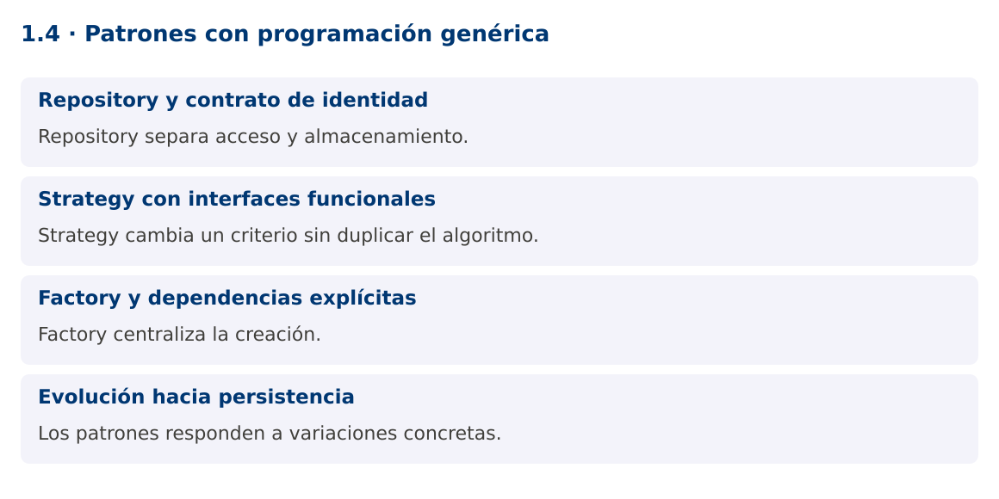

# Programación Aplicada

## 1.4. Patrones con programación genérica


**Autor:** Ing. Pablo Torres, Mgtr.  
**Unidad:** 1. Programación genérica  
**Proyecto de trabajo:** CampusMonitor

[Inicio del curso](../../README.md) · [Presentación editable](presentacion.pptx) · [Ver en el navegador](index.html)

---

## 1. Conceptos y ejemplos

### Contexto

El catálogo debe guardar sensores y lecturas sin duplicar operaciones. También necesita cambiar criterios de selección y fuentes de datos. Los patrones ayudan cuando corresponden a variaciones reales del sistema.

### Antes de empezar

Recupera el avance de [1.3](../1.3-genericos-reflexion/material.md). Conserva sus comandos y evidencias. Revisa el ejemplo completo antes de implementar la PC. Las demostraciones del material se ejecutan separadas del proyecto personal.

<a id="concepto-1"></a>

### 1.1. Repository y contrato de identidad

Un Repository ofrece operaciones de colección sobre objetos del dominio y concentra decisiones de almacenamiento. Un contrato Repository<ID,T> separa el tipo de identificador del tipo de entidad. Definir guardar, buscar y listar obliga a decidir qué significa una identidad duplicada y qué ocurre si no hay coincidencia.

En memoria, LinkedHashMap conserva el orden de inserción y simplifica búsquedas por clave. Devolver una copia de la colección evita que el cliente elimine elementos del repositorio sin pasar por sus operaciones. Esa copia es superficial: si las entidades son mutables, aún pueden alterarse. Los records ayudan a mantener datos de valor inmutables.

<a id="concepto-2"></a>

### 1.2. Strategy con interfaces funcionales

Strategy encapsula un comportamiento intercambiable. Comparator<T> ya cumple ese papel para ordenar, y Predicate<T> para seleccionar. No hace falta crear una jerarquía de clases cuando una interfaz funcional expresa toda la variación. En CampusMonitor, un criterio puede escoger sensores por ubicación y otro por estado.

La estrategia no debería modificar silenciosamente la colección que recibe. Separa las consultas de las actualizaciones y conserva funciones pequeñas. Si la comparación depende de unidades, valida la compatibilidad antes de aplicar el criterio. El uso de genéricos garantiza tipos compatibles, no equivalencia de magnitudes.

<a id="concepto-3"></a>

### 1.3. Factory y dependencias explícitas

Una fábrica concentra cómo se construye un objeto. Supplier<T> permite inyectar la construcción sin reflexión. El consumidor solicita instancias a la fábrica y utiliza únicamente el contrato. Esto facilita cambiar una fuente simulada por una fuente serial en la unidad 5.

Repository, Strategy y Factory se pueden combinar, pero no deben añadirse por obligación. Una clase genérica que necesita veinte parámetros o múltiples casts suele indicar responsabilidades mezcladas. Diseña primero el caso concreto y generaliza la parte repetida que mantiene el mismo comportamiento.

<a id="concepto-4"></a>

### 1.4. Evolución hacia persistencia

El repositorio en memoria desaparecerá al cerrar el programa. Más adelante, una implementación JDBC mantendrá el contrato de consulta, pero incorporará errores de E/S, transacciones y restricciones de base de datos. Esas diferencias no deben esconderse detrás de promesas falsas: guardar puede fallar y varias operaciones pueden requerir una unidad transaccional.

La demostración ofrece un repositorio reutilizable sin capas innecesarias. La PL de esta unidad pide un catálogo autónomo con criterios intercambiables. No incluye base de datos, hilos ni hardware para que el diseño genérico pueda revisarse por separado.

### Mapa de conceptos



---

<a id="demostracion"></a>

## 2. Demostración guiada

### 2.1. Problema y contrato

El catálogo debe guardar sensores y lecturas sin duplicar operaciones. También necesita cambiar criterios de selección y fuentes de datos. Los patrones ayudan cuando corresponden a variaciones reales del sistema.

La implementación siguiente es una demostración resuelta. La PC de la sección 3 requiere desarrollar una ampliación propia sobre CampusMonitor.

**Archivo completo:** [PatronesDemo.java](ejemplos/PatronesDemo.java).

```java
package edu.ups.pap.u01;
import java.util.*;
import java.util.function.*;
public class PatronesDemo {
    record Sensor(String id, String ubicacion) {}
    interface Repositorio<ID,T> {
        void guardar(T valor);
        Optional<T> buscar(ID id);
        List<T> listar();
    }
    static class Memoria<ID,T> implements Repositorio<ID,T> {
        private final Map<ID,T> datos = new LinkedHashMap<>();
        private final Function<T,ID> identidad;
        Memoria(Function<T,ID> identidad) { this.identidad = identidad; }
        public void guardar(T valor) {
            Objects.requireNonNull(valor);
            ID id = Objects.requireNonNull(identidad.apply(valor));
            if (datos.putIfAbsent(id,valor) != null) throw new IllegalArgumentException("ID duplicado");
        }
        public Optional<T> buscar(ID id) { return Optional.ofNullable(datos.get(id)); }
        public List<T> listar() { return List.copyOf(datos.values()); }
    }
    public static void main(String[] args) {
        Repositorio<String,Sensor> repo = new Memoria<>(Sensor::id);
        Supplier<Sensor> fabrica = () -> new Sensor("S01","Lab");
        repo.guardar(fabrica.get());
        repo.guardar(new Sensor("S02","Biblioteca"));
        Predicate<Sensor> enLab = s -> s.ubicacion().equals("Lab");
        System.out.println(repo.listar().stream().filter(enLab).toList());
        System.out.println(repo.buscar("S99"));
        try { repo.guardar(fabrica.get()); }
        catch (IllegalArgumentException e) { System.out.println(e.getMessage()); }
    }
}
```

### 2.2. Ejecución

Desde la raíz de este repositorio, con JDK 25:

```bash
java 01/1.4-patrones-genericos/ejemplos/PatronesDemo.java
```

Con el proyecto Gradle de demostraciones:

```bash
cd demostraciones
./gradlew runDemo -Pdemo=1.4
```

En Windows usa `gradlew.bat`. Ejecuta cada demostración desde una terminal nueva o vuelve a la raíz antes de cambiar de contenido.

### 2.3. Resultado y lectura de la ejecución

```text
[Sensor[id=S01, ubicacion=Lab]]
Optional.empty
ID duplicado
```

1. Identifica los datos iniciales y las precondiciones que la demostración valida.
2. Sigue las llamadas desde `main` o `loop` y relaciona las operaciones con los conceptos de la sección 1.
3. Contrasta el resultado con la salida esperada del ejemplo. Si el orden es concurrente, compara la invariante y no el orden de impresión.
4. Cambia un dato del ejemplo y predice el resultado antes de ejecutarlo. Registra cualquier diferencia y su causa.

---

<a id="pc"></a>

## 3. PC1.4 · Práctica de clase

### 3.1. Ampliación del proyecto

Esta actividad se resuelve en tu repositorio `icc-pap-campusmonitor-apellido`. Mantén la funcionalidad anterior. No reemplaces tu solución con los archivos de demostración del material.

1. Integra Repositorio<ID,T> en CampusMonitor para Sensor y Lectura<Double>, con identidades explícitas y sin casts no comprobados.
2. Agrega estrategias de consulta por ubicación y por umbral. El repositorio debe devolver listas que no permitan alterar su estructura interna.
3. Registra fuentes con Supplier y conserva los comandos anteriores. Documenta dónde existe una variación que justifica cada patrón.

### 3.2. Comprobación y evidencia

Prueba los casos de esta sección y registra entradas, salida real y explicación. Incluye una ejecución normal y un caso de error. La evidencia debe permitir repetir el resultado desde el commit entregado.

| Caso que debes revisar | Comportamiento requerido |
|---|---|
| Insertar dos IDs distintos | Ambos consultables |
| Insertar ID existente | Error controlado, sin reemplazo silencioso |
| Buscar ID ausente | Optional.empty |

En `evidencias/PC1.4.md` agrega: cambio realizado, archivos principales, comandos de ejecución, tabla de pruebas y enlace al commit final. No añadas una rúbrica a esta PC.

### 3.3. Commits de la actividad

```bash
git status
git add src evidencias
git commit -m "feat(pc1.4): patrones-con-programacion-generica"
git push
git log -1 --format=%H
```

Ajusta las rutas de `git add` a los archivos que realmente creaste. Incluye también configuración o SQL si cambiaste esos archivos. El último comando muestra el hash real que debes enlazar en tu evidencia.

### Lo esencial

- Repository separa acceso y almacenamiento.
- Strategy cambia un criterio sin duplicar el algoritmo.
- Factory centraliza la creación.
- Los patrones responden a variaciones concretas.

## Referencias técnicas

- [Genéricos en Java](https://dev.java/learn/generics/)
- [Reflexión](https://dev.java/learn/reflection/)
- [API Java 25](https://docs.oracle.com/en/java/javase/25/docs/api/index.html)
