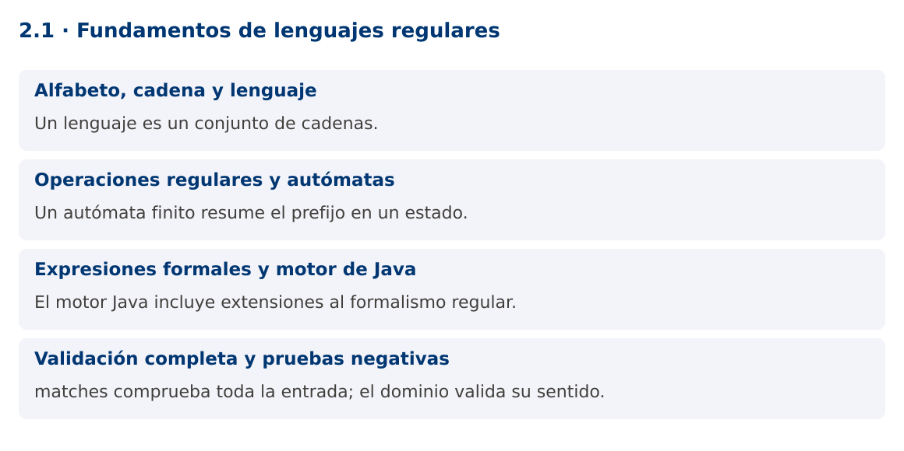

# Programación Aplicada

## 2.1. Fundamentos de lenguajes regulares


**Autor:** Ing. Pablo Torres, Mgtr.  
**Unidad:** 2. Expresiones regulares  
**Proyecto de trabajo:** CampusMonitor

[Inicio del curso](../../README.md) · [Presentación editable](presentacion.pptx) · [Ver en el navegador](index.html)

---

## 1. Conceptos y ejemplos

### Contexto

CampusMonitor recibirá líneas como S01;23.5. Antes de convertirlas a objetos necesitamos definir qué textos pertenecen al formato aceptado. Una expresión regular describe una estructura léxica y un autómata ayuda a explicar cómo se reconoce.

### Antes de empezar

Recupera el avance de [1.4](../../01/1.4-patrones-genericos/material.md). Conserva sus comandos y evidencias. Revisa el ejemplo completo antes de implementar la PC. Las demostraciones del material se ejecutan separadas del proyecto personal.


La ilustración sirve como analogía. El contrato técnico se define en el texto y el código.

<a id="concepto-1"></a>

### 1.1. Alfabeto, cadena y lenguaje

Un alfabeto es un conjunto de símbolos. Una cadena es una secuencia finita de esos símbolos, incluida la cadena vacía ε. Un lenguaje es un conjunto de cadenas sobre un alfabeto. Para identificadores de sensor, podemos definir S seguida de exactamente dos dígitos ASCII: S00 a S99.

El patrón no explica aún qué sensor existe ni si está autorizado. Reconoce una forma. Después se valida el significado con reglas del dominio. Esta separación evita expresiones difíciles de mantener que intentan resolver relaciones de datos. En CampusMonitor, una trama puede tener un ID bien formado y aun así referirse a un sensor no registrado.

<a id="concepto-2"></a>

### 1.2. Operaciones regulares y autómatas

Las operaciones básicas son unión, concatenación y clausura de Kleene. Unión admite alternativas. Concatenación exige una secuencia. La estrella permite cero o más repeticiones. Los lenguajes regulares pueden reconocerse mediante autómatas finitos. Un autómata mantiene un estado que resume la parte relevante del prefijo leído.

Para S y dos dígitos, q0 espera S, q1 espera el primer dígito, q2 el segundo y q3 acepta únicamente si terminó la entrada. Una transición inválida rechaza. El autómata no necesita recordar una cantidad ilimitada de símbolos. La demostración implementa esta lógica y la compara con Pattern, haciendo visible la equivalencia para este lenguaje.

<a id="concepto-3"></a>

### 1.3. Expresiones formales y motor de Java

La sintaxis de java.util.regex incorpora funciones adicionales a las expresiones regulares formales, como referencias a grupos previamente capturados. No todos los patrones admitidos por el motor describen lenguajes regulares en el sentido teórico. Por ejemplo, exigir la repetición exacta de una subcadena arbitraria puede necesitar memoria no acotada.

Java utiliza un motor con retroceso. Una expresión ambigua puede explorar muchas alternativas antes de rechazar un texto. El hecho de que la sintaxis sea breve no garantiza buen rendimiento. En los siguientes temas se evitarán cuantificadores anidados ambiguos y se limitará el tamaño de las entradas externas.

<a id="concepto-4"></a>

### 1.4. Validación completa y pruebas negativas

Matcher.matches exige que toda la región de entrada coincida. Matcher.find busca una coincidencia dentro del texto. Para validar un identificador completo, matches expresa la intención. Usar find podría aceptar XXS01YY porque contiene una subcadena válida.

Las pruebas deben incluir longitudes cercanas al límite, símbolos de otro alfabeto, prefijos, sufijos y cadena vacía. [0-9] limita los dígitos a ASCII de forma explícita. La categoría Unicode de dígitos tiene un alcance diferente y debe decidirse según el protocolo. La PC definirá primero el lenguaje y después la expresión.

### Mapa de conceptos



---

<a id="demostracion"></a>

## 2. Demostración guiada

### 2.1. Problema y contrato

CampusMonitor recibirá líneas como S01;23.5. Antes de convertirlas a objetos necesitamos definir qué textos pertenecen al formato aceptado. Una expresión regular describe una estructura léxica y un autómata ayuda a explicar cómo se reconoce.

La implementación siguiente es una demostración resuelta. La PC de la sección 3 requiere desarrollar una ampliación propia sobre CampusMonitor.

**Archivo completo:** [LenguajeDemo.java](ejemplos/LenguajeDemo.java).

```java
package edu.ups.pap.u02;
import java.util.regex.Pattern;
public class LenguajeDemo {
    static boolean automata(String texto) {
        int estado = 0;
        for (char c : texto.toCharArray()) {
            if (estado == 0 && c == 'S') estado = 1;
            else if ((estado == 1 || estado == 2) && c >= '0' && c <= '9') estado++;
            else return false;
        }
        return estado == 3;
    }
    public static void main(String[] args) {
        Pattern patron = Pattern.compile("S[0-9]{2}");
        for (String s : new String[]{"S01","S9","XS01","S001","S99",""}) {
            boolean manual = automata(s), regex = patron.matcher(s).matches();
            if (manual != regex) throw new AssertionError(s);
            System.out.println("'" + s + "' -> " + regex);
        }
    }
}
```

### 2.2. Ejecución

Desde la raíz de este repositorio, con JDK 25:

```bash
java 02/2.1-lenguajes-regulares/ejemplos/LenguajeDemo.java
```

Con el proyecto Gradle de demostraciones:

```bash
cd demostraciones
./gradlew runDemo -Pdemo=2.1
```

En Windows usa `gradlew.bat`. Ejecuta cada demostración desde una terminal nueva o vuelve a la raíz antes de cambiar de contenido.

### 2.3. Resultado y lectura de la ejecución

```text
'S01' -> true
'S9' -> false
'XS01' -> false
'S001' -> false
'S99' -> true
'' -> false
```

1. Identifica los datos iniciales y las precondiciones que la demostración valida.
2. Sigue las llamadas desde `main` o `loop` y relaciona las operaciones con los conceptos de la sección 1.
3. Contrasta el resultado con la salida esperada del ejemplo. Si el orden es concurrente, compara la invariante y no el orden de impresión.
4. Cambia un dato del ejemplo y predice el resultado antes de ejecutarlo. Registra cualquier diferencia y su causa.

---

<a id="pc"></a>

## 3. PC2.1 · Práctica de clase

### 3.1. Ampliación del proyecto

Esta actividad se resuelve en tu repositorio `icc-pap-campusmonitor-apellido`. Mantén la funcionalidad anterior. No reemplaces tu solución con los archivos de demostración del material.

1. Especifica el lenguaje de identificadores de CampusMonitor: una letra T u O seguida de tres dígitos ASCII.
2. Implementa un reconocedor por estados y otro con Pattern. Integra la validación antes de registrar sensores.
3. Prueba al menos ocho cadenas que cubran aceptación, rechazo y límites. Explica por qué un ID válido puede no existir en el catálogo.

### 3.2. Comprobación y evidencia

Prueba los casos de esta sección y registra entradas, salida real y explicación. Incluye una ejecución normal y un caso de error. La evidencia debe permitir repetir el resultado desde el commit entregado.

| Caso que debes revisar | Comportamiento requerido |
|---|---|
| T001 y O999 | Aceptados |
| T01, A001, XT001 | Rechazados |
| T001 en catálogo vacío | Formato válido, entidad ausente |

En `evidencias/PC2.1.md` agrega: cambio realizado, archivos principales, comandos de ejecución, tabla de pruebas y enlace al commit final. No añadas una rúbrica a esta PC.

### 3.3. Commits de la actividad

```bash
git status
git add src evidencias
git commit -m "feat(pc2.1): fundamentos-de-lenguajes-regulares"
git push
git log -1 --format=%H
```

Ajusta las rutas de `git add` a los archivos que realmente creaste. Incluye también configuración o SQL si cambiaste esos archivos. El último comando muestra el hash real que debes enlazar en tu evidencia.

### Lo esencial

- Un lenguaje es un conjunto de cadenas.
- Un autómata finito resume el prefijo en un estado.
- El motor Java incluye extensiones al formalismo regular.
- matches comprueba toda la entrada; el dominio valida su sentido.

## Referencias técnicas

- [Pattern, Java 25](https://docs.oracle.com/en/java/javase/25/docs/api/java.base/java/util/regex/Pattern.html)
- [Matcher, Java 25](https://docs.oracle.com/en/java/javase/25/docs/api/java.base/java/util/regex/Matcher.html)
- [Files, Java 25](https://docs.oracle.com/en/java/javase/25/docs/api/java.base/java/nio/file/Files.html)
