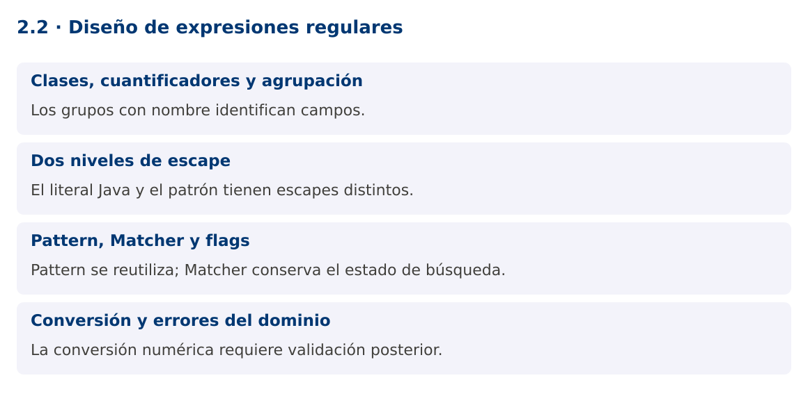

# Programación Aplicada

## 2.2. Diseño de expresiones regulares


**Autor:** Ing. Pablo Torres, Mgtr.  
**Unidad:** 2. Expresiones regulares  
**Proyecto de trabajo:** CampusMonitor

[Inicio del curso](../../README.md) · [Presentación editable](presentacion.pptx) · [Ver en el navegador](index.html)

---

## 1. Conceptos y ejemplos

### Contexto

Las entradas ya tienen identificadores definidos. La siguiente versión de CampusMonitor debe extraer campos de una línea, convertir un valor decimal y registrar errores útiles sin mezclar reconocimiento con persistencia.

### Antes de empezar

Recupera el avance de [2.1](../2.1-lenguajes-regulares/material.md). Conserva sus comandos y evidencias. Revisa el ejemplo completo antes de implementar la PC. Las demostraciones del material se ejecutan separadas del proyecto personal.

<a id="concepto-1"></a>

### 1.1. Clases, cuantificadores y agrupación

Las clases de caracteres delimitan símbolos admitidos. [0-9] acepta un dígito y [A-Z] una letra mayúscula ASCII. Los cuantificadores ?, *, + y {m,n} controlan repetición. Los paréntesis capturan grupos y (?:...) agrupa sin capturar. Usa grupos con nombre para campos semánticos: sensor, valor y unidad son más mantenibles que posiciones numéricas dispersas.

Diseña desde ejemplos positivos y negativos. Un decimal del protocolo puede admitir un signo menos opcional, una parte entera y una fracción opcional con punto. Esa gramática no acepta coma decimal, exponente o NaN. La decisión debe estar en el contrato del protocolo, no depender de la configuración regional del equipo.

<a id="concepto-2"></a>

### 1.2. Dos niveles de escape

El texto de un literal Java se interpreta antes de que Pattern procese la expresión regular. Para expresar el metacarácter de dígito \d en un literal se escribe "\\d". Para un punto literal puede usarse "\\." o la clase "[.]". La demostración utiliza [.] para hacer explícito que el separador decimal es un punto.

Pattern.quote convierte texto externo en un literal del patrón. Matcher.quoteReplacement protege texto externo utilizado como reemplazo, porque $ y la barra inversa tienen significado especial allí. Son funciones diferentes y no intercambiables. Evita concatenar directamente un nombre ingresado por el usuario en una expresión.

```java
Pattern literal = Pattern.compile(Pattern.quote("sensor.a"));
String seguro = Matcher.quoteReplacement("$5");
```

<a id="concepto-3"></a>

### 1.3. Pattern, Matcher y flags

Pattern representa la expresión compilada y puede reutilizarse. Matcher contiene estado de una búsqueda sobre una entrada. Crea un Matcher por operación y no lo compartas entre hilos. Compilar el mismo patrón dentro de un bucle añade trabajo evitable.

CASE_INSENSITIVE modifica la comparación de letras, MULTILINE cambia el comportamiento de ^ y $ respecto de las líneas y DOTALL permite que el punto coincida con saltos de línea. Ninguno de esos flags debe activarse por costumbre. Para protocolos de una línea, el diseño más claro suele rechazar saltos y utilizar matches sobre una línea ya delimitada.

<a id="concepto-4"></a>

### 1.4. Conversión y errores del dominio

Una captura sigue siendo texto. Double.parseDouble transforma el valor y puede lanzar NumberFormatException. Incluso una cadena numérica muy larga puede producir infinito, por lo que se comprueba Double.isFinite. Después se validan rangos físicos y unidades.

La demostración devuelve un record y usa IllegalArgumentException para comunicar una trama inválida. En un importador de lotes, estos errores deben registrarse por línea en lugar de abortar todos los datos. No escondas el error convirtiéndolo a cero: cero puede ser una medida real y produciría un registro incorrecto.

### Mapa de conceptos



---

<a id="demostracion"></a>

## 2. Demostración guiada

### 2.1. Problema y contrato

Las entradas ya tienen identificadores definidos. La siguiente versión de CampusMonitor debe extraer campos de una línea, convertir un valor decimal y registrar errores útiles sin mezclar reconocimiento con persistencia.

La implementación siguiente es una demostración resuelta. La PC de la sección 3 requiere desarrollar una ampliación propia sobre CampusMonitor.

**Archivo completo:** [RegexDemo.java](ejemplos/RegexDemo.java).

```java
package edu.ups.pap.u02;
import java.util.regex.*;
public class RegexDemo {
    record Trama(String sensor, double valor, String unidad) {}
    static final Pattern P = Pattern.compile(
        "(?<sensor>S[0-9]{2});(?<valor>-?[0-9]+(?:[.][0-9]+)?);(?<unidad>C|PCT)");
    static Trama parsear(String linea) {
        if (linea.length() > 80) throw new IllegalArgumentException("Trama demasiado larga");
        Matcher m = P.matcher(linea);
        if (!m.matches()) throw new IllegalArgumentException("Formato inválido");
        double valor = Double.parseDouble(m.group("valor"));
        if (!Double.isFinite(valor)) throw new IllegalArgumentException("Valor no finito");
        return new Trama(m.group("sensor"),valor,m.group("unidad"));
    }
    public static void main(String[] args) {
        for (String s : new String[]{"S01;23.5;C","S02;-2;C","S1;22;C","S01;NaN;C"}) {
            try { System.out.println(parsear(s)); }
            catch (IllegalArgumentException e) { System.out.println(s + ": " + e.getMessage()); }
        }
    }
}
```

### 2.2. Ejecución

Desde la raíz de este repositorio, con JDK 25:

```bash
java 02/2.2-diseno-expresiones/ejemplos/RegexDemo.java
```

Con el proyecto Gradle de demostraciones:

```bash
cd demostraciones
./gradlew runDemo -Pdemo=2.2
```

En Windows usa `gradlew.bat`. Ejecuta cada demostración desde una terminal nueva o vuelve a la raíz antes de cambiar de contenido.

### 2.3. Resultado y lectura de la ejecución

```text
Trama[sensor=S01, valor=23.5, unidad=C]
Trama[sensor=S02, valor=-2.0, unidad=C]
S1;22;C: Formato inválido
S01;NaN;C: Formato inválido
```

1. Identifica los datos iniciales y las precondiciones que la demostración valida.
2. Sigue las llamadas desde `main` o `loop` y relaciona las operaciones con los conceptos de la sección 1.
3. Contrasta el resultado con la salida esperada del ejemplo. Si el orden es concurrente, compara la invariante y no el orden de impresión.
4. Cambia un dato del ejemplo y predice el resultado antes de ejecutarlo. Registra cualquier diferencia y su causa.

---

<a id="pc"></a>

## 3. PC2.2 · Práctica de clase

### 3.1. Ampliación del proyecto

Esta actividad se resuelve en tu repositorio `icc-pap-campusmonitor-apellido`. Mantén la funcionalidad anterior. No reemplaces tu solución con los archivos de demostración del material.

1. Adapta el parser a IDs T001 u O001 del catálogo y a una trama id;valor;unidad. Usa grupos con nombre.
2. Limita la entrada a 80 caracteres y admite únicamente unidades C y PERSONAS. Comprueba que ocupación sea un entero no negativo.
3. Integra un comando validar-trama que muestre cada campo o un error preciso. Conserva la cadena original en la evidencia de errores.

### 3.2. Comprobación y evidencia

Prueba los casos de esta sección y registra entradas, salida real y explicación. Incluye una ejecución normal y un caso de error. La evidencia debe permitir repetir el resultado desde el commit entregado.

| Caso que debes revisar | Comportamiento requerido |
|---|---|
| T001;23.5;C | Temperatura válida |
| O001;12;PERSONAS | Ocupación válida |
| O001;12.5;PERSONAS | Formato numérico válido, regla de dominio rechazada |

En `evidencias/PC2.2.md` agrega: cambio realizado, archivos principales, comandos de ejecución, tabla de pruebas y enlace al commit final. No añadas una rúbrica a esta PC.

### 3.3. Commits de la actividad

```bash
git status
git add src evidencias
git commit -m "feat(pc2.2): diseno-de-expresiones-regulares"
git push
git log -1 --format=%H
```

Ajusta las rutas de `git add` a los archivos que realmente creaste. Incluye también configuración o SQL si cambiaste esos archivos. El último comando muestra el hash real que debes enlazar en tu evidencia.

### Lo esencial

- Los grupos con nombre identifican campos.
- El literal Java y el patrón tienen escapes distintos.
- Pattern se reutiliza; Matcher conserva el estado de búsqueda.
- La conversión numérica requiere validación posterior.

## Referencias técnicas

- [Pattern, Java 25](https://docs.oracle.com/en/java/javase/25/docs/api/java.base/java/util/regex/Pattern.html)
- [Matcher, Java 25](https://docs.oracle.com/en/java/javase/25/docs/api/java.base/java/util/regex/Matcher.html)
- [Files, Java 25](https://docs.oracle.com/en/java/javase/25/docs/api/java.base/java/nio/file/Files.html)
