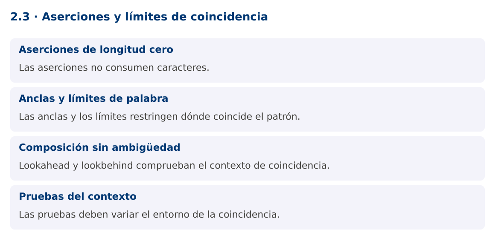

# Programación Aplicada

## 2.3. Aserciones y límites de coincidencia


**Autor:** Ing. Pablo Torres, Mgtr.  
**Unidad:** 2. Expresiones regulares  
**Proyecto de trabajo:** CampusMonitor

[Inicio del curso](../../README.md) · [Presentación editable](presentacion.pptx) · [Ver en el navegador](index.html)

---

## 1. Conceptos y ejemplos

### Contexto

En los registros de diagnóstico aparecen etiquetas mezcladas con unidades y estados. A veces se necesita encontrar un valor únicamente si está acompañado por un contexto, sin incluir ese contexto en el resultado.

### Antes de empezar

Recupera el avance de [2.2](../2.2-diseno-expresiones/material.md). Conserva sus comandos y evidencias. Revisa el ejemplo completo antes de implementar la PC. Las demostraciones del material se ejecutan separadas del proyecto personal.

<a id="concepto-1"></a>

### 1.1. Aserciones de longitud cero

Una aserción verifica una condición en una posición de la entrada y no consume caracteres. ^, $, límites de palabra y lookarounds pertenecen a esta familia. La coincidencia puede depender de símbolos anteriores o posteriores que no forman parte del texto capturado.

Lookahead positivo (?=...) exige lo que sigue y el negativo (?!...) lo prohíbe. Lookbehind positivo (?<=...) exige lo anterior y el negativo (?<!...) lo prohíbe. Diseña primero la coincidencia que deseas devolver y luego las condiciones de contexto. Si una captura normal produce una solución más clara, no hace falta sustituirla por aserciones.

<a id="concepto-2"></a>

### 1.2. Anclas y límites de palabra

^ y $ pueden depender del modo multilínea, y $ admite ciertas posiciones antes de un terminador final. Para límites absolutos del texto, Java ofrece \A y \z. Con Matcher.matches normalmente no hace falta añadir anclas para exigir coincidencia total. El límite \b se relaciona con caracteres de palabra, no con cualquier separador visual.

En protocolos definidos conviene escribir límites explícitos. Para extraer TEMP= seguido de un decimal y C, un lookbehind fijo reconoce la etiqueta y un lookahead comprueba la unidad. Rechaza coincidencias parciales dentro de tokens mayores. La elección de espacios permitidos debe estar documentada.

<a id="concepto-3"></a>

### 1.3. Composición sin ambigüedad

Varias aserciones al inicio pueden verificar condiciones independientes sobre una misma entrada. Esto se usa en validadores, pero una sucesión larga puede ser menos legible que varias comprobaciones de dominio. No uses una regex para comparar dos números ni para comprobar relaciones con una base de datos.

Evita lookbehinds de longitud variable complejos aunque el motor acepte ciertas variantes. Los límites fijos facilitan explicar y probar el patrón. Los cuantificadores anidados y alternativas que reconocen el mismo prefijo pueden producir retroceso costoso. Los grupos atómicos y cuantificadores posesivos cambian la exploración y pueden alterar el conjunto de coincidencias, así que requieren pruebas específicas.

<a id="concepto-4"></a>

### 1.4. Pruebas del contexto

Las pruebas de una aserción deben variar tanto el fragmento buscado como su entorno. Mantén el mismo número y cambia la etiqueta, la unidad y los separadores. Así compruebas que el patrón verifica la condición y no acepta la cifra por accidente.

Matcher.find avanza entre coincidencias y también maneja coincidencias vacías. En extracción de valores numéricos conviene que la parte consumida tenga al menos un carácter. El ejemplo extrae temperaturas solo tras TEMP= y antes de C seguida de espacio o final. No valida una línea completa: selecciona ocurrencias dentro de un texto.

### Mapa de conceptos



---

<a id="demostracion"></a>

## 2. Demostración guiada

### 2.1. Problema y contrato

En los registros de diagnóstico aparecen etiquetas mezcladas con unidades y estados. A veces se necesita encontrar un valor únicamente si está acompañado por un contexto, sin incluir ese contexto en el resultado.

La implementación siguiente es una demostración resuelta. La PC de la sección 3 requiere desarrollar una ampliación propia sobre CampusMonitor.

**Archivo completo:** [AsercionesDemo.java](ejemplos/AsercionesDemo.java).

```java
package edu.ups.pap.u02;
import java.util.regex.*;
public class AsercionesDemo {
    static final Pattern TEMP = Pattern.compile(
        "(?<=TEMP=)-?[0-9]+(?:[.][0-9]+)?(?=C(?: |$))");
    public static void main(String[] args) {
        String texto = "TEMP=23.5C HUM=40PCT TEMP=-2C TEMP=7F TEMP=8CX";
        Matcher m = TEMP.matcher(texto);
        int n = 0;
        while (m.find()) {
            double valor = Double.parseDouble(m.group());
            System.out.println(valor + " en [" + m.start() + "," + m.end() + ")");
            n++;
        }
        if (n != 2) throw new AssertionError("Se esperaban dos temperaturas");
        System.out.println("Coincidencias: " + n);
    }
}
```

### 2.2. Ejecución

Desde la raíz de este repositorio, con JDK 25:

```bash
java 02/2.3-aserciones/ejemplos/AsercionesDemo.java
```

Con el proyecto Gradle de demostraciones:

```bash
cd demostraciones
./gradlew runDemo -Pdemo=2.3
```

En Windows usa `gradlew.bat`. Ejecuta cada demostración desde una terminal nueva o vuelve a la raíz antes de cambiar de contenido.

### 2.3. Resultado y lectura de la ejecución

```text
Extrae 23.5 y -2, con sus posiciones de inicio y fin. No extrae 7F ni 8CX.
Coincidencias: 2
```

1. Identifica los datos iniciales y las precondiciones que la demostración valida.
2. Sigue las llamadas desde `main` o `loop` y relaciona las operaciones con los conceptos de la sección 1.
3. Contrasta el resultado con la salida esperada del ejemplo. Si el orden es concurrente, compara la invariante y no el orden de impresión.
4. Cambia un dato del ejemplo y predice el resultado antes de ejecutarlo. Registra cualquier diferencia y su causa.

---

<a id="pc"></a>

## 3. PC2.3 · Práctica de clase

### 3.1. Ampliación del proyecto

Esta actividad se resuelve en tu repositorio `icc-pap-campusmonitor-apellido`. Mantén la funcionalidad anterior. No reemplaces tu solución con los archivos de demostración del material.

1. Agrega al analizador de CampusMonitor una extracción de valores con etiqueta TEMP= y unidad C usando lookaround.
2. Implementa otra extracción de IDs que no estén inmediatamente precedidos por DESCARTADO:. Mantén una lista de casos del contexto.
3. Compara la solución con grupos de captura sin lookaround. Documenta cuál firma devuelve exactamente el texto deseado.

### 3.2. Comprobación y evidencia

Prueba los casos de esta sección y registra entradas, salida real y explicación. Incluye una ejecución normal y un caso de error. La evidencia debe permitir repetir el resultado desde el commit entregado.

| Caso que debes revisar | Comportamiento requerido |
|---|---|
| TEMP=23.5C | Captura 23.5 |
| TEMP=23.5F o TEMP=23.5CX | No captura |
| DESCARTADO:T001 | ID excluido |

En `evidencias/PC2.3.md` agrega: cambio realizado, archivos principales, comandos de ejecución, tabla de pruebas y enlace al commit final. No añadas una rúbrica a esta PC.

### 3.3. Commits de la actividad

```bash
git status
git add src evidencias
git commit -m "feat(pc2.3): aserciones-y-limites-de-coincidencia"
git push
git log -1 --format=%H
```

Ajusta las rutas de `git add` a los archivos que realmente creaste. Incluye también configuración o SQL si cambiaste esos archivos. El último comando muestra el hash real que debes enlazar en tu evidencia.

### Lo esencial

- Las aserciones no consumen caracteres.
- Las anclas y los límites restringen dónde coincide el patrón.
- Lookahead y lookbehind comprueban el contexto de coincidencia.
- Las pruebas deben variar el entorno de la coincidencia.

## Referencias técnicas

- [Pattern, Java 25](https://docs.oracle.com/en/java/javase/25/docs/api/java.base/java/util/regex/Pattern.html)
- [Matcher, Java 25](https://docs.oracle.com/en/java/javase/25/docs/api/java.base/java/util/regex/Matcher.html)
- [Files, Java 25](https://docs.oracle.com/en/java/javase/25/docs/api/java.base/java/nio/file/Files.html)
