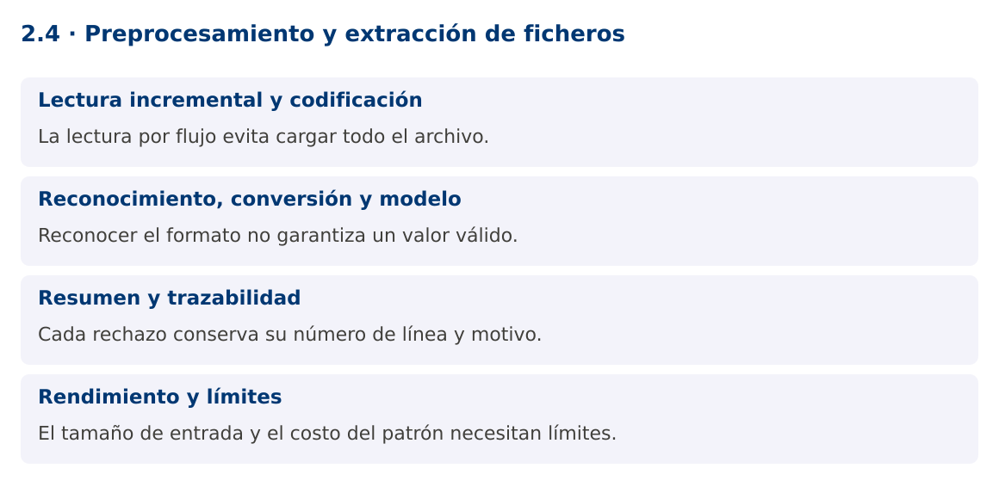

# Programación Aplicada

## 2.4. Preprocesamiento y extracción de ficheros


**Autor:** Ing. Pablo Torres, Mgtr.  
**Unidad:** 2. Expresiones regulares  
**Proyecto de trabajo:** CampusMonitor

[Inicio del curso](../../README.md) · [Presentación editable](presentacion.pptx) · [Ver en el navegador](index.html)

---

## 1. Conceptos y ejemplos

### Contexto

CampusMonitor recibirá un archivo de tramas. Un error en una línea no debería borrar las lecturas válidas de las demás. Se necesita una importación por flujo, un resumen reproducible y un registro de rechazos con su ubicación.

### Antes de empezar

Recupera el avance de [2.3](../2.3-aserciones/material.md). Conserva sus comandos y evidencias. Revisa el ejemplo completo antes de implementar la PC. Las demostraciones del material se ejecutan separadas del proyecto personal.

<a id="concepto-1"></a>

### 1.1. Lectura incremental y codificación

Files.newBufferedReader permite procesar un fichero sin cargarlo completo en una lista. Especifica UTF-8 para que el resultado no dependa de la plataforma. El recurso se cierra con try-with-resources incluso cuando una excepción interrumpe el proceso.

readLine elimina el terminador de línea, pero no elimina espacios del contenido. Normalizar con strip puede cambiar el protocolo si los espacios son significativos. En este formato las líneas vacías se ignoran y las restantes se procesan exactamente como están. La demostración es local y para archivos controlados. Para ficheros no confiables se necesita además un lector con límite antes de acumular una línea completa, no solo revisar su longitud después.

<a id="concepto-2"></a>

### 1.2. Reconocimiento, conversión y modelo

El proceso se divide en etapas: reconocer campos, convertir números, validar dominio y crear un objeto. La expresión regular debe compilarse una sola vez. Cada línea utiliza su propio Matcher. Un error se representa con número de línea, causa y fragmento de entrada, evitando registrar datos sensibles si el formato los contuviera.

Los archivos CSV generales permiten comillas, delimitadores escapados y saltos dentro de campos. Este ejemplo utiliza un protocolo delimitado simple y no pretende ser un parser CSV completo. Cuando el formato lo requiera, debe utilizarse una biblioteca que implemente su gramática.

<a id="concepto-3"></a>

### 1.3. Resumen y trazabilidad

Un resumen útil muestra líneas procesadas, aceptadas, rechazadas y cantidad de registros por sensor. LinkedHashMap conserva el orden de aparición. El número de línea vincula un rechazo con el archivo original y permite repetir el diagnóstico. Las entradas duplicadas necesitan una política explícita: aceptar, rechazar o resolver por una clave.

No confundas el número de líneas físicas con el número de registros válidos. Los comentarios y blancos pueden contarse por separado. En una importación persistente, el resumen tampoco garantiza que la base de datos haya confirmado los cambios. Esa confirmación se resolverá mediante transacciones en la unidad 4.

<a id="concepto-4"></a>

### 1.4. Rendimiento y límites

La lectura por flujo limita el consumo de memoria, pero un mapa de todos los sensores puede crecer con la cardinalidad del archivo. Define tamaño máximo de línea y archivo según el caso. Limita las muestras de errores conservadas en memoria y envía el detalle a un fichero si el volumen aumenta.

Una regex con cuantificadores ambiguos puede volver lenta una línea cuidadosamente construida. Prefiere gramáticas acotadas y separadores claros. La PC medirá resultados funcionales sobre un conjunto determinista. No afirmará mejoras de rendimiento a partir de una sola ejecución ni mezclará resultados de archivos diferentes.

### Mapa de conceptos



---

<a id="demostracion"></a>

## 2. Demostración guiada

### 2.1. Problema y contrato

CampusMonitor recibirá un archivo de tramas. Un error en una línea no debería borrar las lecturas válidas de las demás. Se necesita una importación por flujo, un resumen reproducible y un registro de rechazos con su ubicación.

La implementación siguiente es una demostración resuelta. La PC de la sección 3 requiere desarrollar una ampliación propia sobre CampusMonitor.

**Archivo completo:** [FicherosDemo.java](ejemplos/FicherosDemo.java).

```java
package edu.ups.pap.u02;
import java.io.*;
import java.nio.charset.StandardCharsets;
import java.nio.file.*;
import java.util.*;
import java.util.regex.*;
public class FicherosDemo {
    static final Pattern P = Pattern.compile("(S[0-9]{2});(-?[0-9]+(?:[.][0-9]+)?);C");
    public static void main(String[] args) throws IOException {
        Path archivo = args.length == 0 ? Files.createTempFile("tramas-", ".txt") : Path.of(args[0]);
        boolean temporal = args.length == 0;
        if (temporal) Files.writeString(archivo,"S01;23.5;C\nmal\nS01;24.0;C\nS02;-2;C\n");
        Map<String,Integer> conteo = new LinkedHashMap<>();
        int linea = 0, validas = 0, invalidas = 0;
        try (BufferedReader lector = Files.newBufferedReader(archivo, StandardCharsets.UTF_8)) {
            String texto;
            while ((texto = lector.readLine()) != null) {
                linea++;
                if (texto.isBlank()) continue;
                Matcher m = P.matcher(texto);
                if (texto.length() <= 80 && m.matches() && Double.isFinite(Double.parseDouble(m.group(2)))) {
                    conteo.merge(m.group(1),1,Integer::sum); validas++;
                } else { invalidas++; System.out.println("Rechazada línea " + linea); }
            }
        } finally { if (temporal) Files.deleteIfExists(archivo); }
        System.out.println("Aceptadas=" + validas + ", rechazadas=" + invalidas);
        System.out.println(conteo);
    }
}
```

### 2.2. Ejecución

Desde la raíz de este repositorio, con JDK 25:

```bash
java 02/2.4-textos-ficheros/ejemplos/FicherosDemo.java
```

Con el proyecto Gradle de demostraciones:

```bash
cd demostraciones
./gradlew runDemo -Pdemo=2.4
```

En Windows usa `gradlew.bat`. Ejecuta cada demostración desde una terminal nueva o vuelve a la raíz antes de cambiar de contenido.

### 2.3. Resultado y lectura de la ejecución

```text
Rechazada línea 2
Aceptadas=3, rechazadas=1
{S01=2, S02=1}
```

1. Identifica los datos iniciales y las precondiciones que la demostración valida.
2. Sigue las llamadas desde `main` o `loop` y relaciona las operaciones con los conceptos de la sección 1.
3. Contrasta el resultado con la salida esperada del ejemplo. Si el orden es concurrente, compara la invariante y no el orden de impresión.
4. Cambia un dato del ejemplo y predice el resultado antes de ejecutarlo. Registra cualquier diferencia y su causa.

---

<a id="pc"></a>

## 3. PC2.4 · Práctica de clase

### 3.1. Ampliación del proyecto

Esta actividad se resuelve en tu repositorio `icc-pap-campusmonitor-apellido`. Mantén la funcionalidad anterior. No reemplaces tu solución con los archivos de demostración del material.

1. Añade importar <ruta> al proyecto. Reutiliza el parser de 2.2, acepta tramas de sensores registrados y conserva número de línea para rechazos.
2. Genera un resumen con registros por sensor y promedio por unidad compatible. Guarda errores en un fichero UTF-8 separado.
3. Prueba un archivo con 12 líneas que incluya blancos, formato inválido, sensor inexistente y valores válidos. Justifica cada total y registra el commit.

### 3.2. Comprobación y evidencia

Prueba los casos de esta sección y registra entradas, salida real y explicación. Incluye una ejecución normal y un caso de error. La evidencia debe permitir repetir el resultado desde el commit entregado.

| Caso que debes revisar | Comportamiento requerido |
|---|---|
| Archivo con válidas y errores | Continúa y reporta ambas cantidades |
| Ruta inexistente | Error de E/S descriptivo |
| Dos importaciones del mismo archivo | Política de duplicados documentada |

En `evidencias/PC2.4.md` agrega: cambio realizado, archivos principales, comandos de ejecución, tabla de pruebas y enlace al commit final. No añadas una rúbrica a esta PC.

### 3.3. Commits de la actividad

```bash
git status
git add src evidencias
git commit -m "feat(pc2.4): preprocesamiento-y-extraccion-de-ficheros"
git push
git log -1 --format=%H
```

Ajusta las rutas de `git add` a los archivos que realmente creaste. Incluye también configuración o SQL si cambiaste esos archivos. El último comando muestra el hash real que debes enlazar en tu evidencia.

### Lo esencial

- La lectura por flujo evita cargar todo el archivo.
- Reconocer el formato no garantiza un valor válido.
- Cada rechazo conserva su número de línea y motivo.
- El tamaño de entrada y el costo del patrón necesitan límites.

## Referencias técnicas

- [Pattern, Java 25](https://docs.oracle.com/en/java/javase/25/docs/api/java.base/java/util/regex/Pattern.html)
- [Matcher, Java 25](https://docs.oracle.com/en/java/javase/25/docs/api/java.base/java/util/regex/Matcher.html)
- [Files, Java 25](https://docs.oracle.com/en/java/javase/25/docs/api/java.base/java/nio/file/Files.html)
