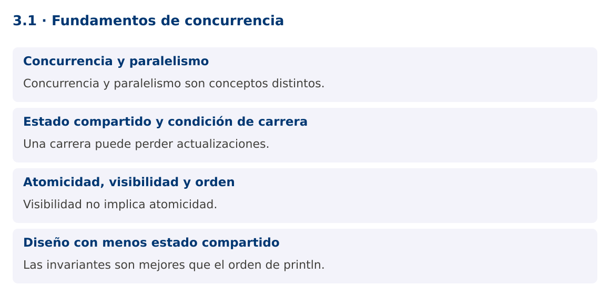

# Programación Aplicada

## 3.1. Fundamentos de concurrencia


**Autor:** Ing. Pablo Torres, Mgtr.  
**Unidad:** 3. Programación concurrente  
**Proyecto de trabajo:** CampusMonitor

[Inicio del curso](../../README.md) · [Presentación editable](presentacion.pptx) · [Ver en el navegador](index.html)

---

## 1. Conceptos y ejemplos

### Contexto

La importación de archivos y la recepción de lecturas pueden coincidir con consultas del usuario. CampusMonitor necesita mantener varias actividades en progreso sin asumir un orden de ejecución accidental.

### Antes de empezar

Recupera el avance de [2.4](../../02/2.4-textos-ficheros/material.md). Conserva sus comandos y evidencias. Revisa el ejemplo completo antes de implementar la PC. Las demostraciones del material se ejecutan separadas del proyecto personal.


La ilustración sirve como analogía. El contrato técnico se define en el texto y el código.

<a id="concepto-1"></a>

### 1.1. Concurrencia y paralelismo

Concurrencia significa que varias actividades progresan durante un intervalo. Paralelismo significa que varias operaciones se ejecutan simultáneamente. Un solo núcleo puede intercalar tareas concurrentes y varios núcleos pueden ejecutar tareas en paralelo. Añadir hilos no garantiza una mejora: existen costos de coordinación y límites en CPU, memoria y dispositivos.

Las tareas que esperan E/S tienen oportunidades distintas de las que consumen CPU. Una importación puede esperar disco o red, mientras una transformación matemática utiliza CPU. Identifica el recurso limitante antes de elegir la estrategia. La interfaz gráfica debe mantenerse disponible aunque una operación tarde.

<a id="concepto-2"></a>

### 1.2. Estado compartido y condición de carrera

Una condición de carrera ocurre cuando el resultado depende de un orden no controlado entre operaciones concurrentes. contador++ contiene conceptualmente lectura, suma y escritura. Dos hilos pueden leer el mismo valor y escribir el mismo resultado, perdiendo una actualización.

La demostración fuerza ese intercalado mediante una barrera. Ambos hilos leen antes de que cualquiera escriba, de modo que el contador ordinario termina en uno. Esto permite estudiar el defecto sin depender de que aparezca por azar. Añadir println o sleep a un programa no corrige su sincronización y puede cambiar el comportamiento observado.

<a id="concepto-3"></a>

### 1.3. Atomicidad, visibilidad y orden

Atomicidad significa que una operación se observa como una unidad indivisible respecto de otras. Visibilidad determina cuándo un hilo observa las escrituras de otro. Orden se refiere a las relaciones permitidas entre operaciones, incluyendo reordenamientos compatibles con el modelo de memoria.

volatile proporciona garantías de visibilidad y orden para accesos al campo, pero no vuelve atómico un incremento compuesto. synchronized, las clases atómicas y otras herramientas establecen relaciones de happens-before documentadas. Thread.start y Thread.join también establecen relaciones relevantes. Razona sobre garantías, no sobre lo que normalmente ocurre en tu computadora.

<a id="concepto-4"></a>

### 1.4. Diseño con menos estado compartido

Una primera opción es asignar cada dato a un único propietario. Otra es usar objetos inmutables y mensajes. Una cola entre productor y consumidor expresa la transferencia de trabajo sin compartir todas las estructuras internas. Cuando sí se comparte estado mutable, identifica la sección crítica y el mecanismo que la protege.

Una prueba correcta define invariantes: cantidad final de registros, ausencia de duplicados y correspondencia entre recibidos y procesados. El orden exacto de mensajes impresos no suele ser un criterio válido. Repite escenarios para aumentar las posibilidades de encontrar un defecto, pero recuerda que pasar muchas ejecuciones no demuestra ausencia de carreras.

### Mapa de conceptos



---

<a id="demostracion"></a>

## 2. Demostración guiada

### 2.1. Problema y contrato

La importación de archivos y la recepción de lecturas pueden coincidir con consultas del usuario. CampusMonitor necesita mantener varias actividades en progreso sin asumir un orden de ejecución accidental.

La implementación siguiente es una demostración resuelta. La PC de la sección 3 requiere desarrollar una ampliación propia sobre CampusMonitor.

**Archivo completo:** [CarreraDemo.java](ejemplos/CarreraDemo.java).

```java
package edu.ups.pap.u03;
import java.util.concurrent.*;
import java.util.concurrent.atomic.AtomicInteger;
public class CarreraDemo {
    static int contador;
    public static void main(String[] args) throws InterruptedException {
        CyclicBarrier barrera = new CyclicBarrier(2);
        AtomicInteger seguro = new AtomicInteger();
        Runnable tarea = () -> {
            int anterior = contador;
            try { barrera.await(); }
            catch (InterruptedException e) { Thread.currentThread().interrupt(); return; }
            catch (BrokenBarrierException e) { throw new IllegalStateException(e); }
            contador = anterior + 1;
            seguro.incrementAndGet();
        };
        Thread a = new Thread(tarea), b = new Thread(tarea);
        a.start(); b.start(); a.join(); b.join();
        System.out.println("Sin operación atómica: " + contador);
        System.out.println("Con AtomicInteger: " + seguro.get());
    }
}
```

### 2.2. Ejecución

Desde la raíz de este repositorio, con JDK 25:

```bash
java 03/3.1-fundamentos/ejemplos/CarreraDemo.java
```

Con el proyecto Gradle de demostraciones:

```bash
cd demostraciones
./gradlew runDemo -Pdemo=3.1
```

En Windows usa `gradlew.bat`. Ejecuta cada demostración desde una terminal nueva o vuelve a la raíz antes de cambiar de contenido.

### 2.3. Resultado y lectura de la ejecución

```text
Sin operación atómica: 1
Con AtomicInteger: 2
```

1. Identifica los datos iniciales y las precondiciones que la demostración valida.
2. Sigue las llamadas desde `main` o `loop` y relaciona las operaciones con los conceptos de la sección 1.
3. Contrasta el resultado con la salida esperada del ejemplo. Si el orden es concurrente, compara la invariante y no el orden de impresión.
4. Cambia un dato del ejemplo y predice el resultado antes de ejecutarlo. Registra cualquier diferencia y su causa.

---

<a id="pc"></a>

## 3. PC3.1 · Práctica de clase

### 3.1. Ampliación del proyecto

Esta actividad se resuelve en tu repositorio `icc-pap-campusmonitor-apellido`. Mantén la funcionalidad anterior. No reemplaces tu solución con los archivos de demostración del material.

1. Identifica en CampusMonitor el catálogo, las listas de lecturas y el resumen que podrían ser compartidos. Documenta sus propietarios.
2. Reproduce una actualización perdida con dos tareas y una coordinación determinista. Después corrige el contador con AtomicInteger.
3. Define tres invariantes para una importación concurrente y explica cuáles no se garantizan usando solo volatile.

### 3.2. Comprobación y evidencia

Prueba los casos de esta sección y registra entradas, salida real y explicación. Incluye una ejecución normal y un caso de error. La evidencia debe permitir repetir el resultado desde el commit entregado.

| Caso que debes revisar | Comportamiento requerido |
|---|---|
| Dos incrementos coordinados sin protección | Se pierde una actualización |
| Dos incrementos atómicos | Resultado 2 |
| volatile y contador++ | La operación compuesta sigue sin ser atómica |

En `evidencias/PC3.1.md` agrega: cambio realizado, archivos principales, comandos de ejecución, tabla de pruebas y enlace al commit final. No añadas una rúbrica a esta PC.

### 3.3. Commits de la actividad

```bash
git status
git add src evidencias
git commit -m "feat(pc3.1): fundamentos-de-concurrencia"
git push
git log -1 --format=%H
```

Ajusta las rutas de `git add` a los archivos que realmente creaste. Incluye también configuración o SQL si cambiaste esos archivos. El último comando muestra el hash real que debes enlazar en tu evidencia.

### Lo esencial

- Concurrencia y paralelismo son conceptos distintos.
- Una carrera puede perder actualizaciones.
- Visibilidad no implica atomicidad.
- Las invariantes son mejores que el orden de println.

## Referencias técnicas

- [Concurrencia, Java 25](https://docs.oracle.com/en/java/javase/25/docs/api/java.base/java/util/concurrent/package-summary.html)
- [Thread](https://docs.oracle.com/en/java/javase/25/docs/api/java.base/java/lang/Thread.html)
- [SwingWorker](https://docs.oracle.com/en/java/javase/25/docs/api/java.desktop/javax/swing/SwingWorker.html)
