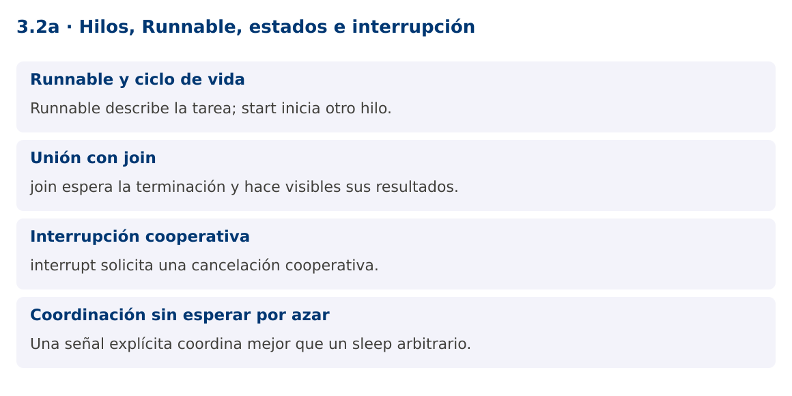

# Programación Aplicada

## 3.2a. Hilos, Runnable, estados e interrupción


**Autor:** Ing. Pablo Torres, Mgtr.  
**Unidad:** 3. Programación concurrente  
**Proyecto de trabajo:** CampusMonitor

[Inicio del curso](../../../README.md) · [Presentación editable](presentacion.pptx) · [Ver en el navegador](index.html)

---

## 1. Conceptos y ejemplos

### Contexto

Una recepción simulada debe comenzar, producir lecturas y detenerse cuando el usuario lo solicite. Runnable define el trabajo y Thread controla una ejecución concreta de ese trabajo.

### Antes de empezar

Recupera el avance de [3.1](../../3.1-fundamentos/material.md). Conserva sus comandos y evidencias. Revisa el ejemplo completo antes de implementar la PC. Las demostraciones del material se ejecutan separadas del proyecto personal.

<a id="concepto-1"></a>

### 1.1. Runnable y ciclo de vida

Runnable declara run() y no devuelve un resultado. Thread asocia una ejecución a una tarea. Llamar start inicia un nuevo hilo y provoca la ejecución de run en ese hilo. Llamar run directamente es una llamada ordinaria en el hilo actual. Un objeto Thread solo puede iniciarse una vez.

Los estados de Thread.State son NEW, RUNNABLE, BLOCKED, WAITING, TIMED_WAITING y TERMINATED. RUNNABLE abarca ejecución o disponibilidad para ejecutarse, no garantiza uso de CPU en ese instante. BLOCKED se refiere a espera para entrar a un monitor synchronized. No todas las esperas de E/S o de locks se reflejan como BLOCKED.

<a id="concepto-2"></a>

### 1.2. Unión con join

join permite esperar a que otro hilo termine. Si retorna normalmente tras la terminación, las acciones del hilo terminado ocurren antes de las posteriores del hilo que hizo join. Esto permite leer sus resultados publicados siguiendo el contrato. Una unión con plazo puede retornar sin que el hilo haya terminado, por lo que se comprueba isAlive.

No hagas join sobre una tarea larga dentro del hilo de interfaz. Esa espera bloquearía los eventos y repintados. La dependencia entre tareas debe estar clara: si A espera a B y B espera a A, ninguna terminará. Evita dependencias circulares de terminación.

<a id="concepto-3"></a>

### 1.3. Interrupción cooperativa

interrupt solicita interrupción. No detiene arbitrariamente el código ni deshace operaciones. Una tarea debe consultar su estado de interrupción o usar operaciones que respondan a ella. sleep, wait y join pueden lanzar InterruptedException. Al lanzarla, normalmente se limpia el estado de interrupción.

Si un método no puede propagar la excepción, una respuesta habitual es restaurar el estado con Thread.currentThread().interrupt() y salir. No captures la excepción para continuar indefinidamente. No uses stop, suspend ni resume. Para E/S que no responde a interrupción, la cancelación puede requerir cerrar el recurso y diseñar un tiempo máximo de espera.

<a id="concepto-4"></a>

### 1.4. Coordinación sin esperar por azar

CountDownLatch permite señalar que una fase comenzó. En la demostración evita interrumpir antes de que la tarea haya comunicado su arranque. El orden de impresión de otros mensajes podría variar, pero se garantiza que el hilo termina antes del mensaje final.

La cancelación debe liberar recursos en finally o try-with-resources. Piensa qué ocurre con una lectura a medio procesar: se descarta, se reintenta o se guarda como pendiente. El contador de lecturas no debería incrementarse antes de que la operación correspondiente concluya correctamente.

### Mapa de conceptos



---

<a id="demostracion"></a>

## 2. Demostración guiada

### 2.1. Problema y contrato

Una recepción simulada debe comenzar, producir lecturas y detenerse cuando el usuario lo solicite. Runnable define el trabajo y Thread controla una ejecución concreta de ese trabajo.

La implementación siguiente es una demostración resuelta. La PC de la sección 3 requiere desarrollar una ampliación propia sobre CampusMonitor.

**Archivo completo:** [HilosDemo.java](ejemplos/HilosDemo.java).

```java
package edu.ups.pap.u03;
import java.util.concurrent.CountDownLatch;
public class HilosDemo {
    public static void main(String[] args) throws InterruptedException {
        CountDownLatch iniciado = new CountDownLatch(1);
        Runnable recibir = () -> {
            try {
                System.out.println("Receptor iniciado");
                iniciado.countDown();
                while (!Thread.currentThread().isInterrupted()) Thread.sleep(1000);
            } catch (InterruptedException e) {
                Thread.currentThread().interrupt();
            } finally { System.out.println("Receptor cerrado"); }
        };
        Thread hilo = Thread.ofPlatform().name("receptor").unstarted(recibir);
        System.out.println(hilo.getState());
        hilo.start();
        iniciado.await();
        hilo.interrupt();
        hilo.join(2000);
        if (hilo.isAlive()) throw new IllegalStateException("No terminó a tiempo");
        System.out.println(hilo.getState());
    }
}
```

### 2.2. Ejecución

Desde la raíz de este repositorio, con JDK 25:

```bash
java 03/3.2-hilos-ejecutables/01-hilos-runnable/ejemplos/HilosDemo.java
```

Con el proyecto Gradle de demostraciones:

```bash
cd demostraciones
./gradlew runDemo -Pdemo=3.2a
```

En Windows usa `gradlew.bat`. Ejecuta cada demostración desde una terminal nueva o vuelve a la raíz antes de cambiar de contenido.

### 2.3. Resultado y lectura de la ejecución

```text
NEW
Receptor iniciado
Receptor cerrado
TERMINATED
```

1. Identifica los datos iniciales y las precondiciones que la demostración valida.
2. Sigue las llamadas desde `main` o `loop` y relaciona las operaciones con los conceptos de la sección 1.
3. Contrasta el resultado con la salida esperada del ejemplo. Si el orden es concurrente, compara la invariante y no el orden de impresión.
4. Cambia un dato del ejemplo y predice el resultado antes de ejecutarlo. Registra cualquier diferencia y su causa.

---

<a id="pc"></a>

## 3. PC3.2a · Práctica de clase

### 3.1. Ampliación del proyecto

Esta actividad se resuelve en tu repositorio `icc-pap-campusmonitor-apellido`. Mantén la funcionalidad anterior. No reemplaces tu solución con los archivos de demostración del material.

1. Agrega un receptor simulado que produzca una lectura periódica hasta recibir una solicitud de cancelación. Separa Runnable del código de consola.
2. Usa una señal de arranque y cancelación cooperativa. Espera su terminación con un plazo y comprueba que realmente finalizó.
3. Conserva un conteo de lecturas completadas y documenta el comportamiento de una cancelación mientras la tarea espera.

### 3.2. Comprobación y evidencia

Prueba los casos de esta sección y registra entradas, salida real y explicación. Incluye una ejecución normal y un caso de error. La evidencia debe permitir repetir el resultado desde el commit entregado.

| Caso que debes revisar | Comportamiento requerido |
|---|---|
| Inicio y cancelación | Termina y libera recursos |
| Llamar run directamente | Se ejecuta en el hilo llamador |
| Segundo start en el mismo Thread | Uso inválido del ciclo de vida |

En `evidencias/PC3.2a.md` agrega: cambio realizado, archivos principales, comandos de ejecución, tabla de pruebas y enlace al commit final. No añadas una rúbrica a esta PC.

### 3.3. Commits de la actividad

```bash
git status
git add src evidencias
git commit -m "feat(pc3.2a): hilos-runnable-estados-e-interrupcion"
git push
git log -1 --format=%H
```

Ajusta las rutas de `git add` a los archivos que realmente creaste. Incluye también configuración o SQL si cambiaste esos archivos. El último comando muestra el hash real que debes enlazar en tu evidencia.

### Lo esencial

- Runnable describe la tarea; start inicia otro hilo.
- join espera la terminación y hace visibles sus resultados.
- interrupt solicita una cancelación cooperativa.
- Una señal explícita coordina mejor que un sleep arbitrario.

## Referencias técnicas

- [Concurrencia, Java 25](https://docs.oracle.com/en/java/javase/25/docs/api/java.base/java/util/concurrent/package-summary.html)
- [Thread](https://docs.oracle.com/en/java/javase/25/docs/api/java.base/java/lang/Thread.html)
- [SwingWorker](https://docs.oracle.com/en/java/javase/25/docs/api/java.desktop/javax/swing/SwingWorker.html)
