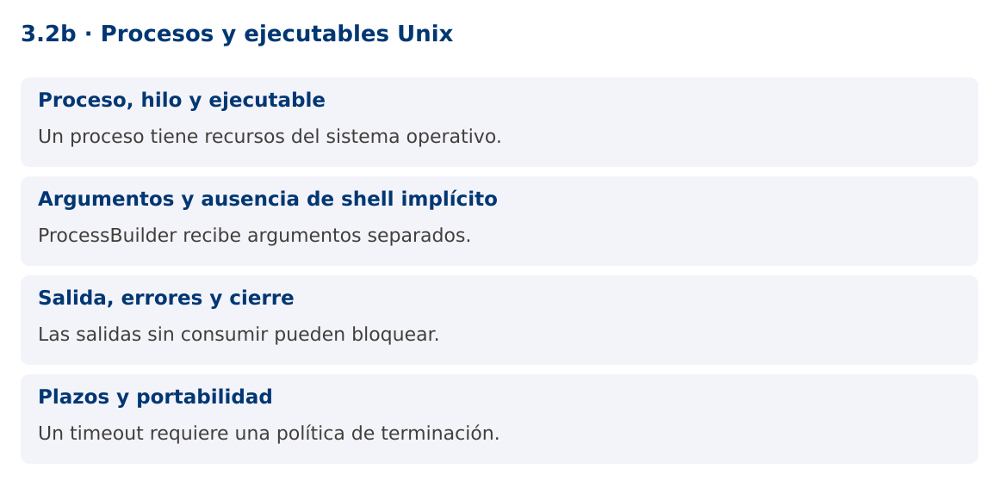

# Programación Aplicada

## 3.2b. Procesos y ejecutables Unix


**Autor:** Ing. Pablo Torres, Mgtr.  
**Unidad:** 3. Programación concurrente  
**Proyecto de trabajo:** CampusMonitor

[Inicio del curso](../../../README.md) · [Presentación editable](presentacion.pptx) · [Ver en el navegador](index.html)

---

## 1. Conceptos y ejemplos

### Contexto

El término ejecutable puede referirse a una tarea Runnable o a un programa del sistema operativo. Son conceptos distintos. Este complemento permite lanzar una herramienta de diagnóstico externa desde Java y controlar su salida y duración.

### Antes de empezar

Recupera el avance de [3.2a](../01-hilos-runnable/material.md). Conserva sus comandos y evidencias. Revisa el ejemplo completo antes de implementar la PC. Las demostraciones del material se ejecutan separadas del proyecto personal.

<a id="concepto-1"></a>

### 1.1. Proceso, hilo y ejecutable

Un proceso dispone de recursos y espacio de direcciones gestionados por el sistema operativo. Un hilo pertenece a un proceso y comparte parte de su memoria con otros hilos del mismo proceso. Un ejecutable externo produce otro proceso; no se convierte en un Runnable por haber sido iniciado desde Java.

ProcessBuilder construye una invocación con argumentos separados. Process permite observar terminación, código de salida y flujos. Runnable sigue siendo una interfaz Java para describir trabajo. En el programa analítico, hilos y ejecutables se trabaja principalmente como Thread y Runnable; esta extensión de procesos aclara el vocabulario y muestra una integración útil.

<a id="concepto-2"></a>

### 1.2. Argumentos y ausencia de shell implícito

new ProcessBuilder("uname", "-s") pasa dos argumentos al sistema. No interpreta tuberías, comodines ni redirecciones como una shell. Esto reduce problemas de escape. Una cadena única "uname -s" intenta encontrar un programa con ese nombre y normalmente falla.

No construyas sh -c con texto de usuarios. Si necesitas funciones de shell, utiliza un script controlado, revisa sus argumentos y limita las herramientas disponibles. La demostración usa únicamente el ejecutable uname y una opción fija. En Windows invoca el propio Java con --version para mantener una alternativa disponible.

<a id="concepto-3"></a>

### 1.3. Salida, errores y cierre

Un proceso tiene stdout, stderr y un código de salida. Si no se consumen sus flujos, puede bloquearse cuando se llenan los buffers. redirectErrorStream(true) combina stderr con stdout, pero pierde la distinción entre ambos canales. La demostración redirige a un archivo temporal para evitar el bloqueo de tuberías sin crear lectores adicionales.

El código cero suele indicar éxito, según el contrato de la herramienta. Cualquier otro código debe tratarse explícitamente. No interpretes una salida parcial como un resultado válido cuando el proceso no terminó. Al finalizar, cierra flujos o elimina los ficheros temporales que hayas creado.

<a id="concepto-4"></a>

### 1.4. Plazos y portabilidad

waitFor con timeout limita la espera, no garantiza que el proceso termine al cumplirse el plazo. La aplicación debe solicitar destroy y, si no basta, destroyForcibly, esperando la terminación posterior. Los procesos hijos requieren una política adicional si una herramienta crea un árbol de procesos.

Los comandos, rutas y permisos cambian entre plataformas. Para un diagnóstico reproducible registra el sistema operativo y la herramienta. No asumas que /dev/ttyUSB0 o uname existen en todos los equipos. La integración serial de la unidad 5 utilizará una biblioteca y selección explícita del puerto, en lugar de comandos de shell.

### Mapa de conceptos



---

<a id="demostracion"></a>

## 2. Demostración guiada

### 2.1. Problema y contrato

El término ejecutable puede referirse a una tarea Runnable o a un programa del sistema operativo. Son conceptos distintos. Este complemento permite lanzar una herramienta de diagnóstico externa desde Java y controlar su salida y duración.

La implementación siguiente es una demostración resuelta. La PC de la sección 3 requiere desarrollar una ampliación propia sobre CampusMonitor.

**Archivo completo:** [ProcesosDemo.java](ejemplos/ProcesosDemo.java).

```java
package edu.ups.pap.u03;
import java.io.*;
import java.nio.file.*;
import java.util.concurrent.TimeUnit;
public class ProcesosDemo {
    public static void main(String[] args) throws IOException, InterruptedException {
        boolean windows = System.getProperty("os.name").toLowerCase().contains("win");
        String java = Path.of(System.getProperty("java.home"),"bin",windows?"java.exe":"java").toString();
        ProcessBuilder pb = windows ? new ProcessBuilder(java,"--version") : new ProcessBuilder("uname","-s");
        Path salida = Files.createTempFile("diagnostico-", ".txt");
        Process proceso = null;
        try {
            proceso = pb.redirectErrorStream(true).redirectOutput(salida.toFile()).start();
            if (!proceso.waitFor(3,TimeUnit.SECONDS)) {
                proceso.destroy();
                if (!proceso.waitFor(1,TimeUnit.SECONDS)) { proceso.destroyForcibly(); proceso.waitFor(); }
                throw new IOException("Tiempo de diagnóstico agotado");
            }
            if (proceso.exitValue()!=0) throw new IOException("Código de salida: "+proceso.exitValue());
            System.out.print(Files.readString(salida));
        } finally {
            if (proceso!=null && proceso.isAlive()) proceso.destroyForcibly();
            Files.deleteIfExists(salida);
        }
    }
}
```

### 2.2. Ejecución

Desde la raíz de este repositorio, con JDK 25:

```bash
java 03/3.2-hilos-ejecutables/02-procesos-unix/ejemplos/ProcesosDemo.java
```

Con el proyecto Gradle de demostraciones:

```bash
cd demostraciones
./gradlew runDemo -Pdemo=3.2b
```

En Windows usa `gradlew.bat`. Ejecuta cada demostración desde una terminal nueva o vuelve a la raíz antes de cambiar de contenido.

### 2.3. Resultado y lectura de la ejecución

```text
Linux o Darwin en Unix/macOS. En Windows muestra la versión del JDK. La salida concreta depende del sistema operativo.
```

1. Identifica los datos iniciales y las precondiciones que la demostración valida.
2. Sigue las llamadas desde `main` o `loop` y relaciona las operaciones con los conceptos de la sección 1.
3. Contrasta el resultado con la salida esperada del ejemplo. Si el orden es concurrente, compara la invariante y no el orden de impresión.
4. Cambia un dato del ejemplo y predice el resultado antes de ejecutarlo. Registra cualquier diferencia y su causa.

---

<a id="pc"></a>

## 3. PC3.2b · Práctica de clase

### 3.1. Ampliación del proyecto

Esta actividad se resuelve en tu repositorio `icc-pap-campusmonitor-apellido`. Mantén la funcionalidad anterior. No reemplaces tu solución con los archivos de demostración del material.

1. Agrega un diagnóstico opcional a CampusMonitor que ejecute una herramienta fija del sistema con argumentos separados.
2. Aplica un plazo de tres segundos, captura código de salida y evita bloqueos por stdout y stderr.
3. Documenta una alternativa portable y explica por qué ProcessBuilder no sustituye a Thread ni a ExecutorService.

### 3.2. Comprobación y evidencia

Prueba los casos de esta sección y registra entradas, salida real y explicación. Incluye una ejecución normal y un caso de error. La evidencia debe permitir repetir el resultado desde el commit entregado.

| Caso que debes revisar | Comportamiento requerido |
|---|---|
| Herramienta disponible | Salida y código correctos |
| Ejecutable inexistente | IOException controlada |
| Proceso que excede plazo | Cancelación y limpieza |

En `evidencias/PC3.2b.md` agrega: cambio realizado, archivos principales, comandos de ejecución, tabla de pruebas y enlace al commit final. No añadas una rúbrica a esta PC.

### 3.3. Commits de la actividad

```bash
git status
git add src evidencias
git commit -m "feat(pc3.2b): procesos-y-ejecutables-unix"
git push
git log -1 --format=%H
```

Ajusta las rutas de `git add` a los archivos que realmente creaste. Incluye también configuración o SQL si cambiaste esos archivos. El último comando muestra el hash real que debes enlazar en tu evidencia.

### Lo esencial

- Un proceso tiene recursos del sistema operativo.
- ProcessBuilder recibe argumentos separados.
- Las salidas sin consumir pueden bloquear.
- Un timeout requiere una política de terminación.

## Referencias técnicas

- [Concurrencia, Java 25](https://docs.oracle.com/en/java/javase/25/docs/api/java.base/java/util/concurrent/package-summary.html)
- [Thread](https://docs.oracle.com/en/java/javase/25/docs/api/java.base/java/lang/Thread.html)
- [SwingWorker](https://docs.oracle.com/en/java/javase/25/docs/api/java.desktop/javax/swing/SwingWorker.html)
