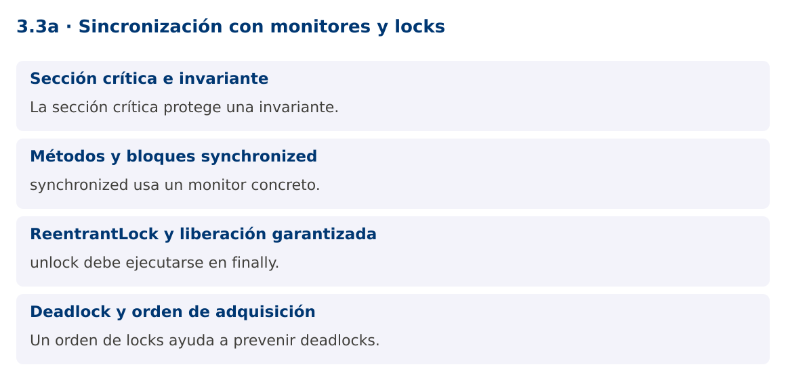

# Programación Aplicada

## 3.3a. Sincronización con monitores y locks


**Autor:** Ing. Pablo Torres, Mgtr.  
**Unidad:** 3. Programación concurrente  
**Proyecto de trabajo:** CampusMonitor

[Inicio del curso](../../../README.md) · [Presentación editable](presentacion.pptx) · [Ver en el navegador](index.html)

---

## 1. Conceptos y ejemplos

### Contexto

Varias tareas pueden intentar registrar el mismo identificador o actualizar un resumen. Proteger operaciones individuales no basta si la regla requiere comprobar y modificar como una única operación.

### Antes de empezar

Recupera el avance de [3.2b](../../3.2-hilos-ejecutables/02-procesos-unix/material.md). Conserva sus comandos y evidencias. Revisa el ejemplo completo antes de implementar la PC. Las demostraciones del material se ejecutan separadas del proyecto personal.


**Pausa:** «En una ejecución funcionó» no prueba ausencia de carreras. La comprobación requiere una invariante y un escenario reproducible.

<a id="concepto-1"></a>

### 1.1. Sección crítica e invariante

Una sección crítica agrupa operaciones que deben observarse de forma indivisible respecto de otros participantes. En una reserva de capacidad, comprobar disponible y descontar deben ejecutarse bajo la misma protección. Sin ello, dos tareas pueden aprobar la misma capacidad restante.

Define primero la invariante, por ejemplo disponibles >= 0 y reservas + disponibles = capacidadInicial. La protección debe cubrir todos los accesos que participan en ella, incluidas lecturas. Si una parte usa un lock y otra modifica el campo directamente, el protocolo queda incompleto. No expongas referencias mutables que permitan saltarse ese protocolo.

<a id="concepto-2"></a>

### 1.2. Métodos y bloques synchronized

synchronized utiliza el monitor del objeto indicado. Un método de instancia sincronizado usa this y un método static sincronizado usa el objeto Class. Dos instancias distintas poseen monitores distintos, aunque ejecuten el mismo método.

Un bloque synchronized permite limitar el alcance y emplear un lock privado final. Al salir del monitor se publican escrituras hacia una adquisición posterior del mismo monitor. Los monitores son reentrantes: un hilo puede volver a entrar al monitor que ya posee. No bloquees sobre cadenas internadas u objetos públicos cuyo uso no controlas.

```java
synchronized (lock) {
    if (disponibles == 0) return false;
    disponibles--;
    return true;
}
```

<a id="concepto-3"></a>

### 1.3. ReentrantLock y liberación garantizada

ReentrantLock ofrece operaciones como tryLock, adquisición con plazo o lockInterruptibly. unlock debe ir en finally después de una adquisición exitosa. Una excepción no debe dejar el recurso bloqueado. El lock no protege por su mera existencia: todos los participantes deben utilizarlo para el mismo estado.

La equidad puede reducir algunos escenarios de espera desigual, pero no garantiza un rendimiento mayor. No mantengas un lock mientras realizas E/S lenta si puedes separar la preparación y la publicación de resultados. Cuanto más larga la sección crítica, más tareas esperan sin hacer trabajo útil.

<a id="concepto-4"></a>

### 1.4. Deadlock y orden de adquisición

Un deadlock puede aparecer cuando varias tareas esperan recursos retenidos por las demás. Un orden global de adquisición reduce ciclos: por ejemplo, ordenar las cuentas o sensores por ID y bloquear siempre en ese orden. Timeouts permiten detectar una espera prolongada, pero no reparan automáticamente un diseño inconsistente.

La demostración protege un registro de IDs con un monitor. Dos tareas intentan insertar el mismo ID y exactamente una tiene éxito. La salida del ganador no es determinista. La invariante relevante es que el catálogo contiene un solo registro y el contador de éxitos vale uno.

### Mapa de conceptos



---

<a id="demostracion"></a>

## 2. Demostración guiada

### 2.1. Problema y contrato

Varias tareas pueden intentar registrar el mismo identificador o actualizar un resumen. Proteger operaciones individuales no basta si la regla requiere comprobar y modificar como una única operación.

La implementación siguiente es una demostración resuelta. La PC de la sección 3 requiere desarrollar una ampliación propia sobre CampusMonitor.

**Archivo completo:** [MonitoresDemo.java](ejemplos/MonitoresDemo.java).

```java
package edu.ups.pap.u03;
import java.util.*;
import java.util.concurrent.atomic.AtomicInteger;
public class MonitoresDemo {
    static final class Registro {
        private final Object lock = new Object();
        private final Set<String> ids = new HashSet<>();
        boolean registrar(String id) {
            synchronized (lock) {
                if (ids.contains(id)) return false;
                ids.add(id); return true;
            }
        }
        int cantidad() { synchronized(lock) { return ids.size(); } }
    }
    public static void main(String[] args) throws InterruptedException {
        Registro registro = new Registro();
        AtomicInteger exitos = new AtomicInteger();
        Runnable insertar = () -> { if (registro.registrar("S01")) exitos.incrementAndGet(); };
        Thread a = new Thread(insertar), b = new Thread(insertar);
        a.start(); b.start(); a.join(); b.join();
        System.out.println("Registros: " + registro.cantidad());
        System.out.println("Inserciones exitosas: " + exitos.get());
    }
}
```

### 2.2. Ejecución

Desde la raíz de este repositorio, con JDK 25:

```bash
java 03/3.3-sincronizacion/01-monitores-locks/ejemplos/MonitoresDemo.java
```

Con el proyecto Gradle de demostraciones:

```bash
cd demostraciones
./gradlew runDemo -Pdemo=3.3a
```

En Windows usa `gradlew.bat`. Ejecuta cada demostración desde una terminal nueva o vuelve a la raíz antes de cambiar de contenido.

### 2.3. Resultado y lectura de la ejecución

```text
Registros: 1
Inserciones exitosas: 1
```

1. Identifica los datos iniciales y las precondiciones que la demostración valida.
2. Sigue las llamadas desde `main` o `loop` y relaciona las operaciones con los conceptos de la sección 1.
3. Contrasta el resultado con la salida esperada del ejemplo. Si el orden es concurrente, compara la invariante y no el orden de impresión.
4. Cambia un dato del ejemplo y predice el resultado antes de ejecutarlo. Registra cualquier diferencia y su causa.

---

<a id="pc"></a>

## 3. PC3.3a · Práctica de clase

### 3.1. Ampliación del proyecto

Esta actividad se resuelve en tu repositorio `icc-pap-campusmonitor-apellido`. Mantén la funcionalidad anterior. No reemplaces tu solución con los archivos de demostración del material.

1. Protege el registro de sensores contra inserciones concurrentes del mismo ID. La comprobación y la inserción deben compartir sección crítica.
2. Implementa una segunda versión con ReentrantLock y liberación en finally. Mantén la misma interfaz y casos de prueba.
3. Ejecuta cien intentos sobre diez IDs. La cantidad final debe ser diez y ningún método debe exponer la estructura mutable interna.

### 3.2. Comprobación y evidencia

Prueba los casos de esta sección y registra entradas, salida real y explicación. Incluye una ejecución normal y un caso de error. La evidencia debe permitir repetir el resultado desde el commit entregado.

| Caso que debes revisar | Comportamiento requerido |
|---|---|
| 100 intentos sobre 10 IDs | 10 registros |
| Excepción dentro de operación | Lock liberado |
| Consulta durante inserciones | Estado consistente según contrato |

En `evidencias/PC3.3a.md` agrega: cambio realizado, archivos principales, comandos de ejecución, tabla de pruebas y enlace al commit final. No añadas una rúbrica a esta PC.

### 3.3. Commits de la actividad

```bash
git status
git add src evidencias
git commit -m "feat(pc3.3a): sincronizacion-con-monitores-y-locks"
git push
git log -1 --format=%H
```

Ajusta las rutas de `git add` a los archivos que realmente creaste. Incluye también configuración o SQL si cambiaste esos archivos. El último comando muestra el hash real que debes enlazar en tu evidencia.

### Lo esencial

- La sección crítica protege una invariante.
- synchronized usa un monitor concreto.
- unlock debe ejecutarse en finally.
- Un orden de locks ayuda a prevenir deadlocks.

## Referencias técnicas

- [Concurrencia, Java 25](https://docs.oracle.com/en/java/javase/25/docs/api/java.base/java/util/concurrent/package-summary.html)
- [Thread](https://docs.oracle.com/en/java/javase/25/docs/api/java.base/java/lang/Thread.html)
- [SwingWorker](https://docs.oracle.com/en/java/javase/25/docs/api/java.desktop/javax/swing/SwingWorker.html)
