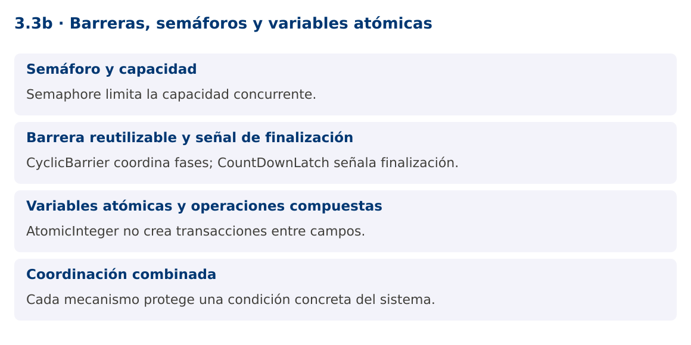

# Programación Aplicada

## 3.3b. Barreras, semáforos y variables atómicas


**Autor:** Ing. Pablo Torres, Mgtr.  
**Unidad:** 3. Programación concurrente  
**Proyecto de trabajo:** CampusMonitor

[Inicio del curso](../../../README.md) · [Presentación editable](presentacion.pptx) · [Ver en el navegador](index.html)

---

## 1. Conceptos y ejemplos

### Contexto

No todas las coordinaciones consisten en bloquear un objeto. CampusMonitor puede limitar conexiones simultáneas, esperar una fase de calibración y contar lecturas completadas con mecanismos distintos.

### Antes de empezar

Recupera el avance de [3.3a](../01-monitores-locks/material.md). Conserva sus comandos y evidencias. Revisa el ejemplo completo antes de implementar la PC. Las demostraciones del material se ejecutan separadas del proyecto personal.

<a id="concepto-1"></a>

### 1.1. Semáforo y capacidad

Semaphore administra permisos. acquire espera un permiso y release lo devuelve. Con dos permisos, hasta dos operaciones pueden entrar simultáneamente a la región controlada. Un semáforo limita capacidad, pero no identifica por sí mismo qué recurso concreto corresponde a cada permiso.

Libera únicamente permisos realmente adquiridos. Si acquire lanza InterruptedException antes de adquirir, no debes ejecutar un release incondicional que aumente la capacidad. Mantén la liberación en finally dentro del bloque posterior a la adquisición exitosa. Para conexiones reales, un pool suele gestionar tanto capacidad como objetos disponibles.

<a id="concepto-2"></a>

### 1.2. Barrera reutilizable y señal de finalización

CyclicBarrier reúne un número fijo de participantes al final de una fase. Cuando todos llegan, pueden continuar y la barrera se reutiliza. CountDownLatch comienza con un contador que solo disminuye y permite a otros esperar que llegue a cero. No se reinicia.

Una barrera puede romperse si un participante falla o se interrumpe. Los demás reciben BrokenBarrierException. No programes una barrera para cuatro tareas en un pool de dos hilos si las dos primeras esperan antes de que las otras puedan arrancar: no habrá suficientes participantes activos. El diseño debe relacionar número de participantes, capacidad del ejecutor y política de fallos.

<a id="concepto-3"></a>

### 1.3. Variables atómicas y operaciones compuestas

AtomicInteger ofrece incrementos, comparaciones e intercambios atómicos sobre una variable. compareAndSet actualiza únicamente si el valor actual coincide con el esperado. Las funciones usadas en updateAndGet pueden evaluarse más de una vez, así que no deben tener efectos externos como enviar mensajes.

Dos campos atómicos no crean una transacción entre ambos. Si una regla requiere actualizar saldo y contador juntos, hace falta otro diseño. LongAdder puede reducir contención en estadísticas, pero su suma no es una instantánea atómica para decisiones de control durante actualizaciones concurrentes. Elige según el contrato que necesitas preservar.

<a id="concepto-4"></a>

### 1.4. Coordinación combinada

La demostración espera que cuatro tareas estén listas mediante una barrera y luego limita a dos el procesamiento con un semáforo. Un contador atómico registra terminaciones. La barrera se encuentra antes de adquirir el permiso, evitando que tareas retengan los únicos permisos mientras esperan participantes que no pueden entrar.

Combinar herramientas exige analizar el orden de las esperas. Cada mecanismo debe tener una sola responsabilidad legible. Registra errores y finalización por tarea. Una métrica de completadas no debe incluir tareas canceladas ni fallidas.

### Mapa de conceptos



---

<a id="demostracion"></a>

## 2. Demostración guiada

### 2.1. Problema y contrato

No todas las coordinaciones consisten en bloquear un objeto. CampusMonitor puede limitar conexiones simultáneas, esperar una fase de calibración y contar lecturas completadas con mecanismos distintos.

La implementación siguiente es una demostración resuelta. La PC de la sección 3 requiere desarrollar una ampliación propia sobre CampusMonitor.

**Archivo completo:** [CoordinacionDemo.java](ejemplos/CoordinacionDemo.java).

```java
package edu.ups.pap.u03;
import java.util.concurrent.*;
import java.util.concurrent.atomic.AtomicInteger;
public class CoordinacionDemo {
    public static void main(String[] args) throws InterruptedException {
        CyclicBarrier listas = new CyclicBarrier(4);
        Semaphore capacidad = new Semaphore(2);
        AtomicInteger completas = new AtomicInteger();
        Thread[] tareas = new Thread[4];
        for (int i=0;i<tareas.length;i++) {
            tareas[i] = new Thread(() -> {
                try {
                    listas.await();
                    capacidad.acquire();
                    try { Thread.sleep(20); completas.incrementAndGet(); }
                    finally { capacidad.release(); }
                } catch (InterruptedException e) { Thread.currentThread().interrupt(); }
                catch (BrokenBarrierException e) { System.err.println("Fase cancelada"); }
            });
            tareas[i].start();
        }
        for (Thread t : tareas) t.join();
        System.out.println("Completas: " + completas.get());
        System.out.println("Permisos: " + capacidad.availablePermits());
    }
}
```

### 2.2. Ejecución

Desde la raíz de este repositorio, con JDK 25:

```bash
java 03/3.3-sincronizacion/02-barreras-semaforos-atomicas/ejemplos/CoordinacionDemo.java
```

Con el proyecto Gradle de demostraciones:

```bash
cd demostraciones
./gradlew runDemo -Pdemo=3.3b
```

En Windows usa `gradlew.bat`. Ejecuta cada demostración desde una terminal nueva o vuelve a la raíz antes de cambiar de contenido.

### 2.3. Resultado y lectura de la ejecución

```text
Completas: 4
Permisos: 2
```

1. Identifica los datos iniciales y las precondiciones que la demostración valida.
2. Sigue las llamadas desde `main` o `loop` y relaciona las operaciones con los conceptos de la sección 1.
3. Contrasta el resultado con la salida esperada del ejemplo. Si el orden es concurrente, compara la invariante y no el orden de impresión.
4. Cambia un dato del ejemplo y predice el resultado antes de ejecutarlo. Registra cualquier diferencia y su causa.

---

<a id="pc"></a>

## 3. PC3.3b · Práctica de clase

### 3.1. Ampliación del proyecto

Esta actividad se resuelve en tu repositorio `icc-pap-campusmonitor-apellido`. Mantén la funcionalidad anterior. No reemplaces tu solución con los archivos de demostración del material.

1. Limita a dos las validaciones externas simuladas simultáneas de CampusMonitor utilizando Semaphore.
2. Usa CountDownLatch para esperar la finalización de un lote de seis tareas, incluyendo las que fallan. Lleva contadores separados de completadas y fallidas.
3. Documenta por qué una barrera requiere suficientes participantes activos y prueba cancelación antes de adquirir un permiso.

### 3.2. Comprobación y evidencia

Prueba los casos de esta sección y registra entradas, salida real y explicación. Incluye una ejecución normal y un caso de error. La evidencia debe permitir repetir el resultado desde el commit entregado.

| Caso que debes revisar | Comportamiento requerido |
|---|---|
| 6 tareas, capacidad 2 | Nunca más de 2 dentro de la región |
| Fallo de una tarea | Latch liberado en finally |
| Interrupción durante acquire | No aumenta el total de permisos |

En `evidencias/PC3.3b.md` agrega: cambio realizado, archivos principales, comandos de ejecución, tabla de pruebas y enlace al commit final. No añadas una rúbrica a esta PC.

### 3.3. Commits de la actividad

```bash
git status
git add src evidencias
git commit -m "feat(pc3.3b): barreras-semaforos-y-variables-atomicas"
git push
git log -1 --format=%H
```

Ajusta las rutas de `git add` a los archivos que realmente creaste. Incluye también configuración o SQL si cambiaste esos archivos. El último comando muestra el hash real que debes enlazar en tu evidencia.

### Lo esencial

- Semaphore limita la capacidad concurrente.
- CyclicBarrier coordina fases; CountDownLatch señala finalización.
- AtomicInteger no crea transacciones entre campos.
- Cada mecanismo protege una condición concreta del sistema.

## Referencias técnicas

- [Concurrencia, Java 25](https://docs.oracle.com/en/java/javase/25/docs/api/java.base/java/util/concurrent/package-summary.html)
- [Thread](https://docs.oracle.com/en/java/javase/25/docs/api/java.base/java/lang/Thread.html)
- [SwingWorker](https://docs.oracle.com/en/java/javase/25/docs/api/java.desktop/javax/swing/SwingWorker.html)
