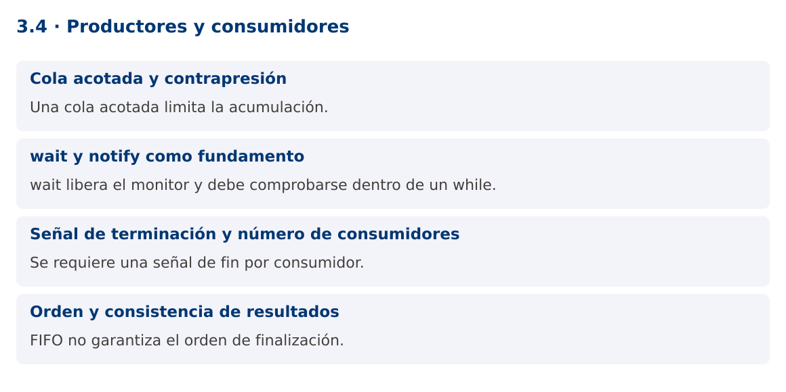

# Programación Aplicada

## 3.4. Productores y consumidores


**Autor:** Ing. Pablo Torres, Mgtr.  
**Unidad:** 3. Programación concurrente  
**Proyecto de trabajo:** CampusMonitor

[Inicio del curso](../../README.md) · [Presentación editable](presentacion.pptx) · [Ver en el navegador](index.html)

---

## 1. Conceptos y ejemplos

### Contexto

Un lector de archivos o un puerto serial produce lecturas a su propia velocidad. El procesamiento y almacenamiento consumen esas lecturas. Una cola separa ambos ritmos y obliga a decidir qué sucede cuando la producción supera la capacidad.

### Antes de empezar

Recupera el avance de [3.3b](../3.3-sincronizacion/02-barreras-semaforos-atomicas/material.md). Conserva sus comandos y evidencias. Revisa el ejemplo completo antes de implementar la PC. Las demostraciones del material se ejecutan separadas del proyecto personal.

<a id="concepto-1"></a>

### 1.1. Cola acotada y contrapresión

BlockingQueue ofrece operaciones de espera coordinadas. put espera espacio y take espera un elemento. ArrayBlockingQueue tiene capacidad fija. Si la cola está llena, el productor se frena: esta contrapresión limita memoria y comunica indirectamente que el consumidor está saturado.

Una cola ilimitada no elimina la saturación, solo la convierte en acumulación de memoria y latencia. Para un dispositivo que no pueda detener su emisión, necesitas una política de descarte o una señal de control. Debes medir cuántas lecturas se descartaron y distinguirlas de las procesadas. La capacidad se elige según volumen, tamaño de mensaje y tolerancia a demora.

<a id="concepto-2"></a>

### 1.2. wait y notify como fundamento

Una implementación manual con monitores comprueba la condición dentro de un while, llama wait y vuelve a comprobar al despertar. El bucle es necesario porque pueden existir despertares espurios y porque otro hilo puede cambiar la condición antes de recuperar el monitor. notifyAll despierta candidatos, pero no garantiza qué hilo continúa primero.

wait libera el monitor mientras espera y lo recupera antes de retornar. sleep no libera el monitor. Estas diferencias explican muchos bloqueos. Para código de aplicación, BlockingQueue evita reimplementar estas reglas y comunica el patrón de forma directa.

```java
synchronized (lock) {
    while (cola.isEmpty()) lock.wait();
    // Extraer bajo el mismo monitor y notificar cambios de condición.
}
```

<a id="concepto-3"></a>

### 1.3. Señal de terminación y número de consumidores

Una señal de fin es un mensaje que los consumidores reconocen para salir. Si hay dos consumidores, una única señal puede dejar al otro esperando. La demostración envía una señal por consumidor después de los datos, con un solo productor y orden FIFO.

Con varios productores, no debe emitirse fin hasta que todos hayan terminado. Puede utilizarse un coordinador o un contador de productores activos. La cancelación por error requiere una vía diferente del fin normal, porque un productor bloqueado en put podría no llegar a emitir las señales. Un ejecutor y cancelación coordinada simplifican ese escenario.

<a id="concepto-4"></a>

### 1.4. Orden y consistencia de resultados

Una cola FIFO conserva el orden de extracción, pero varios consumidores pueden finalizar en distinto orden. Si cada lectura tiene un número de secuencia, el sistema puede detectar faltantes y ordenar la presentación sin exigir ejecución secuencial de todo el proceso.

La demostración comprueba cantidad y suma final, dos invariantes independientes del reparto de trabajo. No utiliza null como señal porque BlockingQueue no admite elementos nulos. El record Mensaje distingue un dato de una señal de fin de forma explícita.

### Mapa de conceptos



---

<a id="demostracion"></a>

## 2. Demostración guiada

### 2.1. Problema y contrato

Un lector de archivos o un puerto serial produce lecturas a su propia velocidad. El procesamiento y almacenamiento consumen esas lecturas. Una cola separa ambos ritmos y obliga a decidir qué sucede cuando la producción supera la capacidad.

La implementación siguiente es una demostración resuelta. La PC de la sección 3 requiere desarrollar una ampliación propia sobre CampusMonitor.

**Archivo completo:** [ColaDemo.java](ejemplos/ColaDemo.java).

```java
package edu.ups.pap.u03;
import java.util.concurrent.*;
import java.util.concurrent.atomic.AtomicInteger;
public class ColaDemo {
    record Mensaje(int valor, boolean fin) {}
    public static void main(String[] args) throws InterruptedException {
        BlockingQueue<Mensaje> cola = new ArrayBlockingQueue<>(4);
        AtomicInteger suma = new AtomicInteger(), cantidad = new AtomicInteger();
        Runnable consumir = () -> {
            try {
                while (true) {
                    Mensaje m = cola.take();
                    if (m.fin()) return;
                    suma.addAndGet(m.valor()); cantidad.incrementAndGet();
                }
            } catch (InterruptedException e) { Thread.currentThread().interrupt(); }
        };
        Thread a = new Thread(consumir), b = new Thread(consumir);
        a.start(); b.start();
        for (int i=1;i<=10;i++) cola.put(new Mensaje(i,false));
        cola.put(new Mensaje(0,true)); cola.put(new Mensaje(0,true));
        a.join(); b.join();
        System.out.println("Cantidad: " + cantidad.get());
        System.out.println("Suma: " + suma.get());
    }
}
```

### 2.2. Ejecución

Desde la raíz de este repositorio, con JDK 25:

```bash
java 03/3.4-productores-consumidores/ejemplos/ColaDemo.java
```

Con el proyecto Gradle de demostraciones:

```bash
cd demostraciones
./gradlew runDemo -Pdemo=3.4
```

En Windows usa `gradlew.bat`. Ejecuta cada demostración desde una terminal nueva o vuelve a la raíz antes de cambiar de contenido.

### 2.3. Resultado y lectura de la ejecución

```text
Cantidad: 10
Suma: 55
```

1. Identifica los datos iniciales y las precondiciones que la demostración valida.
2. Sigue las llamadas desde `main` o `loop` y relaciona las operaciones con los conceptos de la sección 1.
3. Contrasta el resultado con la salida esperada del ejemplo. Si el orden es concurrente, compara la invariante y no el orden de impresión.
4. Cambia un dato del ejemplo y predice el resultado antes de ejecutarlo. Registra cualquier diferencia y su causa.

---

<a id="pc"></a>

## 3. PC3.4 · Práctica de clase

### 3.1. Ampliación del proyecto

Esta actividad se resuelve en tu repositorio `icc-pap-campusmonitor-apellido`. Mantén la funcionalidad anterior. No reemplaces tu solución con los archivos de demostración del material.

1. Conecta el importador de CampusMonitor a una ArrayBlockingQueue de capacidad 20. Dos consumidores validan y procesan mensajes con secuencia.
2. Define terminación normal y cancelación por error. La aplicación debe terminar sin consumidores esperando indefinidamente.
3. Genera cien entradas deterministas, registra aceptadas, rechazadas y descartadas, y comprueba que la suma de categorías corresponde al total producido.

### 3.2. Comprobación y evidencia

Prueba los casos de esta sección y registra entradas, salida real y explicación. Incluye una ejecución normal y un caso de error. La evidencia debe permitir repetir el resultado desde el commit entregado.

| Caso que debes revisar | Comportamiento requerido |
|---|---|
| 100 entradas y 2 consumidores | Cada entrada clasificada una vez |
| Cola llena | Se aplica la política de contrapresión |
| Cancelación durante espera | Todos los participantes terminan |

En `evidencias/PC3.4.md` agrega: cambio realizado, archivos principales, comandos de ejecución, tabla de pruebas y enlace al commit final. No añadas una rúbrica a esta PC.

### 3.3. Commits de la actividad

```bash
git status
git add src evidencias
git commit -m "feat(pc3.4): productores-y-consumidores"
git push
git log -1 --format=%H
```

Ajusta las rutas de `git add` a los archivos que realmente creaste. Incluye también configuración o SQL si cambiaste esos archivos. El último comando muestra el hash real que debes enlazar en tu evidencia.

### Lo esencial

- Una cola acotada limita la acumulación.
- wait libera el monitor y debe comprobarse dentro de un while.
- Se requiere una señal de fin por consumidor.
- FIFO no garantiza el orden de finalización.

## Referencias técnicas

- [Concurrencia, Java 25](https://docs.oracle.com/en/java/javase/25/docs/api/java.base/java/util/concurrent/package-summary.html)
- [Thread](https://docs.oracle.com/en/java/javase/25/docs/api/java.base/java/lang/Thread.html)
- [SwingWorker](https://docs.oracle.com/en/java/javase/25/docs/api/java.desktop/javax/swing/SwingWorker.html)
