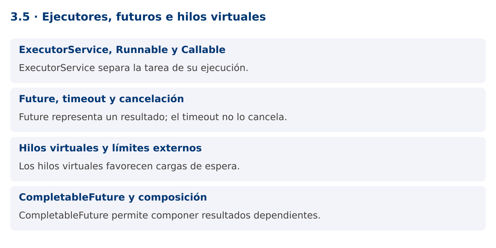

# Programación Aplicada

## 3.5. Ejecutores, futuros e hilos virtuales


**Autor:** Ing. Pablo Torres, Mgtr.  
**Unidad:** 3. Programación concurrente  
**Proyecto de trabajo:** CampusMonitor

[Inicio del curso](../../README.md) · [Presentación editable](presentacion.pptx) · [Ver en el navegador](index.html)

---

## 1. Conceptos y ejemplos

### Contexto

Crear un Thread para cada trabajo dispersa el control del ciclo de vida. CampusMonitor necesita enviar tareas, recuperar resultados, manejar fallos y cerrar los recursos de ejecución de forma coordinada.

### Antes de empezar

Recupera el avance de [3.4](../3.4-productores-consumidores/material.md). Conserva sus comandos y evidencias. Revisa el ejemplo completo antes de implementar la PC. Las demostraciones del material se ejecutan separadas del proyecto personal.

<a id="concepto-1"></a>

### 1.1. ExecutorService, Runnable y Callable

ExecutorService separa envío y ejecución. Runnable representa trabajo sin resultado, mientras Callable<T> devuelve T y puede lanzar excepciones comprobadas. submit devuelve un Future<T> que permite esperar el resultado, cancelar o consultar finalización.

Un pool fijo limita hilos, pero su cola de tareas puede crecer si el productor envía más rápido de lo que se procesa. Limitar hilos no equivale a limitar trabajo pendiente. Para cargas sostenidas usa colas acotadas y una política de rechazo o contrapresión. El programa que crea el ejecutor debe definir quién lo cierra.

<a id="concepto-2"></a>

### 1.2. Future, timeout y cancelación

Future.get espera y puede lanzar ExecutionException si falló la tarea. La causa contiene el error original. get con timeout limita la espera del consumidor, no cancela automáticamente el trabajo. Si decides abandonar la tarea, llama cancel(true) y verifica que su implementación responda a interrupción.

Shutdown deja de aceptar nuevas tareas y permite terminar las enviadas. ShutdownNow intenta interrumpir las activas y devuelve las pendientes que no comenzaron. No garantiza terminación inmediata. En Java moderno, ExecutorService es AutoCloseable y close espera terminación. Una tarea que ignora cancelación puede prolongar ese cierre.

<a id="concepto-3"></a>

### 1.3. Hilos virtuales y límites externos

Los hilos virtuales son una funcionalidad estable desde Java 21. Reducen el costo de muchas tareas que pasan tiempo esperando E/S. No hacen más rápida una operación intensiva en CPU ni amplían la capacidad de la base de datos o del dispositivo serial. No se recomienda agruparlos en un pool para reutilizarlos: un ejecutor por tarea crea uno por cada trabajo.

Usa un semáforo o un pool de conexiones para limitar recursos externos. En Java 25 existen mejoras respecto de versiones anteriores en la interacción entre monitores y virtual threads, pero sigue siendo necesario analizar el comportamiento de librerías y operaciones nativas. El curso evita APIs preview para mantener una base estable.

<a id="concepto-4"></a>

### 1.4. CompletableFuture y composición

CompletableFuture permite combinar resultados sin escribir esperas intermedias explícitas. thenApply transforma un resultado y thenCombine une dos resultados independientes. Los métodos async sin ejecutor explícito suelen usar el common pool, que puede compartirse con otras operaciones de la aplicación.

La demostración proporciona su propio ejecutor y combina dos lecturas simuladas. La composición no vuelve thread-safe a los objetos capturados por las lambdas. Maneja excepciones con una política clara: propagar, recuperar con un valor justificado o registrar el fallo. Nunca conviertas silenciosamente un error de sensor en una medición cero.

### Mapa de conceptos



---

<a id="demostracion"></a>

## 2. Demostración guiada

### 2.1. Problema y contrato

Crear un Thread para cada trabajo dispersa el control del ciclo de vida. CampusMonitor necesita enviar tareas, recuperar resultados, manejar fallos y cerrar los recursos de ejecución de forma coordinada.

La implementación siguiente es una demostración resuelta. La PC de la sección 3 requiere desarrollar una ampliación propia sobre CampusMonitor.

**Archivo completo:** [EjecutoresDemo.java](ejemplos/EjecutoresDemo.java).

```java
package edu.ups.pap.u03;
import java.util.concurrent.*;
public class EjecutoresDemo {
    static double leer(double valor) {
        try { Thread.sleep(30); return valor; }
        catch (InterruptedException e) {
            Thread.currentThread().interrupt();
            throw new CompletionException(e);
        }
    }
    public static void main(String[] args) throws Exception {
        try (ExecutorService executor = Executors.newVirtualThreadPerTaskExecutor()) {
            CompletableFuture<Double> a = CompletableFuture.supplyAsync(() -> leer(22),executor);
            CompletableFuture<Double> b = CompletableFuture.supplyAsync(() -> leer(26),executor);
            CompletableFuture<Double> media = a.thenCombine(b,(x,y)->(x+y)/2);
            try { System.out.println("Media: " + media.get(2,TimeUnit.SECONDS)); }
            catch (TimeoutException e) {
                a.cancel(true); b.cancel(true);
                executor.shutdownNow();
                throw e;
            }
            Future<String> id = executor.submit(() -> "S01");
            System.out.println("Sensor: " + id.get());
        }
    }
}
```

### 2.2. Ejecución

Desde la raíz de este repositorio, con JDK 25:

```bash
java 03/3.5-herramientas/ejemplos/EjecutoresDemo.java
```

Con el proyecto Gradle de demostraciones:

```bash
cd demostraciones
./gradlew runDemo -Pdemo=3.5
```

En Windows usa `gradlew.bat`. Ejecuta cada demostración desde una terminal nueva o vuelve a la raíz antes de cambiar de contenido.

### 2.3. Resultado y lectura de la ejecución

```text
Media: 24.0
Sensor: S01
```

1. Identifica los datos iniciales y las precondiciones que la demostración valida.
2. Sigue las llamadas desde `main` o `loop` y relaciona las operaciones con los conceptos de la sección 1.
3. Contrasta el resultado con la salida esperada del ejemplo. Si el orden es concurrente, compara la invariante y no el orden de impresión.
4. Cambia un dato del ejemplo y predice el resultado antes de ejecutarlo. Registra cualquier diferencia y su causa.

---

<a id="pc"></a>

## 3. PC3.5 · Práctica de clase

### 3.1. Ampliación del proyecto

Esta actividad se resuelve en tu repositorio `icc-pap-campusmonitor-apellido`. Mantén la funcionalidad anterior. No reemplaces tu solución con los archivos de demostración del material.

1. Migra el procesamiento por lotes a ExecutorService y Callable<ResultadoImportacion>. Mantén la clasificación de errores de 3.4.
2. Establece un máximo de tareas pendientes, un plazo por operación y cierre del ejecutor. Explica que cancelar CompletableFuture no necesariamente interrumpe su cálculo subyacente.
3. Compara un pool fijo y virtual threads para esperas simuladas. Registra entorno y volumen sin afirmar que virtual threads mejoran tareas CPU.

### 3.2. Comprobación y evidencia

Prueba los casos de esta sección y registra entradas, salida real y explicación. Incluye una ejecución normal y un caso de error. La evidencia debe permitir repetir el resultado desde el commit entregado.

| Caso que debes revisar | Comportamiento requerido |
|---|---|
| Lote completo | Resultados y ejecutor cerrado |
| Tarea con excepción | Causa original visible |
| Plazo agotado | Política de cancelación y cierre aplicada |

En `evidencias/PC3.5.md` agrega: cambio realizado, archivos principales, comandos de ejecución, tabla de pruebas y enlace al commit final. No añadas una rúbrica a esta PC.

### 3.3. Commits de la actividad

```bash
git status
git add src evidencias
git commit -m "feat(pc3.5): ejecutores-futuros-e-hilos-virtuales"
git push
git log -1 --format=%H
```

Ajusta las rutas de `git add` a los archivos que realmente creaste. Incluye también configuración o SQL si cambiaste esos archivos. El último comando muestra el hash real que debes enlazar en tu evidencia.

### Lo esencial

- ExecutorService separa la tarea de su ejecución.
- Future representa un resultado; el timeout no lo cancela.
- Los hilos virtuales favorecen cargas de espera.
- CompletableFuture permite componer resultados dependientes.

## Referencias técnicas

- [Concurrencia, Java 25](https://docs.oracle.com/en/java/javase/25/docs/api/java.base/java/util/concurrent/package-summary.html)
- [Thread](https://docs.oracle.com/en/java/javase/25/docs/api/java.base/java/lang/Thread.html)
- [SwingWorker](https://docs.oracle.com/en/java/javase/25/docs/api/java.desktop/javax/swing/SwingWorker.html)
