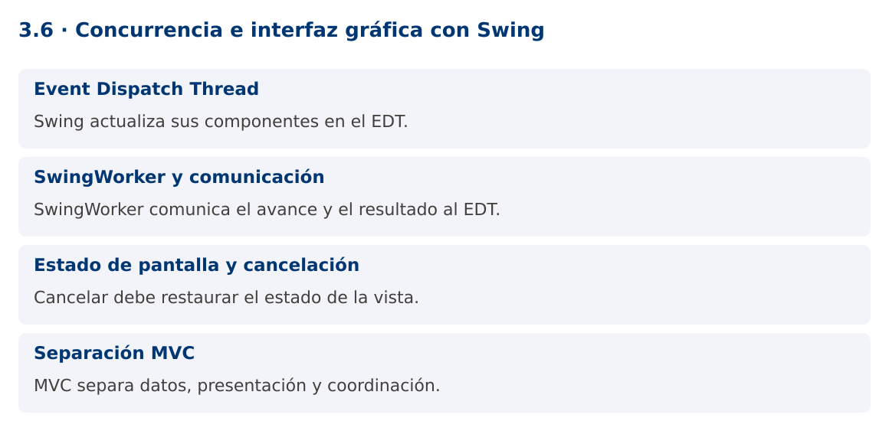

# Programación Aplicada

## 3.6. Concurrencia e interfaz gráfica con Swing


**Autor:** Ing. Pablo Torres, Mgtr.  
**Unidad:** 3. Programación concurrente  
**Proyecto de trabajo:** CampusMonitor

[Inicio del curso](../../README.md) · [Presentación editable](presentacion.pptx) · [Ver en el navegador](index.html)

---

## 1. Conceptos y ejemplos

### Contexto

El monitor necesita mostrar el avance de una importación sin congelar la ventana. Swing forma parte del JDK y permite concentrarse en la regla de actualización de la interfaz y la separación entre trabajo y presentación.

### Antes de empezar

Recupera el avance de [3.5](../3.5-herramientas/material.md). Conserva sus comandos y evidencias. Revisa el ejemplo completo antes de implementar la PC. Las demostraciones del material se ejecutan separadas del proyecto personal.

<a id="concepto-1"></a>

### 1.1. Event Dispatch Thread

Swing procesa eventos y actualizaciones de interfaz en el Event Dispatch Thread, EDT. Crea y modifica componentes Swing en ese hilo. Una tarea lenta ejecutada en un ActionListener bloquea otros eventos, incluido repintado y cierre aparente de la ventana.

SwingUtilities.invokeLater programa una operación breve en el EDT. No ejecuta trabajo pesado en segundo plano. Las operaciones de disco, base de datos o recepción serial deben realizarse fuera del EDT y comunicar resultados mediante mecanismos adecuados. También evita llamadas bloqueantes como get o join dentro del EDT salvo que el resultado ya esté disponible.

<a id="concepto-2"></a>

### 1.2. SwingWorker y comunicación

SwingWorker<T,V> separa doInBackground, que ejecuta trabajo fuera del EDT, de process y done, que se ejecutan en el EDT. publish envía avances que pueden agruparse antes de llegar a process. No supongas que cada publish genera una llamada inmediata e individual.

done se ejecuta al terminar, también cuando hay cancelación o error. get dentro de done permite recuperar el resultado o la causa, porque la tarea ya finalizó. Maneja CancellationException, ExecutionException e InterruptedException de forma diferenciada. Los mensajes al usuario deben indicar el estado real de la operación.

<a id="concepto-3"></a>

### 1.3. Estado de pantalla y cancelación

Mientras se ejecuta una tarea, deshabilita el botón que iniciaría otra copia incompatible y habilita la cancelación si procede. Al terminar, restaura controles en una ruta común. El cierre de la ventana debe cancelar tareas y liberar recursos, especialmente si después se agregan conexiones seriales o JDBC.

cancel(true) solicita interrupción. doInBackground debe consultar isCancelled y responder a InterruptedException. Una barra al cien por ciento no equivale a datos persistidos si la transacción todavía no se confirmó. Usa etiquetas como procesadas o guardadas según la etapa representada.

<a id="concepto-4"></a>

### 1.4. Separación MVC

El modelo mantiene sensores y lecturas, la vista presenta controles y el controlador interpreta acciones. La lógica del parser o repositorio no debería depender de JLabel ni JOptionPane. Esta separación permite ejecutar los mismos casos desde consola y desde interfaz.

La demostración incluye un modo --self-test para verificar el cálculo sin pantalla y un modo gráfico para inspeccionar respuesta y cancelación. La prueba sin pantalla no sustituye la revisión visual. Para una aplicación real, el servicio de importación debe devolver resultados estructurados y la vista decidir cómo mostrarlos.

### Mapa de conceptos



---

<a id="demostracion"></a>

## 2. Demostración guiada

### 2.1. Problema y contrato

El monitor necesita mostrar el avance de una importación sin congelar la ventana. Swing forma parte del JDK y permite concentrarse en la regla de actualización de la interfaz y la separación entre trabajo y presentación.

La implementación siguiente es una demostración resuelta. La PC de la sección 3 requiere desarrollar una ampliación propia sobre CampusMonitor.

**Archivo completo:** [SwingDemo.java](ejemplos/SwingDemo.java).

```java
package edu.ups.pap.u03;
import javax.swing.*;
import java.awt.*;
import java.awt.event.*;
import java.util.List;
import java.util.concurrent.*;
public class SwingDemo {
    static int calcular() { return java.util.stream.IntStream.rangeClosed(1,10).sum(); }
    public static void main(String[] args) {
        if (args.length>0 && args[0].equals("--self-test")) {
            if (calcular()!=55) throw new AssertionError();
            System.out.println("Cálculo: 55"); return;
        }
        SwingUtilities.invokeLater(() -> {
            JFrame ventana = new JFrame("CampusMonitor");
            JLabel estado = new JLabel("Listo");
            JButton iniciar = new JButton("Importar"), cancelar = new JButton("Cancelar");
            cancelar.setEnabled(false);
            final java.util.concurrent.atomic.AtomicReference<SwingWorker<Integer,Integer>> actual = new java.util.concurrent.atomic.AtomicReference<>();
            iniciar.addActionListener(evento -> {
                iniciar.setEnabled(false); cancelar.setEnabled(true);
                actual.set(new SwingWorker<Integer,Integer>() {
                    protected Integer doInBackground() throws Exception {
                        for(int i=1;i<=10;i++) {
                            if(isCancelled()) return 0;
                            Thread.sleep(80); publish(i);
                        }
                        return calcular();
                    }
                    protected void process(List<Integer> lotes) {
                        estado.setText("Procesadas: "+lotes.getLast());
                    }
                    protected void done() {
                        try { estado.setText("Suma: "+get()); }
                        catch(CancellationException e) { estado.setText("Cancelado"); }
                        catch(InterruptedException e) { Thread.currentThread().interrupt(); }
                        catch(ExecutionException e) { estado.setText("Error: "+e.getCause().getMessage()); }
                        finally { iniciar.setEnabled(true); cancelar.setEnabled(false); }
                    }
                });
                actual.get().execute();
            });
            cancelar.addActionListener(e -> { if(actual.get()!=null) actual.get().cancel(true); });
            ventana.addWindowListener(new WindowAdapter() {
                public void windowClosing(WindowEvent e) { if(actual.get()!=null) actual.get().cancel(true); }
            });
            ventana.setDefaultCloseOperation(JFrame.DISPOSE_ON_CLOSE);
            ventana.setLayout(new FlowLayout());
            ventana.add(iniciar);ventana.add(cancelar);ventana.add(estado);
            ventana.setSize(420,140);ventana.setLocationRelativeTo(null);ventana.setVisible(true);
        });
    }
}
```

### 2.2. Ejecución

Desde la raíz de este repositorio, con JDK 25:

```bash
java 03/3.6-interfaz-grafica/ejemplos/SwingDemo.java --self-test
```

Con el proyecto Gradle de demostraciones:

```bash
cd demostraciones
./gradlew runDemo -Pdemo=3.6 -PdemoArgs=--self-test
```

En Windows usa `gradlew.bat`. Ejecuta cada demostración desde una terminal nueva o vuelve a la raíz antes de cambiar de contenido.

Para abrir la ventana, omite `--self-test` en un equipo con entorno gráfico. El modo sin pantalla solo comprueba el cálculo.

### 2.3. Resultado y lectura de la ejecución

```text
Modo --self-test: Cálculo: 55. Modo gráfico: ventana con Importar, Cancelar y progreso. Al completar muestra Suma: 55.
```

1. Identifica los datos iniciales y las precondiciones que la demostración valida.
2. Sigue las llamadas desde `main` o `loop` y relaciona las operaciones con los conceptos de la sección 1.
3. Contrasta el resultado con la salida esperada del ejemplo. Si el orden es concurrente, compara la invariante y no el orden de impresión.
4. Cambia un dato del ejemplo y predice el resultado antes de ejecutarlo. Registra cualquier diferencia y su causa.

---

<a id="pc"></a>

## 3. PC3.6 · Práctica de clase

### 3.1. Ampliación del proyecto

Esta actividad se resuelve en tu repositorio `icc-pap-campusmonitor-apellido`. Mantén la funcionalidad anterior. No reemplaces tu solución con los archivos de demostración del material.

1. Agrega una vista Swing a CampusMonitor con selector de fichero, botón importar, progreso y cancelación. Reutiliza el servicio existente.
2. Ejecuta importación fuera del EDT y actualiza componentes únicamente desde process, done o invokeLater.
3. Prueba doble clic, cancelación y cierre durante el trabajo. La ventana debe responder y no dejar tareas activas sin control.

### 3.2. Comprobación y evidencia

Prueba los casos de esta sección y registra entradas, salida real y explicación. Incluye una ejecución normal y un caso de error. La evidencia debe permitir repetir el resultado desde el commit entregado.

| Caso que debes revisar | Comportamiento requerido |
|---|---|
| Importación activa | La ventana repinta y responde |
| Segundo clic | No inicia un trabajo duplicado |
| Cancelar o cerrar | Operación termina y libera recursos |

En `evidencias/PC3.6.md` agrega: cambio realizado, archivos principales, comandos de ejecución, tabla de pruebas y enlace al commit final. No añadas una rúbrica a esta PC.

### 3.3. Commits de la actividad

```bash
git status
git add src evidencias
git commit -m "feat(pc3.6): concurrencia-e-interfaz-grafica-con-swing"
git push
git log -1 --format=%H
```

Ajusta las rutas de `git add` a los archivos que realmente creaste. Incluye también configuración o SQL si cambiaste esos archivos. El último comando muestra el hash real que debes enlazar en tu evidencia.

### Lo esencial

- Swing actualiza sus componentes en el EDT.
- SwingWorker comunica el avance y el resultado al EDT.
- Cancelar debe restaurar el estado de la vista.
- MVC separa datos, presentación y coordinación.

## Referencias técnicas

- [Concurrencia, Java 25](https://docs.oracle.com/en/java/javase/25/docs/api/java.base/java/util/concurrent/package-summary.html)
- [Thread](https://docs.oracle.com/en/java/javase/25/docs/api/java.base/java/lang/Thread.html)
- [SwingWorker](https://docs.oracle.com/en/java/javase/25/docs/api/java.desktop/javax/swing/SwingWorker.html)
