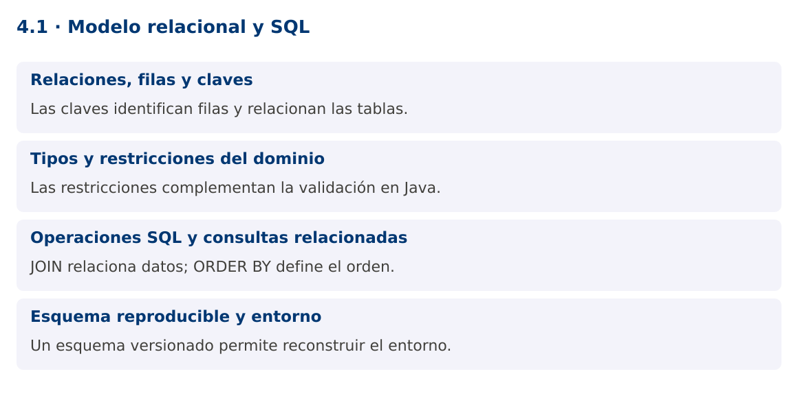

# Programación Aplicada

## 4.1. Modelo relacional y SQL


**Autor:** Ing. Pablo Torres, Mgtr.  
**Unidad:** 4. Conexión a bases de datos  
**Proyecto de trabajo:** CampusMonitor

[Inicio del curso](../../README.md) · [Presentación editable](presentacion.pptx) · [Ver en el navegador](index.html)

---

## 1. Conceptos y ejemplos

### Contexto

El repositorio en memoria pierde su contenido al cerrar CampusMonitor. Una base relacional permite guardar sensores y lecturas con identidades, relaciones y restricciones que sobreviven a la ejecución.

### Antes de empezar

Recupera el avance de [3.6](../../03/3.6-interfaz-grafica/material.md). Conserva sus comandos y evidencias. Revisa el ejemplo completo antes de implementar la PC. Las demostraciones del material se ejecutan separadas del proyecto personal.


La ilustración sirve como analogía. El contrato técnico se define en el texto y el código.

<a id="concepto-1"></a>

### 1.1. Relaciones, filas y claves

Una tabla representa una relación con columnas tipadas y filas. La clave primaria identifica cada fila y no admite valores nulos. Una clave foránea exige que una referencia corresponda a una fila válida de otra tabla, según las reglas configuradas. En CampusMonitor, lectura.sensor_id referencia sensor.id.

El modelo separa sensores de lecturas para no repetir ubicación y tipo del dispositivo en cada medición. Una clave técnica generada puede identificar la lectura, mientras sensor_id y secuencia pueden formar una restricción única del protocolo. Diseña la identidad según la semántica de duplicados, no solo porque el motor permita autoincremento.

<a id="concepto-2"></a>

### 1.2. Tipos y restricciones del dominio

Elige tipos que representen el dato y su precisión. INTEGER sirve para cantidades enteras, NUMERIC para decimales exactos y DOUBLE PRECISION para medidas aproximadas. TIMESTAMP WITH TIME ZONE representa un instante con semántica temporal según el motor. En Java, Instant u OffsetDateTime ayudan a evitar la ambigüedad de horarios locales.

NOT NULL, UNIQUE, CHECK y FOREIGN KEY protegen invariantes incluso si otra aplicación escribe en la base. Una validación en Java ofrece mejores mensajes al usuario, pero no sustituye a la restricción persistente. Evita borrar un sensor con cascada sobre lecturas históricas sin decidir expresamente esa política.

<a id="concepto-3"></a>

### 1.3. Operaciones SQL y consultas relacionadas

INSERT crea filas, SELECT consulta, UPDATE modifica y DELETE elimina. WHERE restringe las filas afectadas y ORDER BY define el orden de los resultados. Sin ORDER BY no se garantiza un orden estable. JOIN reúne datos relacionados por una condición y no debe confundirse con copiar los datos físicamente.

Las consultas agregadas como COUNT y AVG resumen grupos. GROUP BY determina las categorías del resumen. Un índice puede favorecer filtros o uniones, pero agrega costo a escrituras y almacenamiento. En la práctica inicial, consulta por sensor y orden temporal, observando primero la corrección del resultado antes de optimizar.

```sql
SELECT s.id, s.ubicacion, COUNT(l.id) AS cantidad
FROM sensor s LEFT JOIN lectura l ON l.sensor_id = s.id
GROUP BY s.id, s.ubicacion
ORDER BY s.id;
```

<a id="concepto-4"></a>

### 1.4. Esquema reproducible y entorno

Un script de esquema versionado documenta cómo crear la base. Las migraciones posteriores deben conservar datos existentes y registrar su orden. No soluciones cada cambio eliminando la base completa. La demostración usa H2 en memoria para una ejecución aislada y reproducible. El proyecto del estudiante usará PostgreSQL mediante JDBC en los contenidos siguientes.

Las diferencias entre motores importan: identidad, funciones, tipos temporales y sintaxis de retorno pueden variar. Los scripts de PostgreSQL se incluyen por separado. No se promete que una aplicación probada únicamente con H2 se comporte de forma idéntica en PostgreSQL.

### Mapa de conceptos



---

<a id="demostracion"></a>

## 2. Demostración guiada

### 2.1. Problema y contrato

El repositorio en memoria pierde su contenido al cerrar CampusMonitor. Una base relacional permite guardar sensores y lecturas con identidades, relaciones y restricciones que sobreviven a la ejecución.

La implementación siguiente es una demostración resuelta. La PC de la sección 3 requiere desarrollar una ampliación propia sobre CampusMonitor.

**Archivo completo:** [RelacionalDemo.java](ejemplos/RelacionalDemo.java).

```java
package edu.ups.pap.u04;
import java.sql.*;
public class RelacionalDemo {
    public static void main(String[] args) throws SQLException {
        try (Connection c = DriverManager.getConnection("jdbc:h2:mem:modelo")) {
            try (Statement s = c.createStatement()) {
                s.execute("CREATE TABLE sensor(id VARCHAR(8) PRIMARY KEY, ubicacion VARCHAR(80) NOT NULL)");
                s.execute("CREATE TABLE lectura(id BIGINT GENERATED ALWAYS AS IDENTITY PRIMARY KEY, sensor_id VARCHAR(8) REFERENCES sensor(id), valor DOUBLE PRECISION NOT NULL)");
                s.executeUpdate("INSERT INTO sensor VALUES('S01','Lab'),('S02','Biblioteca')");
                s.executeUpdate("INSERT INTO lectura(sensor_id,valor) VALUES('S01',22),('S01',24)");
                try (ResultSet r=s.executeQuery("SELECT s.id,COUNT(l.id) cantidad FROM sensor s LEFT JOIN lectura l ON s.id=l.sensor_id GROUP BY s.id ORDER BY s.id")) {
                    while(r.next()) System.out.println(r.getString("id")+": "+r.getInt("cantidad"));
                }
            }
        }
    }
}
```

### 2.2. Ejecución

Con el proyecto Gradle de demostraciones:

```bash
cd demostraciones
./gradlew runDemo -Pdemo=4.1
```

En Windows usa `gradlew.bat`. Ejecuta cada demostración desde una terminal nueva o vuelve a la raíz antes de cambiar de contenido.

### 2.3. Resultado y lectura de la ejecución

```text
S01: 2
S02: 0
```

1. Identifica los datos iniciales y las precondiciones que la demostración valida.
2. Sigue las llamadas desde `main` o `loop` y relaciona las operaciones con los conceptos de la sección 1.
3. Contrasta el resultado con la salida esperada del ejemplo. Si el orden es concurrente, compara la invariante y no el orden de impresión.
4. Cambia un dato del ejemplo y predice el resultado antes de ejecutarlo. Registra cualquier diferencia y su causa.

---

<a id="pc"></a>

## 3. PC4.1 · Práctica de clase

### 3.1. Ampliación del proyecto

Esta actividad se resuelve en tu repositorio `icc-pap-campusmonitor-apellido`. Mantén la funcionalidad anterior. No reemplaces tu solución con los archivos de demostración del material.

1. Diseña sensor y lectura en PostgreSQL para CampusMonitor, con clave foránea, valores requeridos y unicidad de sensor más secuencia.
2. Versiona schema.sql y seed.sql. Inserta dos sensores, varias lecturas y un sensor sin lecturas para comprobar LEFT JOIN.
3. Escribe consultas de promedio por sensor y últimas lecturas ordenadas. Describe qué restricciones evitan datos inconsistentes.

### 3.2. Comprobación y evidencia

Prueba los casos de esta sección y registra entradas, salida real y explicación. Incluye una ejecución normal y un caso de error. La evidencia debe permitir repetir el resultado desde el commit entregado.

| Caso que debes revisar | Comportamiento requerido |
|---|---|
| Lectura de sensor existente | Inserción válida |
| Sensor inexistente | Violación de clave foránea |
| Sensor sin lecturas | Aparece con cantidad cero en LEFT JOIN |

En `evidencias/PC4.1.md` agrega: cambio realizado, archivos principales, comandos de ejecución, tabla de pruebas y enlace al commit final. No añadas una rúbrica a esta PC.

### 3.3. Commits de la actividad

```bash
git status
git add src evidencias
git commit -m "feat(pc4.1): modelo-relacional-y-sql"
git push
git log -1 --format=%H
```

Ajusta las rutas de `git add` a los archivos que realmente creaste. Incluye también configuración o SQL si cambiaste esos archivos. El último comando muestra el hash real que debes enlazar en tu evidencia.

### Lo esencial

- Las claves identifican filas y relacionan las tablas.
- Las restricciones complementan la validación en Java.
- JOIN relaciona datos; ORDER BY define el orden.
- Un esquema versionado permite reconstruir el entorno.

## Referencias técnicas

- [JDBC, Java 25](https://docs.oracle.com/en/java/javase/25/docs/api/java.sql/java/sql/package-summary.html)
- [PostgreSQL JDBC](https://jdbc.postgresql.org/documentation/)
- [Apache JDO](https://db.apache.org/jdo/)
- [DataNucleus JDO](https://www.datanucleus.org/products/accessplatform_6_0/jdo/guide.html)
