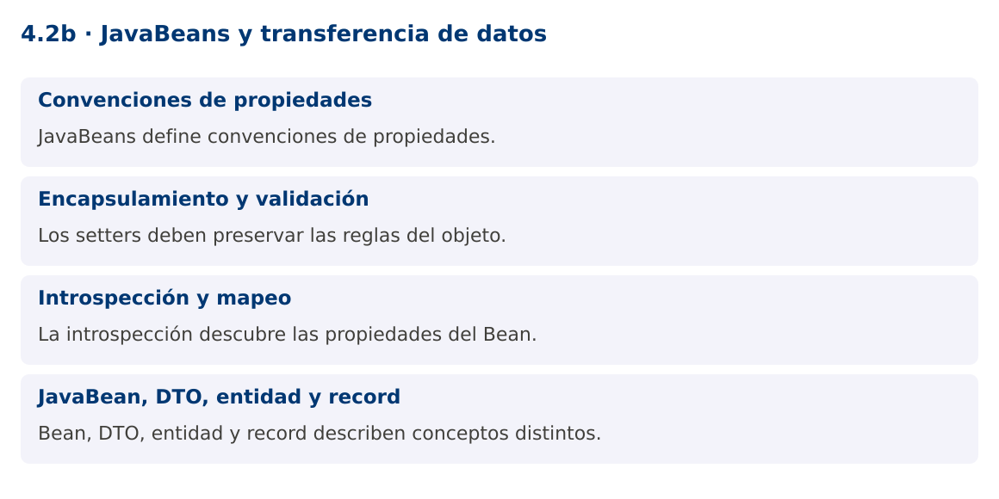

# Programación Aplicada

## 4.2b. JavaBeans y transferencia de datos


**Autor:** Ing. Pablo Torres, Mgtr.  
**Unidad:** 4. Conexión a bases de datos  
**Proyecto de trabajo:** CampusMonitor

[Inicio del curso](../../../README.md) · [Presentación editable](presentacion.pptx) · [Ver en el navegador](index.html)

---

## 1. Conceptos y ejemplos

### Contexto

Los resultados de una consulta deben convertirse en objetos que la aplicación pueda utilizar. JavaBeans define convenciones útiles para propiedades y herramientas de introspección, pero no almacena datos por sí mismo.

### Antes de empezar

Recupera el avance de [4.2a](../01-jdbc-configuracion/material.md). Conserva sus comandos y evidencias. Revisa el ejemplo completo antes de implementar la PC. Las demostraciones del material se ejecutan separadas del proyecto personal.

<a id="concepto-1"></a>

### 1.1. Convenciones de propiedades

Un JavaBean suele tener constructor público sin argumentos y propiedades accesibles con getters y setters. getNombre y setNombre describen la propiedad nombre. Para boolean puede utilizarse isActivo. Las herramientas de introspección identifican esas propiedades sin acceder directamente a los campos.

El concepto no equivale a un bean de un contenedor de inyección como Spring. Tampoco exige anotaciones de persistencia. Serializable puede ser útil para determinados usos históricos, pero no convierte el objeto en una entidad de base de datos ni es una condición universal de todas las convenciones de JavaBeans.

<a id="concepto-2"></a>

### 1.2. Encapsulamiento y validación

Un setter debe proteger la regla del atributo, por ejemplo rechazar una ubicación vacía. Varias propiedades relacionadas pueden requerir validación conjunta para evitar estados intermedios incoherentes. Un constructor vacío permite construir antes de completar los campos, por lo que el código debe saber cuándo el objeto está listo para usarse.

Los modelos mutables no son automáticamente seguros para concurrencia. Si una interfaz necesita enlazar propiedades modificables, el Bean puede resultar conveniente. Para resultados inmutables, records o clases con constructor completo suelen expresar mejor que los datos ya fueron validados.

<a id="concepto-3"></a>

### 1.3. Introspección y mapeo

Introspector.getBeanInfo examina descriptores de propiedades y sus métodos de lectura y escritura. Proporcionar Object.class como límite evita tratar getClass como una propiedad del dominio. Invocar un descriptor puede lanzar excepciones relacionadas con reflexión o con la validación del setter.

El mapeo JDBC puede escribirse explícitamente: rs.getString("sensor_id") y bean.setSensorId(...). Esto mantiene visibles nombres de columnas y conversiones. Un mapeador genérico basado en reflexión reduce repetición, pero también desplaza errores a ejecución. Evalúa si el ahorro compensa la pérdida de claridad.

<a id="concepto-4"></a>

### 1.4. JavaBean, DTO, entidad y record

DTO describe el propósito de transferir datos; JavaBean describe convenciones de propiedades; entidad describe identidad y comportamiento del dominio o persistencia. Un mismo objeto puede cumplir más de un papel, pero los términos no son sinónimos.

Un record ofrece componentes finales y accesores con el nombre del componente, como sensorId(), no getters getSensorId. Por eso algunas herramientas basadas exclusivamente en convenciones JavaBeans requieren adaptación. La PC compara ambos modelos y conserva explícita la transformación entre una fila y el objeto de aplicación.

### Mapa de conceptos



---

<a id="demostracion"></a>

## 2. Demostración guiada

### 2.1. Problema y contrato

Los resultados de una consulta deben convertirse en objetos que la aplicación pueda utilizar. JavaBeans define convenciones útiles para propiedades y herramientas de introspección, pero no almacena datos por sí mismo.

La implementación siguiente es una demostración resuelta. La PC de la sección 3 requiere desarrollar una ampliación propia sobre CampusMonitor.

**Archivo completo:** [BeansDemo.java](ejemplos/BeansDemo.java).

```java
package edu.ups.pap.u04;
import java.beans.*;
import java.lang.reflect.*;
import java.util.*;
public class BeansDemo {
    public static class SensorBean {
        private String id;
        private String ubicacion;
        public SensorBean() {}
        public String getId(){return id;}
        public void setId(String id){
            if(id==null || id.isBlank()) throw new IllegalArgumentException("ID requerido");
            this.id=id;
        }
        public String getUbicacion(){return ubicacion;}
        public void setUbicacion(String ubicacion){
            if(ubicacion==null || ubicacion.isBlank()) throw new IllegalArgumentException("Ubicación requerida");
            this.ubicacion=ubicacion;
        }
    }
    public static void main(String[] args) throws IntrospectionException, ReflectiveOperationException {
        SensorBean bean = new SensorBean();bean.setId("S01");bean.setUbicacion("Lab");
        var propiedades = Introspector.getBeanInfo(SensorBean.class,Object.class).getPropertyDescriptors();
        Arrays.sort(propiedades,Comparator.comparing(PropertyDescriptor::getName));
        for(var p:propiedades) System.out.println(p.getName()+"="+p.getReadMethod().invoke(bean));
    }
}
```

### 2.2. Ejecución

Desde la raíz de este repositorio, con JDK 25:

```bash
java 04/4.2-persistencia/02-javabeans/ejemplos/BeansDemo.java
```

Con el proyecto Gradle de demostraciones:

```bash
cd demostraciones
./gradlew runDemo -Pdemo=4.2b
```

En Windows usa `gradlew.bat`. Ejecuta cada demostración desde una terminal nueva o vuelve a la raíz antes de cambiar de contenido.

### 2.3. Resultado y lectura de la ejecución

```text
id=S01
ubicacion=Lab
```

1. Identifica los datos iniciales y las precondiciones que la demostración valida.
2. Sigue las llamadas desde `main` o `loop` y relaciona las operaciones con los conceptos de la sección 1.
3. Contrasta el resultado con la salida esperada del ejemplo. Si el orden es concurrente, compara la invariante y no el orden de impresión.
4. Cambia un dato del ejemplo y predice el resultado antes de ejecutarlo. Registra cualquier diferencia y su causa.

---

<a id="pc"></a>

## 3. PC4.2b · Práctica de clase

### 3.1. Ampliación del proyecto

Esta actividad se resuelve en tu repositorio `icc-pap-campusmonitor-apellido`. Mantén la funcionalidad anterior. No reemplaces tu solución con los archivos de demostración del material.

1. Crea SensorBean con constructor sin argumentos, getters y setters validados. Agrega un mapper explícito desde una fila JDBC.
2. Representa la misma salida con un record SensorDto y compara mutabilidad, constructores y nombres de accesores.
3. Mantén el modelo de dominio separado de los componentes Swing. Documenta qué representación eliges para consultas de solo lectura.

### 3.2. Comprobación y evidencia

Prueba los casos de esta sección y registra entradas, salida real y explicación. Incluye una ejecución normal y un caso de error. La evidencia debe permitir repetir el resultado desde el commit entregado.

| Caso que debes revisar | Comportamiento requerido |
|---|---|
| Bean con propiedades válidas | Introspección reconoce id y ubicación |
| Ubicación vacía | Setter rechaza |
| Record | Accesores no siguen automáticamente getX |

En `evidencias/PC4.2b.md` agrega: cambio realizado, archivos principales, comandos de ejecución, tabla de pruebas y enlace al commit final. No añadas una rúbrica a esta PC.

### 3.3. Commits de la actividad

```bash
git status
git add src evidencias
git commit -m "feat(pc4.2b): javabeans-y-transferencia-de-datos"
git push
git log -1 --format=%H
```

Ajusta las rutas de `git add` a los archivos que realmente creaste. Incluye también configuración o SQL si cambiaste esos archivos. El último comando muestra el hash real que debes enlazar en tu evidencia.

### Lo esencial

- JavaBeans define convenciones de propiedades.
- Los setters deben preservar las reglas del objeto.
- La introspección descubre las propiedades del Bean.
- Bean, DTO, entidad y record describen conceptos distintos.

## Referencias técnicas

- [JDBC, Java 25](https://docs.oracle.com/en/java/javase/25/docs/api/java.sql/java/sql/package-summary.html)
- [PostgreSQL JDBC](https://jdbc.postgresql.org/documentation/)
- [Apache JDO](https://db.apache.org/jdo/)
- [DataNucleus JDO](https://www.datanucleus.org/products/accessplatform_6_0/jdo/guide.html)
