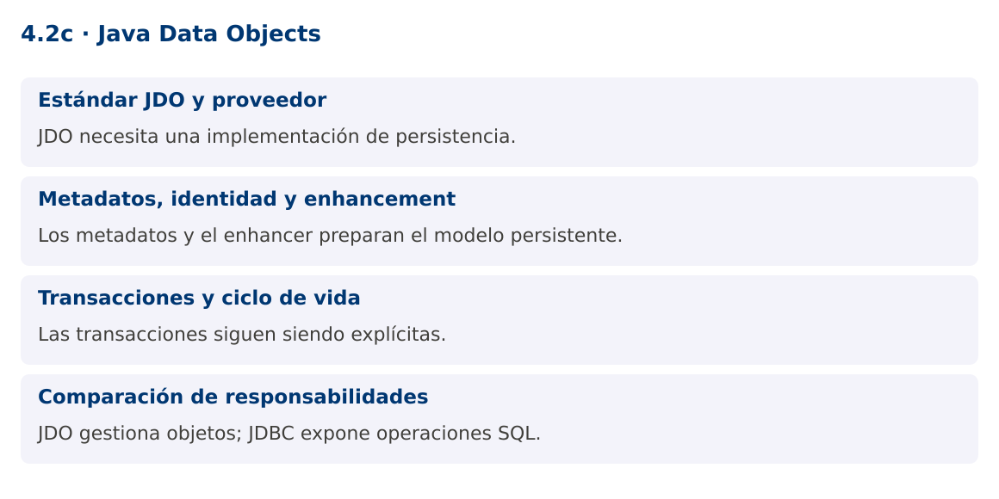

# Programación Aplicada

## 4.2c. Java Data Objects


**Autor:** Ing. Pablo Torres, Mgtr.  
**Unidad:** 4. Conexión a bases de datos  
**Proyecto de trabajo:** CampusMonitor

[Inicio del curso](../../../README.md) · [Presentación editable](presentacion.pptx) · [Ver en el navegador](index.html)

---

## 1. Conceptos y ejemplos

### Contexto

El programa analítico incluye Java Data Objects. Este contenido implementa una persistencia mínima con JDO para compararla con JDBC, manteniendo JDBC como ruta principal de CampusMonitor.

### Antes de empezar

Recupera el avance de [4.2b](../02-javabeans/material.md). Conserva sus comandos y evidencias. Revisa el ejemplo completo antes de implementar la PC. Las demostraciones del material se ejecutan separadas del proyecto personal.

<a id="concepto-1"></a>

### 1.1. Estándar JDO y proveedor

JDO define una API de persistencia de objetos independiente de una implementación específica. PersistenceManagerFactory crea administradores y PersistenceManager trabaja con objetos persistentes dentro de un contexto. Una implementación como DataNucleus proporciona el comportamiento y el acceso al almacenamiento.

JDO no es JDBC ni JPA. JDBC trabaja con sentencias SQL, filas y conexiones. JDO administra estados de objetos y puede apoyarse en distintos tipos de almacenamiento según el proveedor. La abstracción no elimina el diseño del esquema ni los costos de consultas, carga de relaciones y transacciones.

<a id="concepto-2"></a>

### 1.2. Metadatos, identidad y enhancement

Las clases persistentes necesitan metadatos que indiquen identidad y campos persistidos. @PersistenceCapable marca la clase y @PrimaryKey identifica su clave de aplicación en el ejemplo. El proveedor puede requerir enhancement de bytecode para seguir cambios y transiciones de estado.

El subproyecto jdo-demo compila su pequeño modelo a bytecode Java 17 y ejecuta el enhancer de DataNucleus antes de arrancar con Java 25. Esa separación limita el modelo a una versión de bytecode compatible con el proveedor utilizado; no cambia el JDK base de CampusMonitor. El procedimiento está declarado en Gradle y debe repetirse cuando cambia la clase persistente.

<a id="concepto-3"></a>

### 1.3. Transacciones y ciclo de vida

La transacción comienza antes de makePersistent y confirma con commit. Si algo falla y sigue activa, se revierte con rollback. Después de cerrar PersistenceManager, algunos objetos pueden no permitir acceso a campos no cargados. Si el resultado debe salir del contexto, define una estrategia de separación o transformación a DTO.

El ejemplo persiste una lectura, termina el primer administrador y abre otro para recuperarla por identidad. Así evita confundir la referencia original en memoria con una consulta al almacenamiento. Se utiliza una base H2 aislada para esta comparación y no se reemplaza el esquema PostgreSQL del proyecto principal.

<a id="concepto-4"></a>

### 1.4. Comparación de responsabilidades

Con JDBC escribes SQL y realizas el mapeo. Con JDO defines metadatos y trabajas con la API de objetos, aunque aún debes controlar transacciones y recursos. Un proveedor agrega dependencias, configuración y pasos de construcción. La elección depende del tipo de aplicación y de la experiencia del equipo.

La PC debe demostrar persistencia y lectura posterior, identificar los archivos que requiere el proveedor y explicar qué parte reemplaza al mapeo manual. No basta con instanciar una clase anotada: sin proveedor, enhancement cuando corresponda y transacción confirmada, no hay persistencia demostrada.

### Mapa de conceptos



---

<a id="demostracion"></a>

## 2. Demostración guiada

### 2.1. Problema y contrato

El programa analítico incluye Java Data Objects. Este contenido implementa una persistencia mínima con JDO para compararla con JDBC, manteniendo JDBC como ruta principal de CampusMonitor.

La implementación siguiente es una demostración resuelta. La PC de la sección 3 requiere desarrollar una ampliación propia sobre CampusMonitor.

**Archivo completo:** [JdoDemo.java](ejemplos/JdoDemo.java).

```java
package edu.ups.pap.jdo;
import javax.jdo.*;
import java.util.*;
public class JdoDemo {
    public static void main(String[] args) {
        Map<String,String> p = new HashMap<>();
        p.put("javax.jdo.PersistenceManagerFactoryClass","org.datanucleus.api.jdo.JDOPersistenceManagerFactory");
        p.put("javax.jdo.option.ConnectionDriverName","org.h2.Driver");
        p.put("javax.jdo.option.ConnectionURL","jdbc:h2:mem:jdo;DB_CLOSE_DELAY=-1");
        p.put("javax.jdo.option.ConnectionUserName","sa");
        p.put("javax.jdo.option.ConnectionPassword","");
        p.put("datanucleus.schema.autoCreateAll","true");
        PersistenceManagerFactory pmf=JDOHelper.getPersistenceManagerFactory(p);
        try {
            PersistenceManager pm=pmf.getPersistenceManager();
            Transaction tx=pm.currentTransaction();
            try {tx.begin();pm.makePersistent(new JdoLectura(1,23.5));tx.commit();}
            finally {if(tx.isActive())tx.rollback();pm.close();}
            pm=pmf.getPersistenceManager();tx=pm.currentTransaction();
            try {
                tx.begin();
                JdoLectura lectura=pm.getObjectById(JdoLectura.class,1L);
                System.out.println("Lectura JDO: "+lectura.getValor());tx.commit();
            } finally {if(tx.isActive())tx.rollback();pm.close();}
        } finally {pmf.close();}
    }
}
```

**Modelo persistente completo:** [JdoLectura.java](ejemplos/JdoLectura.java). El subproyecto incluye API, proveedor y tarea de enhancement.

### 2.2. Ejecución

Desde `demostraciones`:

```bash
./gradlew :jdo-demo:run
```

En Windows usa `gradlew.bat`. La tarea de ejecución aplica primero el enhancement del modelo.

### 2.3. Resultado y lectura de la ejecución

```text
Lectura JDO: 23.5. El proveedor también puede escribir mensajes de inicialización en stderr.
```

1. Identifica los datos iniciales y las precondiciones que la demostración valida.
2. Sigue las llamadas desde `main` o `loop` y relaciona las operaciones con los conceptos de la sección 1.
3. Contrasta el resultado con la salida esperada del ejemplo. Si el orden es concurrente, compara la invariante y no el orden de impresión.
4. Cambia un dato del ejemplo y predice el resultado antes de ejecutarlo. Registra cualquier diferencia y su causa.

---

<a id="pc"></a>

## 3. PC4.2c · Práctica de clase

### 3.1. Ampliación del proyecto

Esta actividad se resuelve en tu repositorio `icc-pap-campusmonitor-apellido`. Mantén la funcionalidad anterior. No reemplaces tu solución con los archivos de demostración del material.

1. Ejecuta jdo-demo y comprueba que el modelo recibe enhancement antes de la ejecución. Conserva el proyecto principal con JDBC.
2. Añade unidad a JdoLectura y consulta una lectura desde un segundo PersistenceManager. Prueba rollback y demuestra que no queda la nueva identidad.
3. Escribe una comparación con JDBC sobre mapeo, configuración, transacciones y dependencia del proveedor.

### 3.2. Comprobación y evidencia

Prueba los casos de esta sección y registra entradas, salida real y explicación. Incluye una ejecución normal y un caso de error. La evidencia debe permitir repetir el resultado desde el commit entregado.

| Caso que debes revisar | Comportamiento requerido |
|---|---|
| Persistir y abrir otro administrador | Valor recuperado por identidad |
| Rollback de nueva lectura | Identidad no encontrada después |
| Clase sin enhancement | Identifica el error del proveedor y reconstruye |

En `evidencias/PC4.2c.md` agrega: cambio realizado, archivos principales, comandos de ejecución, tabla de pruebas y enlace al commit final. No añadas una rúbrica a esta PC.

### 3.3. Commits de la actividad

```bash
git status
git add src evidencias
git commit -m "feat(pc4.2c): java-data-objects"
git push
git log -1 --format=%H
```

Ajusta las rutas de `git add` a los archivos que realmente creaste. Incluye también configuración o SQL si cambiaste esos archivos. El último comando muestra el hash real que debes enlazar en tu evidencia.

### Lo esencial

- JDO necesita una implementación de persistencia.
- Los metadatos y el enhancer preparan el modelo persistente.
- Las transacciones siguen siendo explícitas.
- JDO gestiona objetos; JDBC expone operaciones SQL.

## Referencias técnicas

- [JDBC, Java 25](https://docs.oracle.com/en/java/javase/25/docs/api/java.sql/java/sql/package-summary.html)
- [PostgreSQL JDBC](https://jdbc.postgresql.org/documentation/)
- [Apache JDO](https://db.apache.org/jdo/)
- [DataNucleus JDO](https://www.datanucleus.org/products/accessplatform_6_0/jdo/guide.html)
