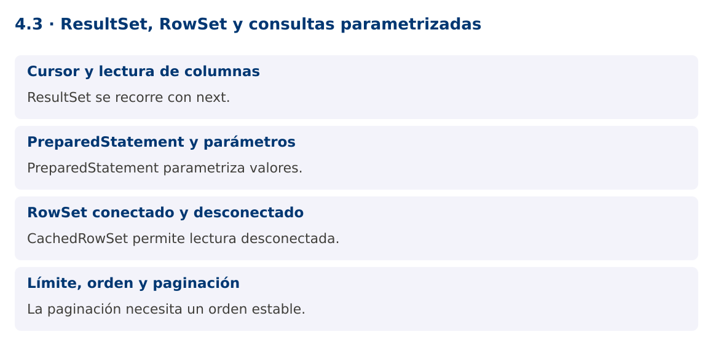

# Programación Aplicada

## 4.3. ResultSet, RowSet y consultas parametrizadas


**Autor:** Ing. Pablo Torres, Mgtr.  
**Unidad:** 4. Conexión a bases de datos  
**Proyecto de trabajo:** CampusMonitor

[Inicio del curso](../../README.md) · [Presentación editable](presentacion.pptx) · [Ver en el navegador](index.html)

---

## 1. Conceptos y ejemplos

### Contexto

CampusMonitor debe consultar lecturas por sensor y mostrar resultados cuando la conexión ya se cerró. ResultSet y CachedRowSet ofrecen modelos de acceso diferentes y exigen decisiones sobre tamaño, tipos y duración de los recursos.

### Antes de empezar

Recupera el avance de [4.2c](../4.2-persistencia/03-jdo/material.md). Conserva sus comandos y evidencias. Revisa el ejemplo completo antes de implementar la PC. Las demostraciones del material se ejecutan separadas del proyecto personal.

<a id="concepto-1"></a>

### 1.1. Cursor y lectura de columnas

ResultSet representa el resultado de una consulta y mantiene un cursor inicialmente antes de la primera fila. next avanza y devuelve false cuando no quedan filas. Acceder a columnas antes del primer next es un uso incorrecto. Usa nombres o alias claros para reducir errores al cambiar el SELECT.

Los getters convierten tipos según JDBC y el controlador. getInt devuelve cero cuando la columna SQL es NULL; para distinguirlo llama wasNull inmediatamente o usa getObject con un tipo compatible. Para importes usa BigDecimal y para valores temporales define la correspondencia explícita. No confundas un cero válido con ausencia de dato.

<a id="concepto-2"></a>

### 1.2. PreparedStatement y parámetros

PreparedStatement separa estructura SQL y valores. Los marcadores ? representan valores que se asignan con setters tipados. No concatenes una entrada externa dentro del WHERE. Los parámetros no sirven para nombres de tabla, columnas ni direcciones ASC/DESC; esos elementos deben seleccionarse desde una lista permitida.

executeQuery se utiliza cuando se espera un resultado tabular, y executeUpdate devuelve el número de filas afectadas por cambios. Revisa ese número: actualizar cero filas puede significar que el ID no existe. El driver puede preparar sentencias en el servidor según su configuración y frecuencia, por lo que no debes prometer una mejora automática en toda consulta.

<a id="concepto-3"></a>

### 1.3. RowSet conectado y desconectado

RowSet extiende ResultSet con una API más apta para componentes. JdbcRowSet es conectado y conserva acceso a su conexión. CachedRowSet copia filas y puede utilizarse desconectado. RowSetProvider crea implementaciones estándar sin importar clases internas com.sun.rowset.

CachedRowSet consume memoria proporcional a los datos copiados. No es un reemplazo adecuado para millones de filas. Sus capacidades de sincronización con la base requieren condiciones y resolución de conflictos; el ejemplo solo consulta y desconecta. Para una vista paginada, puede ser más simple mapear una página a una lista de DTOs.

<a id="concepto-4"></a>

### 1.4. Límite, orden y paginación

Una consulta que alimenta una pantalla debe limitar resultados y establecer un orden. Para paginar, el orden necesita un desempate estable como id. LIMIT y OFFSET son sencillos, pero pueden tener costos altos en páginas profundas y cambiar de contenido mientras se insertan datos. La paginación por clave ofrece otra opción.

La demostración copia dos filas en un CachedRowSet y las recorre después de cerrar Connection. El objetivo es observar su desconexión, no recomendar guardar toda la base en memoria. La PC compara este enfoque con el mapeo explícito a records.

### Mapa de conceptos



---

<a id="demostracion"></a>

## 2. Demostración guiada

### 2.1. Problema y contrato

CampusMonitor debe consultar lecturas por sensor y mostrar resultados cuando la conexión ya se cerró. ResultSet y CachedRowSet ofrecen modelos de acceso diferentes y exigen decisiones sobre tamaño, tipos y duración de los recursos.

La implementación siguiente es una demostración resuelta. La PC de la sección 3 requiere desarrollar una ampliación propia sobre CampusMonitor.

**Archivo completo:** [RowSetDemo.java](ejemplos/RowSetDemo.java).

```java
package edu.ups.pap.u04;
import java.sql.*;
import javax.sql.rowset.*;
public class RowSetDemo {
    public static void main(String[] args) throws SQLException {
        try(CachedRowSet copia=RowSetProvider.newFactory().createCachedRowSet()) {
            try(Connection c=DriverManager.getConnection("jdbc:h2:mem:filas")) {
                try(Statement s=c.createStatement()) {
                    s.execute("CREATE TABLE lectura(id INT PRIMARY KEY,sensor VARCHAR(8),valor DOUBLE PRECISION)");
                    s.executeUpdate("INSERT INTO lectura VALUES(1,'S01',22),(2,'S01',24),(3,'S02',30)");
                }
                try(PreparedStatement p=c.prepareStatement("SELECT id,valor FROM lectura WHERE sensor=? ORDER BY id")) {
                    p.setString(1,"S01");
                    try(ResultSet r=p.executeQuery()){copia.populate(r);}
                }
            }
            while(copia.next()) System.out.println(copia.getInt("id")+": "+copia.getDouble("valor"));
            System.out.println("Filas desconectadas: "+copia.size());
        }
    }
}
```

### 2.2. Ejecución

Con el proyecto Gradle de demostraciones:

```bash
cd demostraciones
./gradlew runDemo -Pdemo=4.3
```

En Windows usa `gradlew.bat`. Ejecuta cada demostración desde una terminal nueva o vuelve a la raíz antes de cambiar de contenido.

### 2.3. Resultado y lectura de la ejecución

```text
1: 22.0
2: 24.0
Filas desconectadas: 2
```

1. Identifica los datos iniciales y las precondiciones que la demostración valida.
2. Sigue las llamadas desde `main` o `loop` y relaciona las operaciones con los conceptos de la sección 1.
3. Contrasta el resultado con la salida esperada del ejemplo. Si el orden es concurrente, compara la invariante y no el orden de impresión.
4. Cambia un dato del ejemplo y predice el resultado antes de ejecutarlo. Registra cualquier diferencia y su causa.

---

<a id="pc"></a>

## 3. PC4.3 · Práctica de clase

### 3.1. Ampliación del proyecto

Esta actividad se resuelve en tu repositorio `icc-pap-campusmonitor-apellido`. Mantén la funcionalidad anterior. No reemplaces tu solución con los archivos de demostración del material.

1. Implementa una consulta de CampusMonitor por sensor y rango de valores con PreparedStatement. Los filtros son valores parametrizados.
2. Mapea el resultado a List<LecturaDto> y crea otra consulta limitada con CachedRowSet para comparar el uso tras cerrar la conexión.
3. Agrega paginación con orden por instante e ID. Prueba un ID con comillas como entrada y verifica que no modifica la consulta.

### 3.2. Comprobación y evidencia

Prueba los casos de esta sección y registra entradas, salida real y explicación. Incluye una ejecución normal y un caso de error. La evidencia debe permitir repetir el resultado desde el commit entregado.

| Caso que debes revisar | Comportamiento requerido |
|---|---|
| Filtro S01 | Solo lecturas de ese sensor |
| ID con ' OR '1'='1 | Se trata como valor literal |
| NULL numérico | Se distingue de cero |

En `evidencias/PC4.3.md` agrega: cambio realizado, archivos principales, comandos de ejecución, tabla de pruebas y enlace al commit final. No añadas una rúbrica a esta PC.

### 3.3. Commits de la actividad

```bash
git status
git add src evidencias
git commit -m "feat(pc4.3): resultset-rowset-y-consultas-parametrizadas"
git push
git log -1 --format=%H
```

Ajusta las rutas de `git add` a los archivos que realmente creaste. Incluye también configuración o SQL si cambiaste esos archivos. El último comando muestra el hash real que debes enlazar en tu evidencia.

### Lo esencial

- ResultSet se recorre con next.
- PreparedStatement parametriza valores.
- CachedRowSet permite lectura desconectada.
- La paginación necesita un orden estable.

## Referencias técnicas

- [JDBC, Java 25](https://docs.oracle.com/en/java/javase/25/docs/api/java.sql/java/sql/package-summary.html)
- [PostgreSQL JDBC](https://jdbc.postgresql.org/documentation/)
- [Apache JDO](https://db.apache.org/jdo/)
- [DataNucleus JDO](https://www.datanucleus.org/products/accessplatform_6_0/jdo/guide.html)
