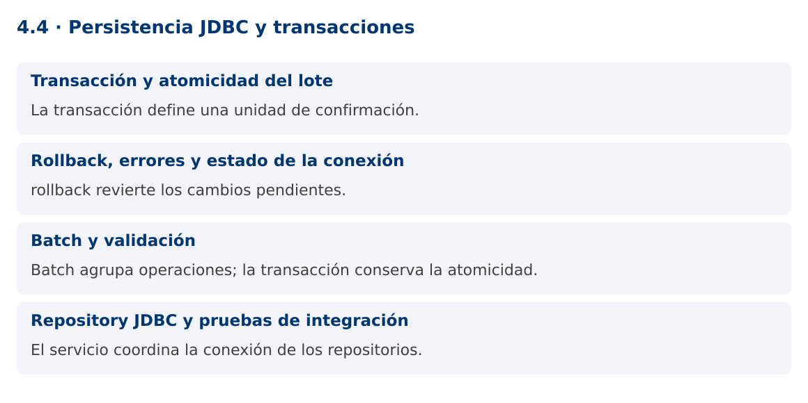

# Programación Aplicada

## 4.4. Persistencia JDBC y transacciones


**Autor:** Ing. Pablo Torres, Mgtr.  
**Unidad:** 4. Conexión a bases de datos  
**Proyecto de trabajo:** CampusMonitor

[Inicio del curso](../../README.md) · [Presentación editable](presentacion.pptx) · [Ver en el navegador](index.html)

---

## 1. Conceptos y ejemplos

### Contexto

La importación debe guardar un lote de lecturas con una política definida: confirmar todo o revertirlo si una operación falla. Además, el repositorio debe preservar la separación entre SQL, reglas del dominio e interfaz.

### Antes de empezar

Recupera el avance de [4.3](../4.3-resultset-rowset/material.md). Conserva sus comandos y evidencias. Revisa el ejemplo completo antes de implementar la PC. Las demostraciones del material se ejecutan separadas del proyecto personal.

<a id="concepto-1"></a>

### 1.1. Transacción y atomicidad del lote

Con autoCommit activado, cada sentencia se confirma de manera independiente según las reglas del controlador. Para agrupar varias operaciones llama setAutoCommit(false), ejecuta los cambios y termina con commit. Si una operación falla, rollback revierte los cambios pendientes de esa transacción.

No abras una conexión distinta para cada operación que deba pertenecer a la misma transacción local. El servicio establece el alcance y pasa la misma conexión a las operaciones necesarias. Una transacción demasiado extensa retiene recursos y puede aumentar contención; evita esperar interacción humana o hardware dentro de ella.

<a id="concepto-2"></a>

### 1.2. Rollback, errores y estado de la conexión

Si falla rollback, preserva tanto la excepción original como la de reversión mediante addSuppressed. Al devolver una conexión a un pool, restaura su estado o sigue el contrato del pool. try-with-resources cierra recursos, pero no sustituye la decisión de confirmar o revertir.

SQLState y códigos del motor ayudan a clasificar errores como unicidad, clave foránea o conexión. No dependas exclusivamente del texto del mensaje, que puede variar por idioma y versión. Devuelve al usuario un mensaje útil sin mostrar contraseñas, cadenas de conexión con secretos o detalles innecesarios del servidor.

<a id="concepto-3"></a>

### 1.3. Batch y validación

addBatch acumula parámetros y executeBatch envía un lote. La respuesta puede incluir SUCCESS_NO_INFO y no siempre un conteo exacto por sentencia. BatchUpdateException puede contener resultados parciales. Cuando el contrato es todo o nada, esos cambios se revierten si la transacción no se confirma.

Valida formato y dominio antes del lote, pero conserva restricciones en la base para proteger contra carreras y otros clientes. Una clave única por sensor y secuencia puede impedir duplicados. La política de reintento debe considerar qué quedó confirmado para no registrar dos veces el mismo evento.

<a id="concepto-4"></a>

### 1.4. Repository JDBC y pruebas de integración

El Repository JDBC implementa las operaciones del dominio y encapsula SQL y mapeo. El servicio coordina reglas y transacciones. La vista Swing muestra resultados de forma asíncrona sin compartir una conexión entre tareas. La fábrica de conexiones puede cambiar sin reescribir el parser.

La demostración fuerza una clave duplicada después de una inserción válida y comprueba que el lote completo se revierte. La PL repetirá estas pruebas en PostgreSQL y añadirá reinicio de la aplicación para demostrar persistencia real. Que un objeto siga en una lista de memoria no demuestra que la base guardó sus datos.

### Mapa de conceptos



---

<a id="demostracion"></a>

## 2. Demostración guiada

### 2.1. Problema y contrato

La importación debe guardar un lote de lecturas con una política definida: confirmar todo o revertirlo si una operación falla. Además, el repositorio debe preservar la separación entre SQL, reglas del dominio e interfaz.

La implementación siguiente es una demostración resuelta. La PC de la sección 3 requiere desarrollar una ampliación propia sobre CampusMonitor.

**Archivo completo:** [TransaccionesDemo.java](ejemplos/TransaccionesDemo.java).

```java
package edu.ups.pap.u04;
import java.sql.*;
public class TransaccionesDemo {
    public static void main(String[] args) throws SQLException {
        try(Connection c=DriverManager.getConnection("jdbc:h2:mem:transacciones")) {
            try(Statement s=c.createStatement()) {s.execute("CREATE TABLE lectura(id INT PRIMARY KEY, valor DOUBLE PRECISION NOT NULL)");}
            c.setAutoCommit(false);
            try(PreparedStatement p=c.prepareStatement("INSERT INTO lectura(id,valor) VALUES(?,?)")) {
                p.setInt(1,1);p.setDouble(2,22);p.executeUpdate();
                p.setInt(1,1);p.setDouble(2,24);p.executeUpdate();
                c.commit();
            } catch(SQLException e) {
                try {c.rollback();} catch(SQLException rollback) {e.addSuppressed(rollback);throw e;}
                System.out.println("Lote revertido por clave duplicada");
            } finally {c.setAutoCommit(true);}
            try(Statement s=c.createStatement();ResultSet r=s.executeQuery("SELECT COUNT(*) FROM lectura")) {
                r.next();System.out.println("Filas confirmadas: "+r.getInt(1));
                if(r.getInt(1)!=0) throw new AssertionError("Rollback incompleto");
            }
        }
    }
}
```

### 2.2. Ejecución

Con el proyecto Gradle de demostraciones:

```bash
cd demostraciones
./gradlew runDemo -Pdemo=4.4
```

En Windows usa `gradlew.bat`. Ejecuta cada demostración desde una terminal nueva o vuelve a la raíz antes de cambiar de contenido.

### 2.3. Resultado y lectura de la ejecución

```text
Lote revertido por clave duplicada
Filas confirmadas: 0
```

1. Identifica los datos iniciales y las precondiciones que la demostración valida.
2. Sigue las llamadas desde `main` o `loop` y relaciona las operaciones con los conceptos de la sección 1.
3. Contrasta el resultado con la salida esperada del ejemplo. Si el orden es concurrente, compara la invariante y no el orden de impresión.
4. Cambia un dato del ejemplo y predice el resultado antes de ejecutarlo. Registra cualquier diferencia y su causa.

---

<a id="pc"></a>

## 3. PC4.4 · Práctica de clase

### 3.1. Ampliación del proyecto

Esta actividad se resuelve en tu repositorio `icc-pap-campusmonitor-apellido`. Mantén la funcionalidad anterior. No reemplaces tu solución con los archivos de demostración del material.

1. Implementa RepositorioJdbc en CampusMonitor y conserva la interfaz del repositorio en memoria donde sus contratos coincidan.
2. Guarda un lote en una transacción. Fuerza un duplicado en medio y comprueba cero nuevas filas al aplicar rollback.
3. Añade consulta desde Swing en segundo plano y prueba cerrar y reabrir la aplicación. Registra esquema, datos de prueba y resultados reales.

### 3.2. Comprobación y evidencia

Prueba los casos de esta sección y registra entradas, salida real y explicación. Incluye una ejecución normal y un caso de error. La evidencia debe permitir repetir el resultado desde el commit entregado.

| Caso que debes revisar | Comportamiento requerido |
|---|---|
| Lote válido | Todas las filas confirmadas |
| Duplicado a mitad del lote | Ninguna fila nueva |
| Reinicio de aplicación | Lecturas confirmadas siguen disponibles |

En `evidencias/PC4.4.md` agrega: cambio realizado, archivos principales, comandos de ejecución, tabla de pruebas y enlace al commit final. No añadas una rúbrica a esta PC.

### 3.3. Commits de la actividad

```bash
git status
git add src evidencias
git commit -m "feat(pc4.4): persistencia-jdbc-y-transacciones"
git push
git log -1 --format=%H
```

Ajusta las rutas de `git add` a los archivos que realmente creaste. Incluye también configuración o SQL si cambiaste esos archivos. El último comando muestra el hash real que debes enlazar en tu evidencia.

### Lo esencial

- La transacción define una unidad de confirmación.
- rollback revierte los cambios pendientes.
- Batch agrupa operaciones; la transacción conserva la atomicidad.
- El servicio coordina la conexión de los repositorios.

## Referencias técnicas

- [JDBC, Java 25](https://docs.oracle.com/en/java/javase/25/docs/api/java.sql/java/sql/package-summary.html)
- [PostgreSQL JDBC](https://jdbc.postgresql.org/documentation/)
- [Apache JDO](https://db.apache.org/jdo/)
- [DataNucleus JDO](https://www.datanucleus.org/products/accessplatform_6_0/jdo/guide.html)
