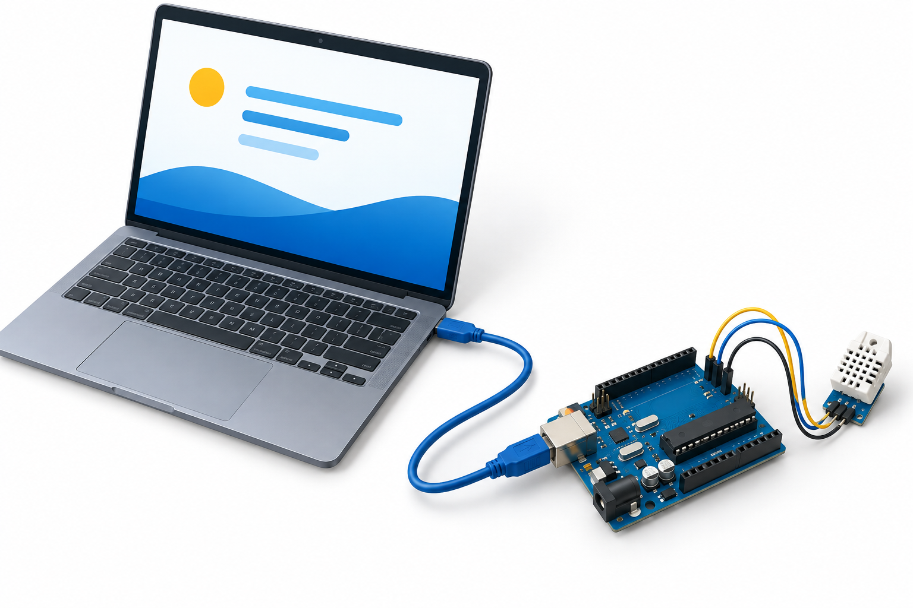
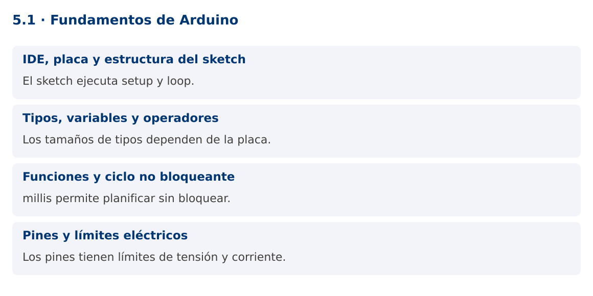

# Programación Aplicada

## 5.1. Fundamentos de Arduino


**Autor:** Ing. Pablo Torres, Mgtr.  
**Unidad:** 5. Interfaz de comunicación  
**Proyecto de trabajo:** CampusMonitor

[Inicio del curso](../../README.md) · [Presentación editable](presentacion.pptx) · [Ver en el navegador](index.html)

---

## 1. Conceptos y ejemplos

### Contexto

CampusMonitor recibirá mediciones de un dispositivo físico. Arduino ejecuta un programa en un microcontrolador y Java ejecuta la aplicación del PC. La comunicación permite integrar ambos programas, pero sus tipos, recursos y ciclos de ejecución son diferentes.

### Antes de empezar

Recupera el avance de [4.4](../../04/4.4-aplicacion-jdbc/material.md). Conserva sus comandos y evidencias. Revisa el ejemplo completo antes de implementar la PC. Las demostraciones del material se ejecutan separadas del proyecto personal.



La ilustración sirve como analogía. El contrato técnico se define en el texto y el código.

<a id="concepto-1"></a>

### 1.1. IDE, placa y estructura del sketch

Arduino IDE permite editar, compilar y cargar un sketch. Debes seleccionar la placa y el puerto correctos e instalar el soporte correspondiente. Un sketch utiliza C++ con el entorno Arduino. setup se ejecuta una vez al arrancar y loop se repite mientras el dispositivo está activo.

La referencia del curso es Arduino UNO R3, basada en ATmega328P. Sus límites no deben extrapolarse a todas las placas Arduino. Una UNO R4 y una ESP32 tienen arquitecturas diferentes. La aplicación Java no se carga en la UNO: corre en el PC y se comunica con el sketch por el puerto serial.

<a id="concepto-2"></a>

### 1.2. Tipos, variables y operadores

En UNO R3, int tiene 16 bits y long 32 bits. Para tamaños explícitos utiliza uint16_t y uint32_t cuando corresponda. bool representa condiciones. Los operadores aritméticos y lógicos se parecen a Java, pero los tamaños, conversiones y manejo de memoria siguen reglas de C++.

Una división entre enteros descarta la fracción. Para calcular porcentajes, multiplica en un tipo suficientemente amplio antes de dividir. Constantes constexpr o const expresan valores que no deben cambiar. Evita construir cadenas dinámicas repetidamente en dispositivos con memoria limitada. Un buffer de caracteres acotado ofrece un uso más predecible.

<a id="concepto-3"></a>

### 1.3. Funciones y ciclo no bloqueante

Las funciones separan adquisición, transformación y salida. Un prototipo declara tipos de parámetros y retorno. El ejemplo calcula un porcentaje a partir de la lectura ADC y lo imprime como dato de diagnóstico.

millis devuelve milisegundos desde el inicio y su contador se desborda aproximadamente cada 49.7 días en plataformas con unsigned long de 32 bits. La comparación ahora - anterior >= periodo, realizada con aritmética sin signo, funciona a través del desbordamiento para intervalos apropiados. No compares ahora >= anterior + periodo porque esa suma puede desbordarse y alterar la condición.

<a id="concepto-4"></a>

### 1.4. Pines y límites eléctricos

Los pines digitales leen o generan niveles lógicos. Las entradas analógicas convierten una tensión en una cuenta ADC. Una cuenta no es automáticamente una temperatura ni una tensión calibrada. Se necesita conocer referencia, resolución y característica del sensor.

Antes de conectar, identifica la placa exacta, alimentación y límites de corriente en su documentación. No conectes cargas de potencia directamente a un pin. En este curso se utiliza inicialmente un potenciómetro de 10 kΩ entre 5 V y GND con cursor a A0 en UNO R3, y el LED incorporado para salida. Desconecta la alimentación al cambiar el montaje.

### Mapa de conceptos



---

<a id="demostracion"></a>

## 2. Demostración guiada

### 2.1. Problema y contrato

CampusMonitor recibirá mediciones de un dispositivo físico. Arduino ejecuta un programa en un microcontrolador y Java ejecuta la aplicación del PC. La comunicación permite integrar ambos programas, pero sus tipos, recursos y ciclos de ejecución son diferentes.

La implementación siguiente es una demostración resuelta. La PC de la sección 3 requiere desarrollar una ampliación propia sobre CampusMonitor.

**Archivo completo:** [Fundamentos.ino](ejemplos/Fundamentos.ino).

```cpp
#include <Arduino.h>
constexpr uint8_t PIN_SENSOR = A0;
constexpr unsigned long PERIODO_MS = 500;
unsigned long anterior = 0;
uint16_t porcentaje(uint16_t raw) {
  return static_cast<uint16_t>((static_cast<uint32_t>(raw) * 100U) / 1023U);
}
void setup() {
  Serial.begin(115200);
  pinMode(LED_BUILTIN, OUTPUT);
}
void loop() {
  unsigned long ahora = millis();
  if (ahora - anterior >= PERIODO_MS) {
    anterior = ahora;
    uint16_t raw = analogRead(PIN_SENSOR);
    Serial.print("RAW="); Serial.print(raw);
    Serial.print(";PCT="); Serial.println(porcentaje(raw));
    digitalWrite(LED_BUILTIN, raw > 512 ? HIGH : LOW);
  }
}
```

### 2.2. Ejecución

Abre el sketch en Arduino IDE. Si el IDE solicita una carpeta con el mismo nombre, acepta crearla. Selecciona **Arduino UNO**, el puerto del dispositivo y carga el programa. Abre el monitor serial a **115200**. El montaje y las pruebas se detallan en la PC y en la guía de hardware.

### 2.3. Resultado y lectura de la ejecución

```text
Cada 500 ms imprime RAW y PCT. El valor depende de la posición del potenciómetro; el LED se enciende cuando RAW > 512.
```

1. Identifica los datos iniciales y las precondiciones que la demostración valida.
2. Sigue las llamadas desde `main` o `loop` y relaciona las operaciones con los conceptos de la sección 1.
3. Contrasta el resultado con la salida esperada del ejemplo. Si el orden es concurrente, compara la invariante y no el orden de impresión.
4. Cambia un dato del ejemplo y predice el resultado antes de ejecutarlo. Registra cualquier diferencia y su causa.

---

<a id="pc"></a>

## 3. PC5.1 · Práctica de clase

### 3.1. Ampliación del proyecto

Esta actividad se resuelve en tu repositorio `icc-pap-campusmonitor-apellido`. Mantén la funcionalidad anterior. No reemplaces tu solución con los archivos de demostración del material.

1. Crea firmware/campus_monitor/campus_monitor.ino en el repositorio personal. Selecciona UNO R3, puerto y velocidad serial.
2. Lee A0 cada 500 ms sin delay y convierte las cuentas a un porcentaje entero mediante una función. No lo presentes como temperatura.
3. Registra placa, montaje, captura del monitor serial y tres posiciones del potenciómetro. Explica el tamaño de los tipos utilizados.

### 3.2. Comprobación y evidencia

Prueba los casos de esta sección y registra entradas, salida real y explicación. Incluye una ejecución normal y un caso de error. La evidencia debe permitir repetir el resultado desde el commit entregado.

| Caso que debes revisar | Comportamiento requerido |
|---|---|
| Cursor cerca de GND | Cuenta cercana a 0 |
| Cursor cerca de 5 V | Cuenta cercana a 1023 en UNO R3 |
| Ejecución continua | Muestreo periódico sin delay |

En `evidencias/PC5.1.md` agrega: cambio realizado, archivos principales, comandos de ejecución, tabla de pruebas y enlace al commit final. No añadas una rúbrica a esta PC.

### 3.3. Commits de la actividad

```bash
git status
git add src evidencias firmware
git commit -m "feat(pc5.1): fundamentos-de-arduino"
git push
git log -1 --format=%H
```

Ajusta las rutas de `git add` a los archivos que realmente creaste. Incluye también configuración o SQL si cambiaste esos archivos. El último comando muestra el hash real que debes enlazar en tu evidencia.

### Lo esencial

- El sketch ejecuta setup y loop.
- Los tamaños de tipos dependen de la placa.
- millis permite planificar sin bloquear.
- Los pines tienen límites de tensión y corriente.

## Referencias técnicas

- [Arduino Language Reference](https://docs.arduino.cc/language-reference/)
- [Arduino UNO R3](https://docs.arduino.cc/hardware/uno-rev3/)
- [jSerialComm](https://fazecast.github.io/jSerialComm/)
- [ESP32 Arduino ADC](https://docs.espressif.com/projects/arduino-esp32/en/latest/api/adc.html)
