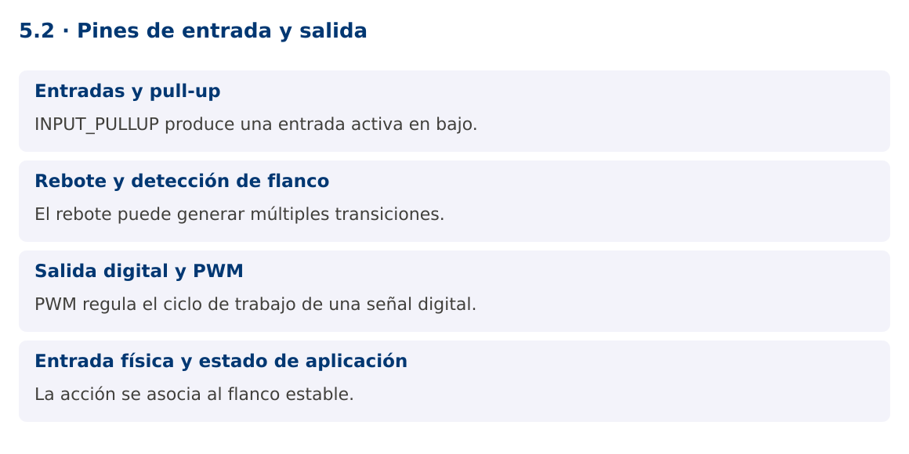

# Programación Aplicada

## 5.2. Pines de entrada y salida


**Autor:** Ing. Pablo Torres, Mgtr.  
**Unidad:** 5. Interfaz de comunicación  
**Proyecto de trabajo:** CampusMonitor

[Inicio del curso](../../README.md) · [Presentación editable](presentacion.pptx) · [Ver en el navegador](index.html)

---

## 1. Conceptos y ejemplos

### Contexto

El dispositivo debe detectar una acción física y cambiar una salida. Un pulsador real puede rebotar, de modo que una pulsación no equivale automáticamente a un único cambio lógico.

### Antes de empezar

Recupera el avance de [5.1](../5.1-fundamentos-arduino/material.md). Conserva sus comandos y evidencias. Revisa el ejemplo completo antes de implementar la PC. Las demostraciones del material se ejecutan separadas del proyecto personal.

<a id="concepto-1"></a>

### 1.1. Entradas y pull-up

pinMode define el uso del pin. INPUT deja una entrada de alta impedancia que necesita una referencia externa; un pin flotante puede alternar de forma impredecible. INPUT_PULLUP activa una resistencia interna de pull-up. Con un pulsador entre D2 y GND, sin pulsar se lee HIGH y al pulsar LOW.

Esta lógica activa en bajo debe reflejarse en los nombres y condiciones. Usa bool presionado = digitalRead(PIN_BOTON) == LOW. El pulsador debe conectarse respetando las patas realmente unidas del componente. Verifica continuidad y orientación antes de culpar al programa.

<a id="concepto-2"></a>

### 1.2. Rebote y detección de flanco

Los contactos mecánicos pueden producir varias transiciones rápidas en una sola pulsación. El antirrebote por tiempo registra el último cambio y acepta un nuevo estado solo cuando permanece estable durante un intervalo. El ejemplo usa 30 ms como parámetro ajustable para este montaje.

Detectar estado y detectar flanco no son equivalentes. Si se cambia el LED en cada iteración mientras el botón está presionado, la salida alternará rápidamente. El programa cambia la salida únicamente cuando el estado estable pasa a LOW. Mantener presionado no genera nuevas acciones.

<a id="concepto-3"></a>

### 1.3. Salida digital y PWM

digitalWrite fija HIGH o LOW. analogWrite, en placas y pines compatibles, suele generar PWM: una señal digital cuya proporción de tiempo en alto varía. No implica una salida analógica continua mediante DAC. En UNO R3, PWM está disponible en pines específicos y el rango usual de analogWrite es 0 a 255.

El LED incorporado simplifica la demostración sin cableado externo de salida. Para un LED externo se necesita una resistencia adecuada y conexión correcta. Motores, relés y otras cargas requieren una etapa de potencia y protección según el componente; no se conectan directamente a una salida del microcontrolador.

<a id="concepto-4"></a>

### 1.4. Entrada física y estado de aplicación

El firmware mantiene el estado lógico del LED y comunica cambios por serial. La aplicación Java puede representar ese estado, pero no debe asumir que un comando enviado ya fue ejecutado. En el siguiente contenido se añadirá confirmación ACK.

La PC documenta lectura estable, flancos y salida. Un diagrama eléctrico debe coincidir con la placa exacta. Las ilustraciones del material son analogías visuales y no sustituyen el esquema de conexión textual. La evidencia debe mostrar el montaje real utilizado.

### Mapa de conceptos



---

<a id="demostracion"></a>

## 2. Demostración guiada

### 2.1. Problema y contrato

El dispositivo debe detectar una acción física y cambiar una salida. Un pulsador real puede rebotar, de modo que una pulsación no equivale automáticamente a un único cambio lógico.

La implementación siguiente es una demostración resuelta. La PC de la sección 3 requiere desarrollar una ampliación propia sobre CampusMonitor.

**Archivo completo:** [Pines.ino](ejemplos/Pines.ino).

```cpp
#include <Arduino.h>
constexpr uint8_t PIN_BOTON = 2;
constexpr unsigned long REBOTE_MS = 30;
int ultimaLectura = HIGH;
int estable = HIGH;
unsigned long cambio = 0;
bool encendido = false;
void setup() {
  pinMode(PIN_BOTON, INPUT_PULLUP);
  pinMode(LED_BUILTIN, OUTPUT);
  Serial.begin(115200);
}
void loop() {
  int actual = digitalRead(PIN_BOTON);
  unsigned long ahora = millis();
  if (actual != ultimaLectura) { cambio = ahora; ultimaLectura = actual; }
  if (ahora - cambio >= REBOTE_MS && actual != estable) {
    estable = actual;
    if (estable == LOW) {
      encendido = !encendido;
      digitalWrite(LED_BUILTIN, encendido ? HIGH : LOW);
      Serial.print("LED="); Serial.println(encendido ? 1 : 0);
    }
  }
}
```

### 2.2. Ejecución

Abre el sketch en Arduino IDE. Si el IDE solicita una carpeta con el mismo nombre, acepta crearla. Selecciona **Arduino UNO**, el puerto del dispositivo y carga el programa. Abre el monitor serial a **115200**. El montaje y las pruebas se detallan en la PC y en la guía de hardware.

### 2.3. Resultado y lectura de la ejecución

```text
Una pulsación estable alterna LED=1 y LED=0. Mantener pulsado no genera alternancias adicionales.
```

1. Identifica los datos iniciales y las precondiciones que la demostración valida.
2. Sigue las llamadas desde `main` o `loop` y relaciona las operaciones con los conceptos de la sección 1.
3. Contrasta el resultado con la salida esperada del ejemplo. Si el orden es concurrente, compara la invariante y no el orden de impresión.
4. Cambia un dato del ejemplo y predice el resultado antes de ejecutarlo. Registra cualquier diferencia y su causa.

---

<a id="pc"></a>

## 3. PC5.2 · Práctica de clase

### 3.1. Ampliación del proyecto

Esta actividad se resuelve en tu repositorio `icc-pap-campusmonitor-apellido`. Mantén la funcionalidad anterior. No reemplaces tu solución con los archivos de demostración del material.

1. Agrega un pulsador entre D2 y GND con INPUT_PULLUP, además del sensor de 5.1. Documenta el montaje antes de energizar.
2. Implementa antirrebote sin delay y una acción por flanco de pulsación. Conserva el muestreo periódico de A0.
3. Prueba pulsación corta, prolongada y varias pulsaciones. Registra cuánto tarda en aceptarse un estado estable y por qué la lógica es activa en bajo.

### 3.2. Comprobación y evidencia

Prueba los casos de esta sección y registra entradas, salida real y explicación. Incluye una ejecución normal y un caso de error. La evidencia debe permitir repetir el resultado desde el commit entregado.

| Caso que debes revisar | Comportamiento requerido |
|---|---|
| Pulsación mantenida 2 segundos | Una sola alternancia |
| Liberación del botón | No alterna |
| Muestreo durante pulsación | Continúa cada 500 ms |

En `evidencias/PC5.2.md` agrega: cambio realizado, archivos principales, comandos de ejecución, tabla de pruebas y enlace al commit final. No añadas una rúbrica a esta PC.

### 3.3. Commits de la actividad

```bash
git status
git add src evidencias firmware
git commit -m "feat(pc5.2): pines-de-entrada-y-salida"
git push
git log -1 --format=%H
```

Ajusta las rutas de `git add` a los archivos que realmente creaste. Incluye también configuración o SQL si cambiaste esos archivos. El último comando muestra el hash real que debes enlazar en tu evidencia.

### Lo esencial

- INPUT_PULLUP produce una entrada activa en bajo.
- El rebote puede generar múltiples transiciones.
- PWM regula el ciclo de trabajo de una señal digital.
- La acción se asocia al flanco estable.

## Referencias técnicas

- [Arduino Language Reference](https://docs.arduino.cc/language-reference/)
- [Arduino UNO R3](https://docs.arduino.cc/hardware/uno-rev3/)
- [jSerialComm](https://fazecast.github.io/jSerialComm/)
- [ESP32 Arduino ADC](https://docs.espressif.com/projects/arduino-esp32/en/latest/api/adc.html)
