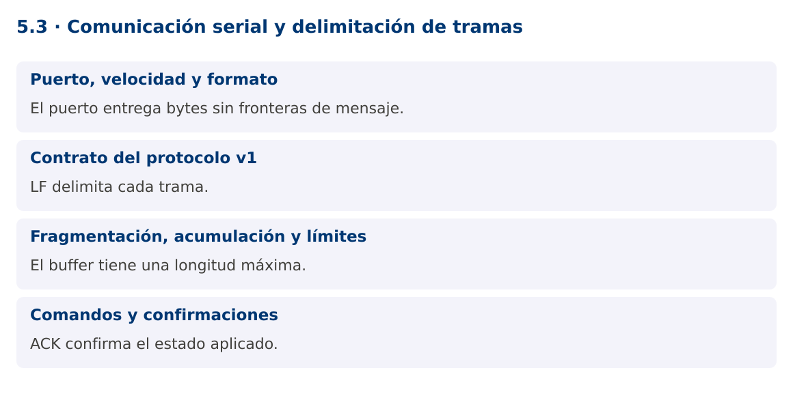

# Programación Aplicada

## 5.3. Comunicación serial y delimitación de tramas


**Autor:** Ing. Pablo Torres, Mgtr.  
**Unidad:** 5. Interfaz de comunicación  
**Proyecto de trabajo:** CampusMonitor

[Inicio del curso](../../README.md) · [Presentación editable](presentacion.pptx) · [Ver en el navegador](index.html)

---

## 1. Conceptos y ejemplos

### Contexto

Una conexión serial entrega bytes, no mensajes completos. Una lectura puede contener media trama o varias tramas juntas. CampusMonitor necesita un protocolo con delimitador, longitud máxima, validación y confirmaciones.

### Antes de empezar

Recupera el avance de [5.2](../5.2-pines-entrada-salida/material.md). Conserva sus comandos y evidencias. Revisa el ejemplo completo antes de implementar la PC. Las demostraciones del material se ejecutan separadas del proyecto personal.

<a id="concepto-1"></a>

### 1.1. Puerto, velocidad y formato

El puerto identifica una interfaz del sistema, por ejemplo COM3, /dev/ttyACM0 o /dev/cu.usbmodem.... La velocidad y los parámetros deben coincidir en ambos extremos. El protocolo del curso usa 115200 baudios, 8 bits de datos, sin paridad y un bit de parada.

USB puede exponer un puerto serial virtual. Abrirlo puede reiniciar determinadas placas como UNO R3; espera una trama válida antes de enviar comandos críticos. El monitor serial del IDE debe estar cerrado para que Java pueda abrir el mismo puerto. La selección de puerto es explícita, sin asumir que el primero de la lista es el dispositivo correcto.

<a id="concepto-2"></a>

### 1.2. Contrato del protocolo v1

Cada trama contiene texto ASCII y termina en LF. El receptor admite CR inmediatamente anterior al LF para interoperar con Serial.println. DATA;secuencia;raw comunica una muestra ADC, SET;LED;0 y SET;LED;1 solicitan una salida, ACK;LED;estado confirma su aplicación y ERR;CMD informa de un comando rechazado.

La longitud máxima es 80 caracteres antes del terminador. La secuencia es un entero sin signo de 32 bits del firmware. Los ejemplos Java la almacenan en long. El raw de UNO R3 está entre 0 y 1023. Este protocolo didáctico no incorpora autenticación ni checksum de aplicación y no se usa para control de cargas peligrosas.

<a id="concepto-3"></a>

### 1.3. Fragmentación, acumulación y límites

El decodificador agrega bytes a un buffer hasta encontrar LF. Solo entonces valida la línea. Si supera el límite, descarta hasta el siguiente LF y registra el error. No continúa acumulando memoria. Una única lectura del puerto puede producir cero, una o varias tramas.

La clase compartida Protocolo.Decodificador implementa esa lógica y se prueba con fragmentos de distinto tamaño. El parser devuelve mensajes tipados y verifica número de campos, rango y valores. Mantiene ACK separado de DATA para no confundir una confirmación de comando con una lectura de sensor.

<a id="concepto-4"></a>

### 1.4. Comandos y confirmaciones

Enviar bytes correctamente no demuestra que el firmware aplicó el comando. El ACK debe corresponder al estado solicitado. Esta versión permite un solo comando LED pendiente. Si se requieren varios comandos simultáneos, añade un identificador de solicitud y una tabla de pendientes con plazos.

Ante desconexión, detén el lector, cierra el puerto y actualiza la interfaz. Reintentar indefinidamente puede ocultar fallos. La demostración Java ofrece --simulate con las mismas reglas de delimitación y un modo --port para hardware. La simulación comprueba software y no valida voltajes, cableado ni comportamiento físico.

### Mapa de conceptos



---

<a id="demostracion"></a>

## 2. Demostración guiada

### 2.1. Problema y contrato

Una conexión serial entrega bytes, no mensajes completos. Una lectura puede contener media trama o varias tramas juntas. CampusMonitor necesita un protocolo con delimitador, longitud máxima, validación y confirmaciones.

La implementación siguiente es una demostración resuelta. La PC de la sección 3 requiere desarrollar una ampliación propia sobre CampusMonitor.

**Archivo completo:** [SerialDemo.java](ejemplos/SerialDemo.java).

```java
package edu.ups.pap.u05;
import edu.ups.pap.comun.Protocolo;
import com.fazecast.jSerialComm.*;
import java.io.*;
import java.nio.charset.StandardCharsets;
public class SerialDemo {
    static void recibir(InputStream in, long duracionMs) throws IOException {
        var decoder = new Protocolo.Decodificador(80);
        long fin = System.nanoTime() + duracionMs * 1_000_000L;
        while (System.nanoTime() < fin) {
            int b;
            try {b=in.read();} catch(SerialPortTimeoutException e) {continue;}
            if(b<0) break;
            try {
                String linea = decoder.aceptar(b);
                if(linea!=null) System.out.println(Protocolo.parsear(linea));
            } catch(IllegalArgumentException e) {System.out.println("Rechazo: "+e.getMessage());}
        }
    }
    public static void main(String[] args) throws Exception {
        if(args.length==0 || args[0].equals("--simulate")) {
            try(var in=new ByteArrayInputStream("DATA;1;512\nACK;LED;1\nMAL\n".getBytes(StandardCharsets.US_ASCII))) {
                recibir(in,1000);
            }
            return;
        }
        if(args.length!=2 || !args[0].equals("--port")) throw new IllegalArgumentException("Uso: --simulate | --port PUERTO");
        SerialPort puerto=SerialPort.getCommPort(args[1]);
        puerto.setComPortParameters(115200,8,SerialPort.ONE_STOP_BIT,SerialPort.NO_PARITY);
        puerto.setComPortTimeouts(SerialPort.TIMEOUT_READ_SEMI_BLOCKING,300,0);
        if(!puerto.openPort()) throw new IOException("No se pudo abrir el puerto");
        try(InputStream in=puerto.getInputStream();OutputStream out=puerto.getOutputStream()) {
            recibir(in,2200);
            out.write("SET;LED;1\n".getBytes(StandardCharsets.US_ASCII));out.flush();
            recibir(in,3000);
        } finally {puerto.closePort();}
    }
}
```

**Dependencia compartida:** [Protocolo.java](../../demostraciones/src/main/java/edu/ups/pap/comun/Protocolo.java). El archivo contiene la implementación completa y se compila junto con los ejemplos.

**Firmware compatible completo:** [campus_monitor.ino](../../firmware/campus_monitor/campus_monitor.ino). Cierra el monitor serial del IDE antes de abrir el puerto desde Java.

### 2.2. Ejecución

Con el proyecto Gradle de demostraciones:

```bash
cd demostraciones
./gradlew runDemo -Pdemo=5.3
```

En Windows usa `gradlew.bat`. Ejecuta cada demostración desde una terminal nueva o vuelve a la raíz antes de cambiar de contenido.

Para hardware: `./gradlew runDemo -Pdemo=5.3 -PdemoArgs="--port /dev/ttyACM0"`. Sustituye el puerto por el de tu equipo.

### 2.3. Resultado y lectura de la ejecución

```text
Simulación: Dato[secuencia=1, raw=512], Ack[encendido=true] y un rechazo de MAL. Hardware: imprime DATA y ACK recibidos durante el plazo.
```

1. Identifica los datos iniciales y las precondiciones que la demostración valida.
2. Sigue las llamadas desde `main` o `loop` y relaciona las operaciones con los conceptos de la sección 1.
3. Contrasta el resultado con la salida esperada del ejemplo. Si el orden es concurrente, compara la invariante y no el orden de impresión.
4. Cambia un dato del ejemplo y predice el resultado antes de ejecutarlo. Registra cualquier diferencia y su causa.

---

<a id="pc"></a>

## 3. PC5.3 · Práctica de clase

### 3.1. Ampliación del proyecto

Esta actividad se resuelve en tu repositorio `icc-pap-campusmonitor-apellido`. Mantén la funcionalidad anterior. No reemplaces tu solución con los archivos de demostración del material.

1. Adapta el firmware al protocolo v1 y utiliza el receptor Java de bytes acotados como referencia. Conserva la lógica de muestreo sin delay.
2. Integra SET y ACK para el LED en CampusMonitor, con un solo comando pendiente y timeout de confirmación.
3. Prueba tramas fragmentadas, concatenadas, demasiado largas e inválidas. Después repite el intercambio con una placa real.

### 3.2. Comprobación y evidencia

Prueba los casos de esta sección y registra entradas, salida real y explicación. Incluye una ejecución normal y un caso de error. La evidencia debe permitir repetir el resultado desde el commit entregado.

| Caso que debes revisar | Comportamiento requerido |
|---|---|
| DATA;1;512 dividida en tres lecturas | Una trama válida |
| Dos líneas en el mismo bloque | Dos mensajes |
| Más de 80 caracteres | Descarta hasta LF y continúa |

En `evidencias/PC5.3.md` agrega: cambio realizado, archivos principales, comandos de ejecución, tabla de pruebas y enlace al commit final. No añadas una rúbrica a esta PC.

### 3.3. Commits de la actividad

```bash
git status
git add src evidencias firmware
git commit -m "feat(pc5.3): comunicacion-serial-y-delimitacion-de-tramas"
git push
git log -1 --format=%H
```

Ajusta las rutas de `git add` a los archivos que realmente creaste. Incluye también configuración o SQL si cambiaste esos archivos. El último comando muestra el hash real que debes enlazar en tu evidencia.

### Lo esencial

- El puerto entrega bytes sin fronteras de mensaje.
- LF delimita cada trama.
- El buffer tiene una longitud máxima.
- ACK confirma el estado aplicado.

## Referencias técnicas

- [Arduino Language Reference](https://docs.arduino.cc/language-reference/)
- [Arduino UNO R3](https://docs.arduino.cc/hardware/uno-rev3/)
- [jSerialComm](https://fazecast.github.io/jSerialComm/)
- [ESP32 Arduino ADC](https://docs.espressif.com/projects/arduino-esp32/en/latest/api/adc.html)
