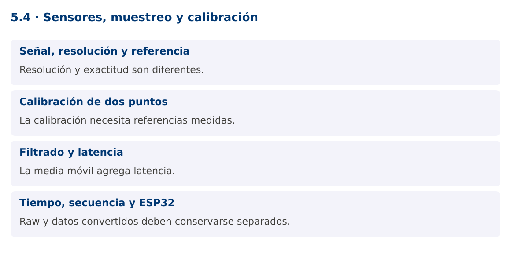

# Programación Aplicada

## 5.4. Sensores, muestreo y calibración


**Autor:** Ing. Pablo Torres, Mgtr.  
**Unidad:** 5. Interfaz de comunicación  
**Proyecto de trabajo:** CampusMonitor

[Inicio del curso](../../README.md) · [Presentación editable](presentacion.pptx) · [Ver en el navegador](index.html)

---

## 1. Conceptos y ejemplos

### Contexto

La aplicación ya recibe cuentas ADC. Para mostrarlas con significado debemos transformar la señal, describir su incertidumbre y distinguir lectura cruda, filtrado y calibración.

### Antes de empezar

Recupera el avance de [5.3](../5.3-protocolo-serial/material.md). Conserva sus comandos y evidencias. Revisa el ejemplo completo antes de implementar la PC. Las demostraciones del material se ejecutan separadas del proyecto personal.

<a id="concepto-1"></a>

### 1.1. Señal, resolución y referencia

analogRead convierte una tensión a un número. En UNO R3, la configuración usual entrega 10 bits: cuentas de 0 a 1023. La resolución no equivale a exactitud. El valor depende de la referencia, ruido, tolerancias y circuito. Una fórmula ideal V = raw × Vref / 1023 aproxima una escala por extremos, pero no sustituye una calibración ni el análisis de cuantización.

Un potenciómetro representa una posición relativa. No debe etiquetarse como temperatura. Para un sensor real, usa su curva de conversión y ficha técnica. Si el sensor es digital, su protocolo puede ser I²C, SPI u otro y no corresponde aplicar directamente la fórmula de un ADC.

<a id="concepto-2"></a>

### 1.2. Calibración de dos puntos

Una calibración lineal usa dos pares conocidos para calcular pendiente y desplazamiento. Para un rango normalizado, porcentaje = 100 × (raw - mínimo) / (máximo - mínimo). Debe cumplirse máximo > mínimo. Registrar solo una fórmula sin documentar cómo se obtuvieron los extremos no permite reproducir la calibración.

No recortes automáticamente todos los valores fuera de rango sin avisar. Un valor bajo mínimo puede indicar una condición fuera de la calibración o un fallo de conexión. Conserva raw y estado de calidad. Para presentar un indicador de 0 a 100 puedes limitar la visualización, pero conserva el dato original para diagnóstico.

<a id="concepto-3"></a>

### 1.3. Filtrado y latencia

Una media móvil reduce variaciones rápidas a costa de retrasar cambios. Con una ventana de N muestras, mantiene las últimas N y calcula su promedio. El filtro no recupera información perdida, no elimina cualquier ruido y no sustituye una frecuencia de muestreo adecuada.

El ejemplo usa una ventana de tres y calcula sobre las muestras disponibles durante el arranque. Otra política sería no emitir hasta llenar la ventana; ambas deben documentarse. Una muestra inválida no se añade. Mantén separado el dato crudo del filtrado para poder revisar cómo cambió la señal.

<a id="concepto-4"></a>

### 1.4. Tiempo, secuencia y ESP32

El timestamp del PC indica recepción, mientras el del microcontrolador indica adquisición según su reloj. No son intercambiables. Una secuencia permite detectar faltantes y reinicios, pero el contador de 32 bits puede desbordarse. La aplicación debe decidir si un retroceso significa reinicio, desbordamiento o dato fuera de orden.

ESP32 ofrece variantes con ADC, conectividad y pines diferentes. Muchos modelos trabajan con lógica de 3.3 V y no toleran 5 V en entradas. No conectes sin adaptar el montaje de UNO R3. Selecciona un modelo exacto, revisa atenuación, resolución y calibración del ADC, y evita pines reservados. La variante se documenta al final como extensión, no como sustitución automática.

### Mapa de conceptos



---

<a id="demostracion"></a>

## 2. Demostración guiada

### 2.1. Problema y contrato

La aplicación ya recibe cuentas ADC. Para mostrarlas con significado debemos transformar la señal, describir su incertidumbre y distinguir lectura cruda, filtrado y calibración.

La implementación siguiente es una demostración resuelta. La PC de la sección 3 requiere desarrollar una ampliación propia sobre CampusMonitor.

**Archivo completo:** [SensoresDemo.java](ejemplos/SensoresDemo.java).

```java
package edu.ups.pap.u05;
import java.util.*;
public class SensoresDemo {
    static final class MediaMovil {
        private final int ventana;
        private final Deque<Double> valores = new ArrayDeque<>();
        private double suma;
        MediaMovil(int ventana) {
            if(ventana<=0)throw new IllegalArgumentException("Ventana inválida");
            this.ventana=ventana;
        }
        double agregar(double valor) {
            if(!Double.isFinite(valor))throw new IllegalArgumentException("Valor no finito");
            valores.addLast(valor);suma+=valor;
            if(valores.size()>ventana)suma-=valores.removeFirst();
            return suma/valores.size();
        }
    }
    static double calibrar(int raw,int minimo,int maximo) {
        if(maximo<=minimo)throw new IllegalArgumentException("Extremos inválidos");
        return 100.0*(raw-minimo)/(maximo-minimo);
    }
    public static void main(String[] args) {
        MediaMovil filtro=new MediaMovil(3);
        for(int raw:new int[]{100,300,500,700}) {
            double pct=calibrar(raw,100,900);
            System.out.printf(Locale.ROOT,"raw=%d pct=%.1f media=%.1f%n",raw,pct,filtro.agregar(pct));
        }
    }
}
```

### 2.2. Ejecución

Desde la raíz de este repositorio, con JDK 25:

```bash
java 05/5.4-sensores/ejemplos/SensoresDemo.java
```

Con el proyecto Gradle de demostraciones:

```bash
cd demostraciones
./gradlew runDemo -Pdemo=5.4
```

En Windows usa `gradlew.bat`. Ejecuta cada demostración desde una terminal nueva o vuelve a la raíz antes de cambiar de contenido.

### 2.3. Resultado y lectura de la ejecución

```text
raw=100 pct=0.0 media=0.0
raw=300 pct=25.0 media=12.5
raw=500 pct=50.0 media=25.0
raw=700 pct=75.0 media=50.0
```

1. Identifica los datos iniciales y las precondiciones que la demostración valida.
2. Sigue las llamadas desde `main` o `loop` y relaciona las operaciones con los conceptos de la sección 1.
3. Contrasta el resultado con la salida esperada del ejemplo. Si el orden es concurrente, compara la invariante y no el orden de impresión.
4. Cambia un dato del ejemplo y predice el resultado antes de ejecutarlo. Registra cualquier diferencia y su causa.

---

<a id="pc"></a>

## 3. PC5.4 · Práctica de clase

### 3.1. Ampliación del proyecto

Esta actividad se resuelve en tu repositorio `icc-pap-campusmonitor-apellido`. Mantén la funcionalidad anterior. No reemplaces tu solución con los archivos de demostración del material.

1. Agrega calibración por sensor a CampusMonitor y conserva raw, valor convertido y marca temporal de recepción.
2. Implementa una media móvil de cinco muestras sin compartir una misma ventana entre sensores. Señala datos fuera del rango de calibración.
3. Documenta dos puntos medidos y compara señal cruda y filtrada. Si usas ESP32, identifica el modelo y adapta explícitamente límites eléctricos y ADC.

### 3.2. Comprobación y evidencia

Prueba los casos de esta sección y registra entradas, salida real y explicación. Incluye una ejecución normal y un caso de error. La evidencia debe permitir repetir el resultado desde el commit entregado.

| Caso que debes revisar | Comportamiento requerido |
|---|---|
| raw igual al mínimo | 0 % |
| máximo igual al mínimo | Configuración rechazada |
| Cambio brusco | Filtro suaviza con latencia observable |

En `evidencias/PC5.4.md` agrega: cambio realizado, archivos principales, comandos de ejecución, tabla de pruebas y enlace al commit final. No añadas una rúbrica a esta PC.

### 3.3. Commits de la actividad

```bash
git status
git add src evidencias firmware
git commit -m "feat(pc5.4): sensores-muestreo-y-calibracion"
git push
git log -1 --format=%H
```

Ajusta las rutas de `git add` a los archivos que realmente creaste. Incluye también configuración o SQL si cambiaste esos archivos. El último comando muestra el hash real que debes enlazar en tu evidencia.

### Lo esencial

- Resolución y exactitud son diferentes.
- La calibración necesita referencias medidas.
- La media móvil agrega latencia.
- Raw y datos convertidos deben conservarse separados.

## Referencias técnicas

- [Arduino Language Reference](https://docs.arduino.cc/language-reference/)
- [Arduino UNO R3](https://docs.arduino.cc/hardware/uno-rev3/)
- [jSerialComm](https://fazecast.github.io/jSerialComm/)
- [ESP32 Arduino ADC](https://docs.espressif.com/projects/arduino-esp32/en/latest/api/adc.html)
