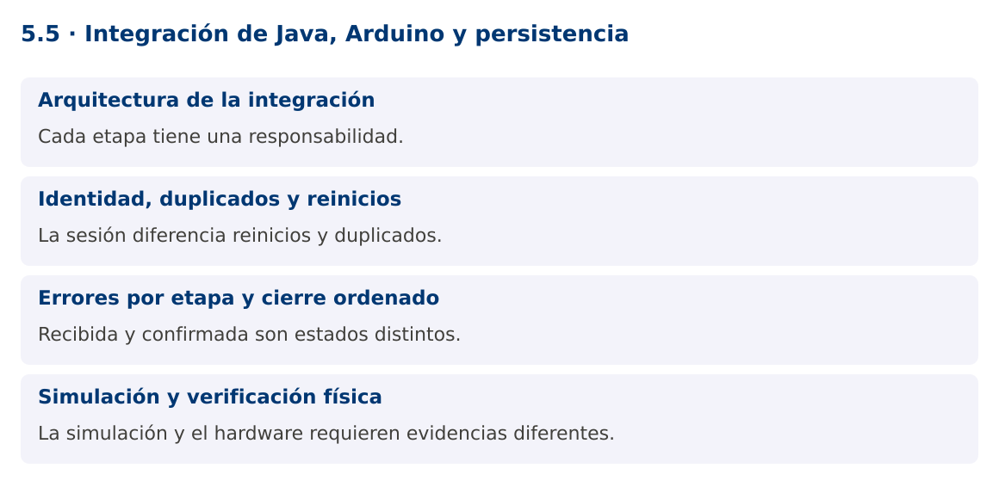

# Programación Aplicada

## 5.5. Integración de Java, Arduino y persistencia


**Autor:** Ing. Pablo Torres, Mgtr.  
**Unidad:** 5. Interfaz de comunicación  
**Proyecto de trabajo:** CampusMonitor

[Inicio del curso](../../README.md) · [Presentación editable](presentacion.pptx) · [Ver en el navegador](index.html)

---

## 1. Conceptos y ejemplos

### Contexto

CampusMonitor reúne ahora recepción serial, validación, procesamiento, persistencia y vista. El proyecto final debe coordinar fallos y cierre sin perder la distinción entre una muestra recibida y una muestra confirmada en la base.

### Antes de empezar

Recupera el avance de [5.4](../5.4-sensores/material.md). Conserva sus comandos y evidencias. Revisa el ejemplo completo antes de implementar la PC. Las demostraciones del material se ejecutan separadas del proyecto personal.

<a id="concepto-1"></a>

### 1.1. Arquitectura de la integración

El adaptador serial produce bytes y el decodificador crea líneas. El parser genera mensajes tipados. Los mensajes DATA entran a una cola acotada y un consumidor transforma y almacena. ACK actualiza el estado de comandos pendientes. La vista recibe resúmenes o DTOs a través del EDT.

Mantén dependencias hacia contratos: FuenteMensajes para hardware o simulación, RepositorioLecturas para persistencia y un servicio que coordine el ciclo de vida. No permitas que el parser acceda directamente a Swing ni que el lector serial mantenga una transacción abierta mientras espera nuevas muestras.

<a id="concepto-2"></a>

### 1.2. Identidad, duplicados y reinicios

Una secuencia de dispositivo ayuda a detectar pérdidas, pero vuelve a cero después de un reinicio. Define una sesión de captura con identidad propia y una clave única por sesión, sensor y secuencia. Así distingues un duplicado de una lectura válida en una nueva sesión.

El consumidor confirma una lectura únicamente después del commit. Si se reintenta un lote, la clave de idempotencia permite reconocer lo ya guardado. No generes silenciosamente una nueva identidad en cada reintento porque producirías duplicados lógicos. Registra cuándo empieza y termina cada sesión.

<a id="concepto-3"></a>

### 1.3. Errores por etapa y cierre ordenado

Los errores de formato se registran y permiten continuar. Una desconexión detiene la producción y cambia el estado de la sesión. Un error de base puede requerir detener, reintentar con límite o mantener pendientes según la política definida. Una cola llena también necesita una decisión explícita.

Para cierre normal, deja de producir, cierra el puerto, permite drenar la cola hasta un plazo, termina consumidores y cierra ejecutores y conexiones. Para una cancelación inmediata, informa cuántas lecturas quedaron sin confirmar. El cierre no debe bloquear el EDT mientras espera. La interfaz distingue conectado, capturando, cerrando y desconectado.

<a id="concepto-4"></a>

### 1.4. Simulación y verificación física

La demostración integra protocolo, cola y transacción con un conjunto de bytes simulado y H2. Permite comprobar el recorrido sin depender de una placa. La PL completa exige sustituir esa fuente por el puerto real y ejecutar contra PostgreSQL con el mismo contrato de mensajes.

La simulación no prueba reinicio USB, niveles eléctricos, ruido, permisos del puerto ni cableado. La evidencia final debe incluir tramas reales, ACK de control, desconexión, reinicio de Java y consulta persistida. Si se usa una variante ESP32, se documentan las diferencias y se conserva el protocolo o se versiona expresamente.

### Mapa de conceptos



---

<a id="demostracion"></a>

## 2. Demostración guiada

### 2.1. Problema y contrato

CampusMonitor reúne ahora recepción serial, validación, procesamiento, persistencia y vista. El proyecto final debe coordinar fallos y cierre sin perder la distinción entre una muestra recibida y una muestra confirmada en la base.

La implementación siguiente es una demostración resuelta. La PC de la sección 3 requiere desarrollar una ampliación propia sobre CampusMonitor.

**Archivo completo:** [IntegracionDemo.java](ejemplos/IntegracionDemo.java).

```java
package edu.ups.pap.u05;
import edu.ups.pap.comun.Protocolo;
import java.sql.*;
import java.util.concurrent.*;
public class IntegracionDemo {
    public static void main(String[] args) throws Exception {
        BlockingQueue<Protocolo.Dato> cola = new ArrayBlockingQueue<>(10);
        for(String linea:new String[]{"DATA;1;100","DATA;2;500","DATA;3;900"}) {
            var mensaje=Protocolo.parsear(linea);
            if(mensaje instanceof Protocolo.Dato dato) cola.put(dato);
        }
        try(Connection c=DriverManager.getConnection("jdbc:h2:mem:integracion")) {
            try(Statement s=c.createStatement()) {
                s.execute("CREATE TABLE lectura(sesion VARCHAR(40),secuencia BIGINT,raw INT,PRIMARY KEY(sesion,secuencia))");
            }
            c.setAutoCommit(false);
            try(PreparedStatement p=c.prepareStatement("INSERT INTO lectura VALUES(?,?,?)")) {
                Protocolo.Dato d;
                while((d=cola.poll())!=null) {
                    p.setString(1,"sesion-demo");p.setLong(2,d.secuencia());p.setInt(3,d.raw());p.addBatch();
                }
                p.executeBatch();c.commit();
            } catch(SQLException e) {c.rollback();throw e;}
            try(Statement s=c.createStatement();ResultSet r=s.executeQuery("SELECT COUNT(*),AVG(raw) FROM lectura")) {
                r.next();System.out.println("Confirmadas: "+r.getInt(1));
                System.out.println("Promedio raw: "+r.getDouble(2));
            }
        }
    }
}
```

**Dependencia compartida:** [Protocolo.java](../../demostraciones/src/main/java/edu/ups/pap/comun/Protocolo.java). El archivo contiene la implementación completa y se compila junto con los ejemplos.

### 2.2. Ejecución

Con el proyecto Gradle de demostraciones:

```bash
cd demostraciones
./gradlew runDemo -Pdemo=5.5
```

En Windows usa `gradlew.bat`. Ejecuta cada demostración desde una terminal nueva o vuelve a la raíz antes de cambiar de contenido.

### 2.3. Resultado y lectura de la ejecución

```text
Confirmadas: 3
Promedio raw: 500.0
```

1. Identifica los datos iniciales y las precondiciones que la demostración valida.
2. Sigue las llamadas desde `main` o `loop` y relaciona las operaciones con los conceptos de la sección 1.
3. Contrasta el resultado con la salida esperada del ejemplo. Si el orden es concurrente, compara la invariante y no el orden de impresión.
4. Cambia un dato del ejemplo y predice el resultado antes de ejecutarlo. Registra cualquier diferencia y su causa.

---

<a id="pc"></a>

## 3. PC5.5 · Práctica de clase

### 3.1. Ampliación del proyecto

Esta actividad se resuelve en tu repositorio `icc-pap-campusmonitor-apellido`. Mantén la funcionalidad anterior. No reemplaces tu solución con los archivos de demostración del material.

1. Integra captura real en CampusMonitor conservando el modo simulado. El consumidor JDBC debe usar una conexión propia y una sesión identificada.
2. Muestra en Swing recibidas, rechazadas, confirmadas y pendientes. Añade LED con ACK y cierre ordenado de puerto, cola y tareas.
3. Prueba una desconexión, un duplicado y un reinicio. La consulta PostgreSQL debe demostrar qué datos se confirmaron y a qué sesión pertenecen.

### 3.2. Comprobación y evidencia

Prueba los casos de esta sección y registra entradas, salida real y explicación. Incluye una ejecución normal y un caso de error. La evidencia debe permitir repetir el resultado desde el commit entregado.

| Caso que debes revisar | Comportamiento requerido |
|---|---|
| Tres tramas válidas | Tres registros confirmados |
| Misma sesión y secuencia | Duplicado identificado |
| Nueva sesión tras reinicio | Secuencia reutilizable sin colisión lógica |

En `evidencias/PC5.5.md` agrega: cambio realizado, archivos principales, comandos de ejecución, tabla de pruebas y enlace al commit final. No añadas una rúbrica a esta PC.

### 3.3. Commits de la actividad

```bash
git status
git add src evidencias firmware
git commit -m "feat(pc5.5): integracion-de-java-arduino-y-persistencia"
git push
git log -1 --format=%H
```

Ajusta las rutas de `git add` a los archivos que realmente creaste. Incluye también configuración o SQL si cambiaste esos archivos. El último comando muestra el hash real que debes enlazar en tu evidencia.

### Lo esencial

- Cada etapa tiene una responsabilidad.
- La sesión diferencia reinicios y duplicados.
- Recibida y confirmada son estados distintos.
- La simulación y el hardware requieren evidencias diferentes.

## Referencias técnicas

- [Arduino Language Reference](https://docs.arduino.cc/language-reference/)
- [Arduino UNO R3](https://docs.arduino.cc/hardware/uno-rev3/)
- [jSerialComm](https://fazecast.github.io/jSerialComm/)
- [ESP32 Arduino ADC](https://docs.espressif.com/projects/arduino-esp32/en/latest/api/adc.html)
